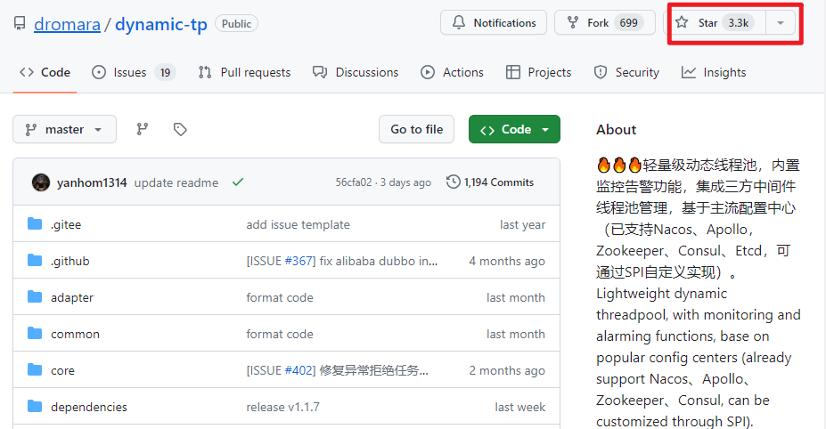
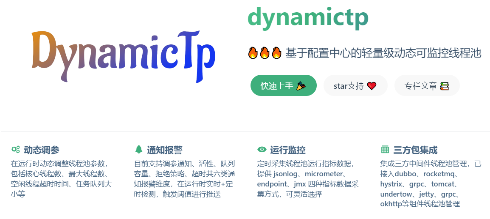

**高并发、微服务 、性能调优实战案例100讲，所有案例均源于个人工作实战，均配合代码落地**

加我微信：itsoku，所有案例均提供在线答疑。


# 第10节 动态线程池

上节课，我们讲了线程池管理器，有些朋友觉得没听过瘾，想听听动态线程池怎么弄，这课就来了，建议听这课之前，先听下上一节课的线程池管理器，本案例代码也是在此基础上进化来的。


## 什么是动态线程池？

无需重启的情况下，可以对线程池进行扩缩容，比如改变线程池的核心线程数量、最大线程数量、队列容量等。


## 还是先看效果

我们会创建一个线程池，然后让其去处理任务，然后对其进行扩缩容，并查看扩缩容前后线程池的各个指标的变化（核心线程数、最大线程数、活动线程数、队列容量、队列中当前元素数量）。

### 创建一个线程池

- 线程池名称：emailThreadPool
- 核心线程数：10
- 最大线程数：20
- 队列容量：1000

```java
@Bean
public ThreadPoolTaskExecutor emailThreadPool() {
    //使用线程池管理器创建线程池
    return ThreadPoolManager.newThreadPool("emailThreadPool", 10, 20, 1000);
}
```

### 启动应用

```java
com.itsoku.lesson009.Lesson009Application
```

为了能看到效果，系统中会使用上面刚创建的这个线程池去模拟批量发邮件的一个操作，这样线程池中的一些数据才会发生变化（如：活动线程数、队列中当前元素的数量queueSize 这些指标）

### 看下线程池的信息

系统中暴露了一个接口可以查看到线程池管理器中所有线程池的信息。

浏览器中访问：http://localhost:8080/threadPoolManager/threadPoolInfoList，返回如下：

```json
{
  "code": "1",
  "data": [
    {
      "name": "emailThreadPool", // 线程池名称
      "corePoolSize": 10,        // 核心线程数
      "maxPoolSize": 20,   	     // 最大线程数
      "activeCount": 10,   	     // 活动线程数
      "queueCapacity": 1000,     // 队列容量
      "queueSize": 288		     // 队列中当前元素数量
    }
  ],
  "msg": null
}
```


## 演示扩容

### 扩缩容接口

com.itsoku.lesson009.controller.ThreadPoolManagerController#threadPoolChange

```java
/**
 * 线程池扩缩容
 *
 * @return
 */
@PostMapping("/threadPoolChange")
public Result<Boolean> threadPoolChange(@RequestBody ThreadPoolChange threadPoolChange) {
    ThreadPoolManager.changeThreadPool(threadPoolChange);
    return ResultUtils.ok(true);
}
```

### 执行扩容

核心线程数、最大线程数、容量都扩容一倍

```http
### 测试扩容
POST http://localhost:8080/threadPoolManager/threadPoolChange
Accept: application/json
Content-Type: application/json

{
  "name": "emailThreadPool",
  "corePoolSize": 50,
  "maxPoolSize": 100,
  "queueCapacity": 2000
}
```

### 看下扩容后线程池的信息

浏览器中访问：http://localhost:8080/threadPoolManager/threadPoolInfoList，返回如下：

```json
{
  "code": "1",
  "data": [
    {
      "name": "emailThreadPool",
      "corePoolSize": 50,
      "maxPoolSize": 100,
      "activeCount": 50,
      "queueCapacity": 2000,
      "queueSize": 408
    }
  ],
  "msg": null
}
```


## 演示缩容

### 执行缩容

核心线程数、最大线程数、容量都扩容一倍

```http
### 测试缩容
POST http://localhost:8080/threadPoolManager/threadPoolChange
Accept: application/json
Content-Type: application/json

{
  "name": "emailThreadPool",
  "corePoolSize": 5,
  "maxPoolSize": 10,
  "queueCapacity": 500
}
```

### 看下扩容后线程池的信息

浏览器中访问：http://localhost:8080/threadPoolManager/threadPoolInfoList，返回如下：

```json
{
  "code": "1",
  "data": [
    {
      "name": "emailThreadPool",
      "corePoolSize": 5,
      "maxPoolSize": 10,
      "activeCount": 2,
      "queueCapacity": 500,
      "queueSize": 0
    }
  ],
  "msg": null
}
```


## 代码讲解

1. 线程池中会用到Java中的阻塞队列`java.util.concurrent.BlockingQueue`，目前jdk中自带几个阻塞队列都不支持动态扩容，比如`java.util.concurrent.LinkedBlockingQueue`，他里面的capacity是final的，不支持修改，为了是队列容量能够支持调整，我们创建了一个可扩容的阻塞队列`ResizeLinkedBlockingQueue`，代码是从`LinkedBlockingQueue`中拷贝过来的，然后添加了一个可以修改容量capacity的方法，如下，然后创建线程池的时候，我们使用自定义的这个阻塞队列便可以实现线程池的动态扩容。

   ```java
   /**
    * 设置容量
    * @param capacity
    */
   public void setCapacity(int capacity) {
       if (capacity <= 0) throw new IllegalArgumentException();
       final ReentrantLock putLock = this.putLock;
       putLock.lock();
       try {
           if (count.get() > capacity) {
               throw new IllegalArgumentException();
           }
           this.capacity = capacity;
       } finally {
           putLock.unlock();
       }
   }
   ```

2. 线程池扩容的方法：com.itsoku.lesson009.comm.ThreadPoolManager#changeThreadPool


## 源码

在高并发系列实战案例的 lesson009 模块中，如果找不到的，留言获取，感谢大家。


## 推荐使用开源的动态线程池：dynamic-tp

https://github.com/dromara/dynamic-tp

这个动态线程池是美团开源的，star数量3.3k，支持通过配置中心nacos配置线程池、对线程池进行扩缩容，很强大。





# 高并发 & 微服务 & 性能调优实战案例100讲

## 已更新 10 节课

<span style="font-weight:bold; color:red">目前整个课程59块钱，一杯咖啡的价格，还没下手的朋友，赶紧了，马上要涨价了</span>。

```java
1. 分片上传实战
2. 通用并发处理工具类实战
3. 实现一个好用接口性能压测工具类
4. 超卖问题的4种解决方案，也是防止并发修改数据出错的通用方案
5. Semaphore实现接口限流实战
6. 并行查询，优化接口响应速度实战
7. 接口性能优化之大事务优化
8. 通用的Excel动态导出功能实战
9. 手写线程池管理器，管理&监控所有线程池
10. 动态线程池
```


## 课程部分大纲，连载中。。。。

以下课程均来源于个人多年的实战，均提供原理讲解 && 源码落地

<span style="font-weight:bold; color:red">目前整个课程59块钱，一杯咖啡的价格，还没下手的朋友，赶紧了，马上要涨价了</span>。

```java
1. 分片上传实战
2. 通用并发处理工具类实战
3. 实现一个好用接口性能压测工具类
4. 超卖问题的4种解决方案，也是防止并发修改数据出错的通用方案
5. Semaphore实现接口限流实战
6. 并行查询，优化接口响应速度实战
7. 接口性能优化之大事务优化
8. 通用的Excel动态导出功能实战
9. 手写线程池管理器，管理&监控所有线程池
10. 动态线程池
11. 使用SpringBoot实现动态Job管理功能
12. 通用的幂等性工具类实战
13. 接口返回值通用设计
14. 接口太多，各种dto、vo不计其数，如何命名？
15. 一个业务太复杂了，方法太多，如何传参？
16. 如何统计接口耗时？
17. AOP实战接口日志打印功能
18. AOP实现业务操作日志记录功能
19. AOP实现MyBatis分页功能
20. SpringBoot读写分离实战
21. MQ专题：事务消息实战（防止消息丢失）
22. MQ专题：消息幂等消费通用方案实战
23. MQ专题：延迟消息通用方案实战
24. MQ专题：顺序消息通用方案实战
25. MQ专题：消息积压问题
26. 分布式事务：使用事务消息实现事务最终一致性
27. 分布式事务：通用的TCC分布式事务生产级代码落地实战
28. 分布式锁案例实战
29. 微服务中如何传递上下文？实战
30. 微服务链路日志追踪实战（原理&代码落地）
31. SpringBoot实现租户数据隔离
32. MyBatis进阶：封装MyBatis，实现通用的无SQL版CRUD功能，架构师必备
33. MyBatis进阶：自己实现通用分表功能，架构师必备
34. MyBatis进阶：实现多租户隔离ORM框架
35. SpringBoot中实现自动监听PO的变化，自动生成表结构
36. 分布式专题：其他实战课程等
37. 性能调优：如何排查死锁？
38. 性能调优：如何排查内存溢出？
39. 性能调优：CPU被打满，如何排查？
40. 性能调优：生产代码没生效，如何定位？
41. 性能调优：接口太慢，如何定位？
42. 性能调优：如何查看生产上接口的入参和返回值？
43. 性能调优：远程debug
44. 生产上出现了各种故障，如何定位？
45. 其他等各种实战案例。。。
。。。
```
