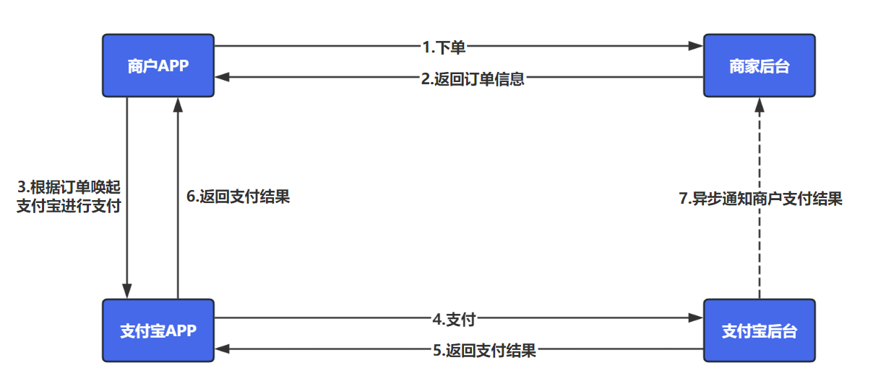
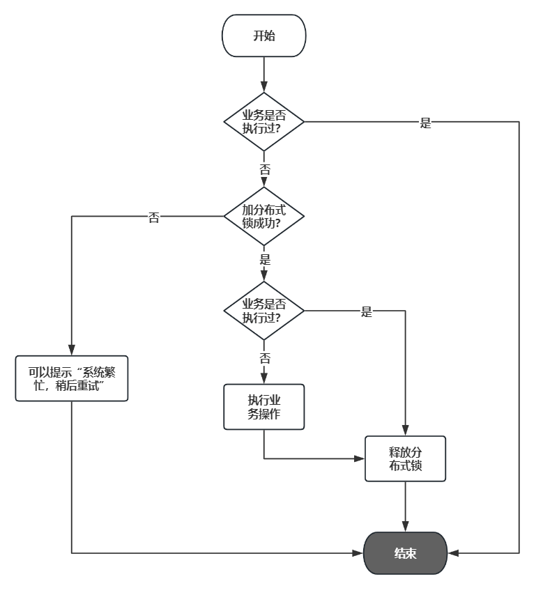

**高并发、微服务 、性能调优实战案例100讲，所有案例均源于个人工作实战，均配合代码落地**

加我微信：itsoku，所有案例均提供在线答疑。


# 第13节 幂等的4种解决方案

本文将介绍幂等问题的 4 种解决方案，理解后，可以应对工作中所有幂等性问题。

每种方案都会有代码落地，并对每种方案进行并发压测，验证其可靠性，可能有点长，大家耐心看完，吃透后，以后也不用在幂等性问题上耗费时间了。


## 什么是幂等

幂等指多次操作产生的影响只会跟一次执行的结果相同，通俗的说：某个行为重复的执行，最终获取的结果是相同的，不会因为重复执行对系统造成变化。


## 给大家举个例子

比如说咱们有个网站，网站上支持购物，但只能用网站上自己的金币进行付款。

金币从哪里来呢？可通过支付宝充值来，1元对1金币，充值的过程如下



上图中的第7步，这个地方支付宝会给商家发送通知，商家收到支付宝的通知后会执行下面逻辑

```
step1、判断订单是否处理过
step2、若订单已处理，则直接返回SUCCESS，否则继续向下走
step3、将订单状态置为成功
step4、给用户在平台的账户加金币
step5、返回SUCCESS
```

由于网络存在不稳定的因素，这个通知可能会发送多次，极端情况下，同一笔订单的多次通知可能同时到达商户端，若商家这边不做幂等操作，那么同一笔订单就可能被处理多次。

比如2次通知同时走到`step2`，都会看到订单未处理，则会继续向下走，那么账户就会被加2次钱，这将出现严重的事故，搞不好公司就被干倒闭了。


## 如何解决这个问题？

本文中，我会给大家提供4种方案，每种方案都会有代码落地，以及会对每种方案进行并发压测，验证其可靠性。


## 先添加2张表（账户表、充值订单表）

```sql
-- 创建账户表
create table if not exists t_account
(
    id      varchar(50) primary key comment '账户id',
    name    varchar(50)    not null comment '账户名称',
    balance decimal(12, 2) not null default '0.00' comment '账户余额'
) comment '账户表';

-- 充值记录表
create table if not exists t_recharge
(
    id         varchar(50) primary key comment 'id，主键',
    account_id varchar(50)    not null comment '账户id，来源于表t_account.id',
    price      decimal(12, 2) not null comment '充值金额',
    status     smallint       not null default 0 comment '充值记录状态，0：处理中，1：充值成功',
    version    bigint         not null default 0 comment '系统版本号，默认为0，每次更新+1，用于乐观锁'
) comment '充值记录表';

-- 准备测试数据，
-- 账号数据来一条，
insert ignore into t_account values ('1', '路人', 0);
-- 充值记录来一条，状态为0，稍后我们模拟回调，会将状态置为充值成功
insert ignore into t_recharge values ('1', '1', 100.00, 0, 0);
```

下面我们将实现，业务方这边给支付宝提供的回调方法，在这个回调方法中会处理刚才上面sql中插入的那个订单，会将订单状态置为成功，成功也就是1，然后给用户的账户余额中添加100金币。

这个回调方法，下面会提供4种实现，都可以确保这个回调方法的幂等性，余额只会加100。


## 方案1：update时将status=0作为条件判断解决

### 原理

逻辑如下，重点在于更新订单状态的时候要加上status = 0这个条件，如果有并发执行到这条sql的时候，数据库会对update的这条记录加锁，确保他们排队执行，只有一个会执行成功。

```java
String rechargeId = "充值订单id";

// 根据rechargeId去找充值记录，如果已处理过，则直接返回成功
RechargePO rechargePo = select * from t_recharge where id = #{rechargeId};

// 充值记录已处理过，直接返回成功
if(rechargePo.status==1){
	return "SUCCESS";
}

开启Spring事务

// 下面这个sql是重点，重点在where后面要加 status = 0 这个条件；count表示影响行数
int count = (update t_recharge set status = 1 where id = #{rechargeId} and status = 0);

// count = 1，表示上面sql执行成功
if(count!=1){
	// 走到这里，说明有并发，直接抛出异常
	throw new RuntimeException("系统繁忙，请重试")
}else{
	//给账户加钱
	update t_account set balance = balance + #{rechargePo.price} where id = #{rechargePo.accountId}
}

提交Spring事务
```

### 源码

```java
com.itsoku.lesson012.controller.RechargeController#rechargeCallBack1
```

### 运行看结果

```java
RechargeControllerTest#rechargeCallBack1
```

> 并发100次请求对这个方案进行压测，在压测前后，我们会打印出订单的状态、账户的余额，大家注意看着几个数据。
>
> 预期的结果，订单状态应该是1，账户余额应该是100

```java
-----------------------------方案1 幂等测试----------------------------------------

测试前，充值订单&账户信息：充值订单号：1，状态：0，账户余额：0.00

接口：http://localhost:8080/rechargeCallBack1?rechargeId=1
[main] 22:08:26 ：压测开始......共发送请求数量：100，并发量：100
[main] 22:08:27 ：压测结束，总耗时(ms):170

测试后，充值订单&账户信息：充值订单号：1，状态：1，账户余额：100.00
```


## 方案2：乐观锁

### 原理

```java
String rechargeId = "充值订单id";

// 根据rechargeId去找充值记录，如果已处理过，则直接返回成功
RechargePO rechargePo = select * from t_recharge where id = #{rechargeId};

// 充值记录已处理过，直接返回成功
if(rechargePo.status==1){
	return "SUCCESS";
}

开启Spring事务

// 期望的版本号
Long exceptVersion = rechargePo.version;

// 下面这个sql是重点，重点在set后面要有version = version + 1，where后面要加 status = 0 这个条件；count表示影响行数
int count = (update t_recharge set status = 1,version = version + 1 where id = #{rechargeId} and version = #{exceptVersion});

// count = 1，表示上面sql执行成功
if(count!=1){
	// 走到这里，说明有并发，直接抛出异常
	throw new RuntimeException("系统繁忙，请重试")
}else{
	//给账户加钱
	update t_account set balance = balance + #{rechargePo.price} where id = #{rechargePo.accountId}
}

提交spring事务
```

重点在于`update t_recharge set status = 1,version = version + 1 where id = #{rechargeId} and version = #{exceptVersion}`这条sql

- set 后面必须要有 version = version + 1
- where后面必须要有 version = #{exceptVersion}

这样乐观锁才能起作用。

### 源码

```java
com.itsoku.lesson012.controller.RechargeController#rechargeCallBack2
```

### 运行看结果

```java
RechargeControllerTest#rechargeCallBack2
```

> 并发100次请求对这个方案进行压测，在压测前后，我们会打印出订单的状态、账户的余额，大家注意看着几个数据。
>
> 预期的结果，订单状态应该是1，账户余额应该是100

```java
-----------------------------方案2 幂等测试----------------------------------------

测试前，充值订单&账户信息：充值订单号：1，状态：0，账户余额：0.00

接口：http://localhost:8080/rechargeCallBack2?rechargeId=1
[main] 22:08:44 ：压测开始......共发送请求数量：100，并发量：100
[main] 22:08:44 ：压测结束，总耗时(ms):156

测试后，充值订单&账户信息：充值订单号：1，状态：1，账户余额：100.00
```


## 方案3：唯一约束

### 需要添加一张唯一约束辅助表

> 如下，这个表重点关注第二个字段`idempotent_key`，这个字段添加了唯一约束，说明同时向这个表中插入同样值的idempotent_key，则只有一条记录会执行成功，其他的请求会报异常，而失败，让事务回滚，这个知识点了解后，方案就容易看懂了。

```java
-- 幂等辅助表
create table if not exists t_idempotent
(
    id             varchar(50) primary key comment 'id，主键',
    idempotent_key varchar(200) not null comment '需要确保幂等的key',
    unique key uq_idempotent_key (idempotent_key)
) comment '幂等辅助表';
```

### 原理

```java
String idempotentKey = "幂等key";

// 幂等表是否存在记录，如果存在说明处理过，直接返回成功
IdempotentPO idempotentPO = select * from t_idempotent where idempotent_key = #{idempotentKey};
if(idempotentPO!=null){
	return "SUCCESS";
}

开启Spring事务(这里千万不要漏掉，一定要有事务)

// 这里放入需要幂等的业务代码，最好是db操作的代码。。。。。
    


String idempotentId = "";
// 这里是关键一步，向 t_idempotent 插入记录，如果有并发过来，只会有一个成功，其他的会报异常导致事务回滚
insert into t_idempotent (id, idempotent_key) values (#{idempotentId}, #{idempotentKey});

提交spring事务
```

### 用这种方案来处理支付回调通知，伪代码如下

```java
String rechargeId = "充值订单id";

// 根据rechargeId去找充值记录，如果已处理过，则直接返回成功
RechargePO rechargePo = select * from t_recharge where id = #{rechargeId};

// 充值记录已处理过，直接返回成功
if(rechargePo.status==1){
	return "SUCCESS";
}

// 生成idempotentKey，这里可以使用，业务id:业务类型，那么我们这里可以使用rechargeId+":"+"RECHARGE_CALLBACK"
String idempotentKey = rechargeId+":"+"RECHARGE_CALLBACK";

// 幂等表是否存在记录，如果存在说明处理过，直接返回成功
IdempotentPO idempotentPO = select * from t_idempotent where idempotent_key = #{idempotentKey};
if(idempotentPO!=null){
	return "SUCCESS";
}

开启Spring事务(这里千万不要漏掉，一定要有事务)


// count表示影响行数，这个sql比较特别，看起来并发会出现问题，实际上配合唯一约束辅助表，就不会有问题了
int count = update t_recharge set status = 1 where id = #{rechargeId};

// count != 1，表示未成功
if(count!=1){
	// 走到这里，直接抛出异常，让事务回滚
	throw new RuntimeException("系统繁忙，请重试")
}else{
	//给账户加钱
	update t_account set balance = balance + #{rechargePo.price} where id = #{rechargePo.accountId}
}

String idempotentId = "";
// 这里是关键一步，向 t_recharge 插入记录，如果有并发过来，只会有一个成功，其他的会报异常导致事务回滚，上面的
insert into t_recharge (id, idempotent_key) values (#{idempotentId}, #{idempotentKey});

提交spring事务
```

### 源码

```java
com.itsoku.lesson012.controller.RechargeController#rechargeCallBack3
```

### 运行看结果

```java
RechargeControllerTest#rechargeCallBack3
```

> 并发100次请求对这个方案进行压测，在压测前后，我们会打印出订单的状态、账户的余额，大家注意看着几个数据。
>
> 预期的结果，订单状态应该是1，账户余额应该是100

```java
-----------------------------方案3 幂等测试----------------------------------------

测试前，充值订单&账户信息：充值订单号：1，状态：0，账户余额：0.00

接口：http://localhost:8080/rechargeCallBack3?rechargeId=1
[main] 22:08:59 ：压测开始......共发送请求数量：100，并发量：100
[main] 22:08:59 ：压测结束，总耗时(ms):127

测试后，充值订单&账户信息：充值订单号：1，状态：1，账户余额：100.00
```


## 方案四：分布式锁

上面三种方式都是依靠数据库的功能解决幂等性的问题，所以比较适合对数据库操作的业务。

若业务没有数据库操作，需要实现幂等，可用分布式锁解决，逻辑如下：



## 总结

1. 数据库操作的幂等性，4种种方案都可以，第3种方案算是一种通用的方案，可以在项目框架搭建初期就提供此方案，然后在组内推广，让所有人都知晓，可避免很多幂等性问题。
2. 方案4大家也要熟悉这个处理过程。


## 源码

源码同样是放在我的《高并发&微服务&性能调优实战案例100讲》的代码中，有兴趣的可以点击左下角的小黄车了解下，感谢大家的观看。


# 高并发 & 微服务 & 性能调优实战案例100讲

## 已更新 12 节课

<span style="font-weight:bold; color:red">目前整个课程59块钱，一杯咖啡的价格，还没下手的朋友，赶紧了，马上要涨价了</span>。

```java
1. 分片上传实战
2. 通用并发处理工具类实战
3. 实现一个好用接口性能压测工具类
4. 超卖问题的4种解决方案，也是防止并发修改数据出错的通用方案
5. Semaphore实现接口限流实战
6. 并行查询，优化接口响应速度实战
7. 接口性能优化之大事务优化
8. 通用的Excel动态导出功能实战
9. 手写线程池管理器，管理&监控所有线程池
10. 动态线程池
11. 使用SpringBoot实现动态Job实战
12. 幂等的4种解决方案，吃透幂等性问题
```


## 课程部分大纲，连载中。。。。

以下课程均来源于个人多年的实战，均提供原理讲解 && 源码落地

<span style="font-weight:bold; color:red">目前整个课程59块钱，一杯咖啡的价格，还没下手的朋友，赶紧了，马上要涨价了</span>。

```java
1. 分片上传实战
2. 通用并发处理工具类实战
3. 实现一个好用接口性能压测工具类
4. 超卖问题的4种解决方案，也是防止并发修改数据出错的通用方案
5. Semaphore实现接口限流实战
6. 并行查询，优化接口响应速度实战
7. 接口性能优化之大事务优化
8. 通用的Excel动态导出功能实战
9. 手写线程池管理器，管理&监控所有线程池
10. 动态线程池
11. 使用SpringBoot实现动态Job实战
12. 通用的幂等性工具类实战
13. 接口返回值通用设计
14. 接口太多，各种dto、vo不计其数，如何命名？
15. 一个业务太复杂了，方法太多，如何传参？
16. 如何统计接口耗时？
17. AOP实战接口日志打印功能
18. AOP实现业务操作日志记录功能
19. AOP实现MyBatis分页功能
20. SpringBoot读写分离实战
21. MQ专题：事务消息实战（防止消息丢失）
22. MQ专题：消息幂等消费通用方案实战
23. MQ专题：延迟消息通用方案实战
24. MQ专题：顺序消息通用方案实战
25. MQ专题：消息积压问题
26. 分布式事务：使用事务消息实现事务最终一致性
27. 分布式事务：通用的TCC分布式事务生产级代码落地实战
28. 分布式锁案例实战
29. 微服务中如何传递上下文？实战
30. 微服务链路日志追踪实战（原理&代码落地）
31. SpringBoot实现租户数据隔离
32. MyBatis进阶：封装MyBatis，实现通用的无SQL版CRUD功能，架构师必备
33. MyBatis进阶：自己实现通用分表功能，架构师必备
34. MyBatis进阶：实现多租户隔离ORM框架
35. SpringBoot中实现自动监听PO的变化，自动生成表结构
36. 分布式专题：其他实战课程等
37. 性能调优：如何排查死锁？
38. 性能调优：如何排查内存溢出？
39. 性能调优：CPU被打满，如何排查？
40. 性能调优：生产代码没生效，如何定位？
41. 性能调优：接口太慢，如何定位？
42. 性能调优：如何查看生产上接口的入参和返回值？
43. 性能调优：远程debug
44. 生产上出现了各种故障，如何定位？
45. 其他等各种实战案例。。。
。。。
```

