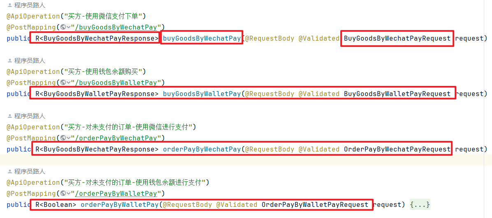

**高并发、微服务 、性能调优实战案例100讲，所有案例均源于个人工作实战，均配合代码落地**

加我微信：itsoku，所有案例均提供在线答疑。


# 第15节 解决DTO、VO泛滥，命名困难的问题


## 痛点

有些项目接口很多，而接口入参一般我们使用XxxDTO这种类型参数，返回值通常使用XxxVO这种类型，很多开发按照自己项目搞事情，时间久了，导致系统中充斥着大量的dto、vo命名的类，各种命名千奇百怪。

问题来了，然后我们再添加新的接口的时候，入参和返回值不知道如何命名了，大家有没有这种经历？


## 如何解决？

当我们遇到问题的时候，别人肯定也会遇到这种问题。

那我们就去看高手遇到这种问题的时候，是如何解决的？

elasticsearch，这个框架框架大家应该比较熟悉吧，非常出名的一个搜索引擎解决方案，他通过restfull接口对外提供搜索服务。

我们来看一下他在SpringBoot中的源码，需要在SpringBoot中引入下面配置，然后可看到的他的源码。

```xml
<dependency>
    <groupId>org.springframework.boot</groupId>
    <artifactId>spring-boot-starter-data-elasticsearch</artifactId>
</dependency>
```

看下面这个类，这个就是elasticsearch为springboot端提供的一个用于调用elasticsearch服务端接口的工具类

```java
co.elastic.clients.elasticsearch.ElasticsearchClient
```

下面是一些方法的定义，大家先看下

```java
IndexResponse index(IndexRequest request)

ReindexResponse reindex(ReindexRequest request)

DeleteResponse delete(DeleteRequest request)

DeleteByQueryResponse deleteByQuery(DeleteByQueryRequest request)

DeleteScriptResponse deleteScript(DeleteScriptRequest request) 
```

不知道大家有没有发现规律，可能有些朋友已经看出来了，上面方法的特点

- 入参的类型是：方法名称+Request
- 返回值的类型是：方法名称+Response

大家觉得这种怎么样？本人觉得这种方式挺好的，最少解决了我们命名的痛点


## 案例

再来给大家看一下我写的接口的命名，和上面es的也类似，大家也可以看下。


## 大家有什么更好的方法呢？

这个问题本身缺少规范导致的问题，如果规范中能够指引大家很容易的解决这个问题，那就没有这个痛点了。

大家在项目中有没有碰到这个问题呢？你们是如何解决的？可以留言一起交流


## 源码

源码同样是放在我的《高并发&微服务&性能调优实战案例100讲》的代码中，有兴趣的可以点击左下角的小黄车了解下，感谢大家的观看。


# 高并发 & 微服务 & 性能调优实战案例100讲

## 已更新 15 节课

<span style="font-weight:bold; color:red">目前整个课程59块钱，一杯咖啡的价格，还没下手的朋友，赶紧了，马上要涨价了</span>。

```java
1. 分片上传实战
2. 通用并发处理工具类实战
3. 实现一个好用接口性能压测工具类
4. 超卖问题的4种解决方案，也是防止并发修改数据出错的通用方案
5. Semaphore实现接口限流实战
6. 并行查询，优化接口响应速度实战
7. 接口性能优化之大事务优化
8. 通用的Excel动态导出功能实战
9. 手写线程池管理器，管理&监控所有线程池
10. 动态线程池
11. 使用SpringBoot实现动态Job实战
12. 并行查询，性能优化利器，可能有坑
13. 幂等的4种解决方案，吃透幂等性问题
14. 接口通用返回值设计与实现
15. 接口太多，各种dto、vo不计其数，如何命名？
```


## 课程部分大纲，连载中。。。。

以下课程均来源于个人多年的实战，均提供原理讲解 && 源码落地

<span style="font-weight:bold; color:red">目前整个课程59块钱，一杯咖啡的价格，还没下手的朋友，赶紧了，马上要涨价了</span>。

1. 分片上传实战
2. 通用并发处理工具类实战
3. 实现一个好用接口性能压测工具类
4. 超卖问题的4种解决方案，也是防止并发修改数据出错的通用方案
5. Semaphore实现接口限流实战
6. 并行查询，优化接口响应速度实战
7. 接口性能优化之大事务优化
8. 通用的Excel动态导出功能实战
9. 手写线程池管理器，管理&监控所有线程池
10. 动态线程池
11. 使用SpringBoot实现动态Job实战
12. 并行查询，性能优化利器，可能有坑
13. 幂等的4种解决方案，吃透幂等性问题
14. 接口通用返回值设计与实现
15. 接口太多，各种dto、vo不计其数，如何命名？
16. 一个业务太复杂了，方法太多，如何传参？
17. 接口报错，如何快速定位日志？
18. AOP实战接口日志打印功能
19. AOP实现业务操作日志记录功能
20. AOP实现MyBatis分页功能
21. SpringBoot读写分离实战
22. MQ专题：事务消息实战（防止消息丢失）
23. MQ专题：消息消息重试策略
24. MQ专题：消息幂等消费通用方案实战
25. MQ专题：延迟消息通用方案实战
26. MQ专题：顺序消息通用方案实战
27. MQ专题：消息积压问题
28. 分布式事务：使用事务消息实现事务最终一致性
29. 分布式事务：通用的TCC分布式事务生产级代码落地实战
30. 分布式锁案例实战
31. 微服务中如何传递上下文？实战
32. 微服务链路日志追踪实战（原理&代码落地）
33. SpringBoot实现租户数据隔离
34. MyBatis进阶：封装MyBatis，实现通用的无SQL版CRUD功能，架构师必备
35. MyBatis进阶：自己实现通用分表功能，架构师必备
36. MyBatis进阶：实现多租户隔离ORM框架
37. SpringBoot中实现自动监听PO的变化，自动生成表结构
38. 分布式专题：其他实战课程等
39. 性能调优：如何排查死锁？
40. 性能调优：如何排查内存溢出？
41. 性能调优：CPU被打满，如何排查？
42. 性能调优：生产代码没生效，如何定位？
43. 性能调优：接口太慢，如何定位？
44. 性能调优：如何查看生产上接口的入参和返回值？
45. 性能调优：远程debug
46. 生产上出现了各种故障，如何定位？
47. db和缓存一致性，常见的方案
48. redis一些使用场景案例。。。
49. 系统资金账户设计案例（一些系统涉及到资金操作）
50. 其他等各种实战案例。。。

