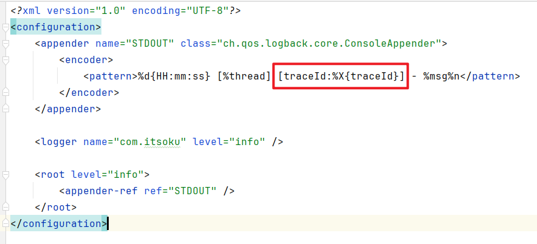
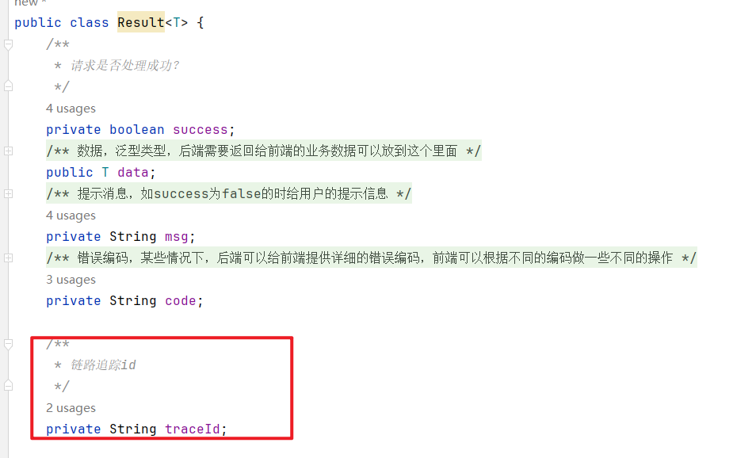
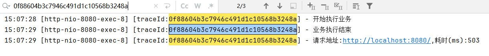
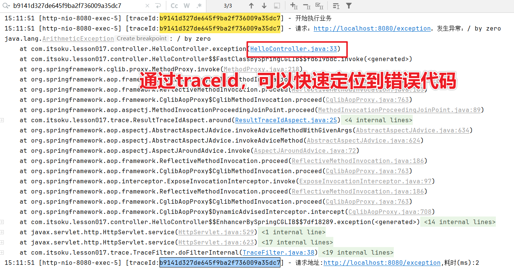

**高并发、微服务 、性能调优实战案例100讲，所有案例均源于个人工作实战，均配合代码落地**

加我微信：itsoku，所有案例均提供在线答疑。


# 第17节 接口报错，如何快速定位日志？


## 要解决的问题？

接口报错，如何快速定位问题？这个需要日志的辅助，一般错误日志中有详细的堆栈信息，具体是哪行代码报错，都可以看到。

要想快速定位问题，前提是要能够快速定位日志。


## 海量日志，如何定位呢？

日志量一般都是很大的，如何能够从大量日志中找到自己需要的日志呢？


## 解决方案

1、服务端入口处可以生成一个唯一的id，记做：traceId

2、日志中均需要输出traceId的值

3、接口返回值中，添加一个通用的字段：traceId，将上面的traceId作为这个字段的值

4、这样前端发现接口有问题的时候，直接将这个traceId提供给我们，我们便可以在日志中快速查询出对应的日志。


## 代码如何实现？（4步）

### 1、添加一个TraceFilter

> 拦截所有请求，入口生成一个唯一的traceId，放到ThreadLocal中

```java
@Order(Ordered.HIGHEST_PRECEDENCE)
@WebFilter(urlPatterns = "/**", filterName = "TraceFilter")
public class TraceFilter extends OncePerRequestFilter {
    public static Logger logger = LoggerFactory.getLogger(TraceFilter.class);

    @Override
    protected void doFilterInternal(HttpServletRequest request, HttpServletResponse response, FilterChain filterChain) throws ServletException, IOException {
        String traceID = IdUtil.fastSimpleUUID();
        TraceUtils.setTraceId(traceID);
        long st = System.currentTimeMillis();
        try {
            filterChain.doFilter(request, response);
        } finally {
            long et = System.currentTimeMillis();
            logger.info("请求地址:{},耗时(ms):{}", request.getRequestURL().toString(), (et - st));
            TraceUtils.removeTraceId();
        }
    }
}
```

### 2、日志中输出traceId

需要在MDC中设置一下traceId：MDC.put("traceId", traceId); 

MDC是logback为我们提供的一个扩展的入口，可以向里面放入一些键值对，然后在logback中的日志中就可以通过这个traceId获取到对应的值

如下，logback.xml中使用`%X{traceId}`可以获取到MDC中设置的traceId



### 3、返回值中添加通用字段traceId

我们这里使用的是通用返回值Result，也就是所有接口的返回值均是Result类型，定义如下，我们在里面添加了一个traceId字段，这个值如何写入呢？看后面



### 4、通过aop将traceId写入响应结果的Result中

下面我们使用aop创建了一个环绕通知，会拦截controller的所有方法，以及全局异常处理器的方法，对Result类型的返回值进行统一处理，将traceId设置到Result中traceId字段中

```java
@Aspect
@Order(Ordered.LOWEST_PRECEDENCE)
public class ResultTraceIdAspect {
    @Pointcut("execution(* com.itsoku..*Controller.*(..)) ||execution(* com.itsoku.lesson017.web.GlobalExceptionHandler.*(..))")
    public void pointCut() {
    }

    @Around("pointCut()")
    public Object around(ProceedingJoinPoint pjp) throws Throwable {
        Object object = pjp.proceed();
        if (object instanceof Result) {
            ((Result<?>) object).setTraceId(TraceUtils.getTraceId());
        }
        return object;
    }

}
```


## 测试效果

访问接口`http://localhost:8080/`，输出

```json
{
  "success": true,
  "data": "欢迎和路人一起学习《高并发 & 微服务 & 性能调优实战案例100讲》",
  "msg": null,
  "code": null,
  "traceId": "92558e52c28845b39c6bf4b76235ffdd"
}
```

通过这个traceId可以去控制台找到对应的日志



## 测试异常情况，快速定位日志

下面提供了一个测试接口，这个接口会抛出异常，代码中有：10/0，除数是零，会报异常

```java
@GetMapping("/exception")
public Result<String> exception() throws InterruptedException {
    logger.info("开始执行业务");
    //这里模拟了一个错误，10/0，会报错
    System.out.println(10/0);
    logger.info("业务执行结束");
    return ResultUtils.success("欢迎和路人一起学习《高并发 & 微服务 & 性能调优实战案例100讲》");
}
```

访问下这个接口`http://localhost:8080/exception`，输出

```json
{
  "success": false,
  "data": null,
  "msg": "系统异常，请稍后重试",
  "code": "500",
  "traceId": "b9141d327de645f9ba2f736009a35dc7"
}
```

我们通过这个traceId去查找下日志



## 思考拓展？

1、如果接口中有子线程，那么子线程中能获取到这个traceId么？

2、如果接口涉及到内部的多个服务，那么多个服务中如何共享这个traceId呢？

这两个问题，后面的章节会讲，敬请关注。


## 源码

源码同样是放在我的《高并发&微服务&性能调优实战案例100讲》的代码中（lesson017模块中），有兴趣的可以点击左下角的小黄车了解下，感谢大家的观看。


# 高并发 & 微服务 & 性能调优实战案例100讲

## 已更新 17 节课

<span style="font-weight:bold; color:red">目前整个课程59块钱，一杯咖啡的价格，还没下手的朋友，赶紧了，马上要涨价了</span>。

```java
1. 分片上传实战
2. 通用并发处理工具类实战
3. 实现一个好用接口性能压测工具类
4. 超卖问题的4种解决方案，也是防止并发修改数据出错的通用方案
5. Semaphore实现接口限流实战
6. 并行查询，优化接口响应速度实战
7. 接口性能优化之大事务优化
8. 通用的Excel动态导出功能实战
9. 手写线程池管理器，管理&监控所有线程池
10. 动态线程池
11. 使用SpringBoot实现动态Job实战
12. 并行查询，性能优化利器，可能有坑
13. 幂等的4种解决方案，吃透幂等性问题
14. 接口通用返回值设计与实现
15. 接口太多，各种dto、vo不计其数，如何命名？
16. 复杂业务，如何传参？
17. 接口报错，如何快速定位日志？
```


## 课程部分大纲，连载中。。。。

以下课程均来源于个人多年的实战，均提供原理讲解 && 源码落地

<span style="font-weight:bold; color:red">目前整个课程59块钱，一杯咖啡的价格，还没下手的朋友，赶紧了，马上要涨价了</span>。

1. 分片上传实战
2. 通用并发处理工具类实战
3. 实现一个好用接口性能压测工具类
4. 超卖问题的4种解决方案，也是防止并发修改数据出错的通用方案
5. Semaphore实现接口限流实战
6. 并行查询，优化接口响应速度实战
7. 接口性能优化之大事务优化
8. 通用的Excel动态导出功能实战
9. 手写线程池管理器，管理&监控所有线程池
10. 动态线程池
11. 使用SpringBoot实现动态Job实战
12. 并行查询，性能优化利器，可能有坑
13. 幂等的4种解决方案，吃透幂等性问题
14. 接口通用返回值设计与实现
15. 接口太多，各种dto、vo不计其数，如何命名？
16. 一个业务太复杂了，方法太多，如何传参？
17. 接口报错，如何快速定位日志？
18. AOP实战接口日志打印功能
19. AOP实现业务操作日志记录功能
20. AOP实现MyBatis分页功能
21. SpringBoot读写分离实战
22. MQ专题：事务消息实战（防止消息丢失）
23. MQ专题：消息消息重试策略
24. MQ专题：消息幂等消费通用方案实战
25. MQ专题：延迟消息通用方案实战
26. MQ专题：顺序消息通用方案实战
27. MQ专题：消息积压问题
28. 分布式事务：使用事务消息实现事务最终一致性
29. 分布式事务：通用的TCC分布式事务生产级代码落地实战
30. 分布式锁案例实战
31. 微服务中如何传递上下文？实战
32. 微服务链路日志追踪实战（原理&代码落地）
33. SpringBoot实现租户数据隔离
34. MyBatis进阶：封装MyBatis，实现通用的无SQL版CRUD功能，架构师必备
35. MyBatis进阶：自己实现通用分表功能，架构师必备
36. MyBatis进阶：实现多租户隔离ORM框架
37. SpringBoot中实现自动监听PO的变化，自动生成表结构
38. 分布式专题：其他实战课程等
39. 性能调优：如何排查死锁？
40. 性能调优：如何排查内存溢出？
41. 性能调优：CPU被打满，如何排查？
42. 性能调优：生产代码没生效，如何定位？
43. 性能调优：接口太慢，如何定位？
44. 性能调优：如何查看生产上接口的入参和返回值？
45. 性能调优：远程debug
46. 生产上出现了各种故障，如何定位？
47. db和缓存一致性，常见的方案
48. redis一些使用场景案例。。。
49. 系统资金账户设计案例（一些系统涉及到资金操作）
50. 其他等各种实战案例。。。

