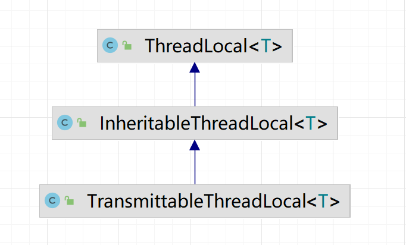

**高并发、微服务 、性能调优实战案例100讲，所有案例均源于个人工作实战，均配合代码落地**

加我微信：itsoku，所有案例均提供在线答疑。


# 第18节 ThreadLocal、InheritableThreadLocal、TransmittableThreadLocal

3个非常常用的工具类，很多地方和框架中都会用到，必须要掌握。

可能很多人并不知道他们怎么用，有什么区别，本文将通过5个案例代码，带大家搞定他们。


## 本文主要内容

1. ThreadLocal：在当前线程中共享数据的，JUC 中提供的
2. InheritableThreadLocal：也是JUC中的一个工具类，解决 ThreadLocal 难以解决的问题
3. TransmittableThreadLocal：阿里开源的一个工具类，解决上面2个ThreadLocal 难以搞定的问题

也就是一个比一个强，也不能这么说，而是各有各的使用场景。


## 带着问题看文章，效果更好

1. 这3个工具类，他们有什么区别？
2. 分别用来解决什么问题？
3. 用在什么场景下？

下面，通过5个案例了解他们的用法及区别。


## 案例1：ThreadLocal 可以在当前线程中共享数据

### 用法

在当前线程中，调用 ThreadLocal.set()可以向当前线程中存入数据，然后在当前线程的其他位置可以调用 ThreadLocal.get() 获取当刚才放入的数据。

要点： ThreadLocal.set() 和 ThreadLocal.get() 需要再同一个线程中执行。

### 案例代码

```java
//①：这里创建了一个 ThreadLocal
ThreadLocal<String> userNameTL = new ThreadLocal<>();

/**
 * ThreadLocal 可以在当前线程中存储数据
 * @throws InterruptedException
 */
@Test
public void threadLocalTest1() throws InterruptedException {
    //这里是主线程，将用户名放入 userNameTL 中
    userNameTL.set("张三");
    //在m1中，取上面放入用户名名，看看是不是张三？
    m1();

    //这里创建了线程 thread1，里面放入了李四，然后在m1中取出用户名，看看是不是李四?
    new Thread(() -> {
        userNameTL.set("李四");
        m1();
    }, "thread1").start();

    //这里创建了线程 thread2，里面放入了王五，然后在m1中取出用户名，看看是不是王五
    new Thread(() -> {
        userNameTL.set("王五");
        m1();
    }, "thread2").start();
    TimeUnit.SECONDS.sleep(1);
}

public void m1() {
    logger.info("userName:{}", userNameTL.get());
}
```

### 运行输出

```txt
17:13:40 [main] m1 - userName:张三
17:13:40 [thread1] m1 - userName:李四
17:13:41 [thread2] m1 - userName:王五
```

1. 主线程（线程名称：main）中放入了张三，取出来也是张三
2. 线程 thread1 中放入了李四，取出来也是李四
3. 线程 thread2 中放入了王五，取出来也是王五

### 结论

通过ThreadLocal可以在当前线程中共享数据，通过其set方法在当前线程中设置值，然后在当前线程的其他任何位置，都可以通过ThreadLocal的get方法获取到这个值。

### 原理

原理，可以这么理解：

当前线程有个Map，key就是ThreadLocal对象，value就是通过ThreadLocal.set方法放入的值，如下

```
当前线程.map.put(threadLocal对象,threadLocal.set的值);
```

然后通过这个map和threadLocal就可以取到值了，如下

```
当前线程.map.get(threadLocal对象);
```

原理大概就是这样，这样解释大家更容易懂。

源码实现上有些区别，源码中用的不是map，用的是个数组，不过原理类似的，有兴趣的可以去看下源码。


## 案例2：子线程是否可以获取ThreadLocal中的值呢？

### 代码

```java
@Test
public void threadLocalTest2() throws InterruptedException {
    //这里是主线程，ThreadLocal中设置了值：张三
    userNameTL.set("张三");
    logger.info("userName:{}", userNameTL.get());

    //创建了一个子线程thread1，在子线程中去ThreadLocal中拿值，能否拿到刚才放进去的“张三”呢？
    new Thread(() -> {
        logger.info("userName:{}", userNameTL.get());
    }, "thread1").start();

    TimeUnit.SECONDS.sleep(1);
}
```

### 执行输出

```txt
15:08:47 [main] threadLocalTest2 - userName:张三
15:08:47 [thread1] lambda$threadLocalTest2$2 - userName:null
```

子线程中没有拿到父线程中放进去的"张三"，说明ThreadLocal只能在当前线程中共享数据。

### 结论

子线程无法获取父线程ThreadLocal中的set数据。

通过上面2个案例，可知ThreadLocal生效的条件是：其set和get方法必须在同一个线程才能共享数据。

那么有没有方法解决这个问题呢？（父线程中set数据，子线程中可以get到这个数据的）

JUC中的工具类 InheritableThreadLocal 可以解决这个问题。


## 案例3：InheritableThreadLocal（子线程可以获取父线程中存放的数据）

### 代码

```java
// 这里定义了一个 InheritableThreadLocal 对象
private InheritableThreadLocal<String> userNameItl = new InheritableThreadLocal<>();

@Test
public void inheritableThreadLocal1() throws InterruptedException {
    //这里是主线程，使用 InheritableThreadLocal.set 放入值：张三
    userNameItl.set("张三");
    logger.info("userName:{}", userNameItl.get());

    //创建了一个子线程thread1，在子线程中去ThreadLocal中拿值，能否拿到刚才放进去的“张三”呢？
    new Thread(() -> {
        logger.info("userName:{}", userNameItl.get());
    }, "thread1").start();
    TimeUnit.SECONDS.sleep(1);
}
```

### 执行输出

```txt
19:35:48 [main] inheritableThreadLocal1 - userName:张三
19:35:48 [thread1] lambda$inheritableThreadLocal1$3 - userName:张三
```

### 结论

使用 InheritableThreadLocal ，子线程可以访问到父线程中通过InheritableThreadLocal.set进去的值。


## 案例4：InheritableThreadLocal：遇到线程池，会怎么样呢？

### 代码

```java
private InheritableThreadLocal<String> userNameItl = new InheritableThreadLocal<>();

@Test
public void inheritableThreadLocal2() throws InterruptedException {
    //为了看到效果，这里创建大小为1的线程池，注意这里为1才能方便看到效果
    ExecutorService executorService = Executors.newFixedThreadPool(1);

    //主线程中，放入了张三
    userNameItl.set("张三");
    logger.info("userName:{}", userNameItl.get());

    //在线程池中通过 InheritableThreadLocal 拿值，看看能否拿到 刚才放入的张三？
    executorService.execute(() -> {
        logger.info("第1次获取 userName:{}", userNameItl.get());
    });

    //这里稍微休眠一下，等待上面的任务结束
    TimeUnit.SECONDS.sleep(1);

    //这里又在主线程中放入了李四
    userNameItl.set("李四");
    logger.info("userName:{}", userNameItl.get());

    //这里又在线程池中通过 InheritableThreadLocal.get 方法拿值，看看能否拿到 刚才放入的李四？
    executorService.execute(() -> {
        //在线程池中通过 inheritableThreadLocal 拿值，看看能否拿到？
        logger.info("第2次获取 userName:{}", userNameItl.get());
    });

    TimeUnit.SECONDS.sleep(1);
}
```

### 执行输出

```java
20:52:03 [main] inheritableThreadLocal2 - userName:张三
20:52:03 [pool-1-thread-1] lambda$inheritableThreadLocal2$4 - 第1次获取 userName:张三
20:52:04 [main] inheritableThreadLocal2 - userName:李四
20:52:04 [pool-1-thread-1] lambda$inheritableThreadLocal2$5 - 第2次获取 userName:张三
```

### 分析下结果

从结果中看，线程池执行了2次任务，2次拿到的都是张三，和主线程第一次放入的值是一样的，而第二次主线程中放入的是李四啊，但是第二次线程池中拿到的却是张三，这是什么原因？

上面线程池的大小是1，也就是说这个线程池中只有一个线程，所以让线程池执行的2次任务用到的都是一个线程，从上面的日志中可以看到线程名称都是`pool-1-thread-1`，说明这两次任务，都是线程池中同一个线程执行的。

线程池中的线程是重复利用的，线程池中的`pool-1-thread-1`这个线程是什么时候创建的呢？谁创建的？他的父线程是谁？

1. 是主线程中第一次调用executorService.execute让线程池执行任务的时候，线程池发现当前线程数小于核心线程数，所以会创建一个线程
2. 他的父线程是谁？是创建他的线程，也就是执行第一次执行executorService.execute的线程，即主线程

子线程创建的时候，子线程会将父线程中InheritableThreadLocal的值复制一份到子线程的InheritableThreadLocal中，从上面代码中可以看到，父线程InheritableThreadLocal中第一次丢入的是张三，之后就调用线程池的execute方法执行任务，此时，会在线程池中创建子线程，这个子线程会将父线程中InheritableThreadLocal中设置的张三，复制到子线程的InheritableThreadLocal中，此时子线程中的用户名就是从父线程复制过来的，即：张三

复制之后，父子线程中的InheritableThreadLocal就没有关系了，父线程中InheritableThreadLocal的值再修改，也不会影响子线程中的值了，所以两次输出的都是张三。

### 存在的问题

InheritableThreadLocal 用在线程池上，会有问题，可能导致严重事故，这个一定要知道。

如何解决这个问题呢？

阿里的：TransmittableThreadLocal，这个就是为解决这个问题而来的。


## 案例4：TransmittableThreadLocal：解决线程池中不能够访问外部线程数据的问题

### 使用方法

需要引入maven配置

```xml
<dependency>
    <groupId>com.alibaba</groupId>
    <artifactId>transmittable-thread-local</artifactId>
    <version>2.14.3</version>
</dependency>
```

使用 TransmittableThreadLocal 代替 InheritableThreadLocal  和 ThreadLocal

线程池需要用 TtlExecutors.getTtlExecutorService 包裹一下，这个一定不要漏掉

```java
ExecutorService executorService = TtlExecutors.getTtlExecutorService(Executors.newFixedThreadPool(1));
```

### 示例代码

```java
TransmittableThreadLocal<String> userNameTtl = new TransmittableThreadLocal<String>();

@Test
public void transmittableThreadLocal1() throws InterruptedException {
    //为了看到效果，这里创建大小为1的线程池，注意这里为1才能方便看到效果
    ExecutorService executorService = Executors.newFixedThreadPool(1);

    //这里需要用 TtlExecutors.getTtlExecutorService 将原线程池包装下
    executorService = TtlExecutors.getTtlExecutorService(executorService);

    // 主线程中设置 张三
    userNameTtl.set("张三");
    logger.info("userName:{}", userNameTtl.get());

    //在线程池中通过 TransmittableThreadLocal 拿值，看看能否拿到 刚才放入的张三？
    executorService.execute(() -> {
        logger.info("第1次获取 userName:{}", userNameTtl.get());
    });
    TimeUnit.SECONDS.sleep(1);

    //这里放入了李四
    userNameTtl.set("李四");
    logger.info("userName:{}", userNameTtl.get());

    //在线程池中通过 TransmittableThreadLocal 拿值，看看能否拿到 刚才放入的李四？
    executorService.execute(() -> {
        //在线程池中通过 inheritableThreadLocal 拿值，看看能否拿到？
        logger.info("第2次获取 userName:{}", userNameTtl.get());
    });
    
    TimeUnit.SECONDS.sleep(1);
}
```

## 执行输出

```java
20:02:28 [main] transmittableThreadLocal1 - userName:张三
20:02:28 [pool-1-thread-1] lambda$transmittableThreadLocal1$6 - 第1次获取 userName:张三
20:02:29 [main] transmittableThreadLocal1 - userName:李四
20:02:29 [pool-1-thread-1] lambda$transmittableThreadLocal1$7 - 第2次获取 userName:李四
```

这次没问题了，使用阿里的TransmittableThreadLocal，在线程池中，可以正常访问外部线程中的数据了。


## 这3个工具类的关系（继承关系）




## 源码

源码同样是放在我的《高并发&微服务&性能调优实战案例100讲》的代码中（lesson018模块中），有兴趣的可以点击左下角的小黄车了解下，感谢大家的观看。


# 高并发 & 微服务 & 性能调优实战案例100讲

## 已更新 18 节课

<span style="font-weight:bold; color:red">目前整个课程59块钱，一杯咖啡的价格，还没下手的朋友，赶紧了，马上要涨价了</span>。

```java
1. 分片上传实战
2. 通用并发处理工具类实战
3. 实现一个好用接口性能压测工具类
4. 超卖问题的4种解决方案，也是防止并发修改数据出错的通用方案
5. Semaphore实现接口限流实战
6. 并行查询，优化接口响应速度实战
7. 接口性能优化之大事务优化
8. 通用的Excel动态导出功能实战
9. 手写线程池管理器，管理&监控所有线程池
10. 动态线程池
11. 使用SpringBoot实现动态Job实战
12. 并行查询，性能优化利器，可能有坑
13. 幂等的4种解决方案，吃透幂等性问题
14. 接口通用返回值设计与实现
15. 接口太多，各种dto、vo不计其数，如何命名？
16. 复杂业务，如何传参？
17. 接口报错，如何快速定位日志？
18. ThreadLocal、InheritableThreadLocal、TransmittableThreadLocal
```


## 课程部分大纲，连载中。。。。

以下课程均来源于个人多年的实战，均提供原理讲解 && 源码落地

<span style="font-weight:bold; color:red">目前整个课程59块钱，一杯咖啡的价格，还没下手的朋友，赶紧了，马上要涨价了</span>。

1. 分片上传实战
2. 通用并发处理工具类实战
3. 实现一个好用接口性能压测工具类
4. 超卖问题的4种解决方案，也是防止并发修改数据出错的通用方案
5. Semaphore实现接口限流实战
6. 并行查询，优化接口响应速度实战
7. 接口性能优化之大事务优化
8. 通用的Excel动态导出功能实战
9. 手写线程池管理器，管理&监控所有线程池
10. 动态线程池
11. 使用SpringBoot实现动态Job实战
12. 并行查询，性能优化利器，可能有坑
13. 幂等的4种解决方案，吃透幂等性问题
14. 接口通用返回值设计与实现
15. 接口太多，各种dto、vo不计其数，如何命名？
16. 一个业务太复杂了，方法太多，如何传参？
17. 接口报错，如何快速定位日志？
18. ThreadLocal、InheritableThreadLocal、TransmittableThreadLocal
19. AOP实战接口日志打印功能
20. 大批量任务处理常见的方案（模拟余额宝发放收益）
21. AOP实现业务操作日志记录功能
22. AOP实现MyBatis分页功能
23. SpringBoot读写分离实战
24. MQ专题：事务消息实战（防止消息丢失）
25. MQ专题：消息消息重试策略
26. MQ专题：消息幂等消费通用方案实战
27. MQ专题：延迟消息通用方案实战
28. MQ专题：顺序消息通用方案实战
29. MQ专题：消息积压问题
30. 分布式事务：使用事务消息实现事务最终一致性
31. 分布式事务：通用的TCC分布式事务生产级代码落地实战
32. 分布式锁案例实战
33. 微服务中如何传递上下文？实战
34. 微服务链路日志追踪实战（原理&代码落地）
35. SpringBoot实现租户数据隔离
36. MyBatis进阶：封装MyBatis，实现通用的无SQL版CRUD功能，架构师必备
37. MyBatis进阶：自己实现通用分表功能，架构师必备
38. MyBatis进阶：实现多租户隔离ORM框架
39. SpringBoot中实现自动监听PO的变化，自动生成表结构
40. 分布式专题：其他实战课程等
41. 性能调优：如何排查死锁？
42. 性能调优：如何排查内存溢出？
43. 性能调优：CPU被打满，如何排查？
44. 性能调优：生产代码没生效，如何定位？
45. 性能调优：接口太慢，如何定位？
46. 性能调优：如何查看生产上接口的入参和返回值？
47. 性能调优：远程debug
48. 生产上出现了各种故障，如何定位？
49. db和缓存一致性，常见的方案
50. redis一些使用场景案例。。。
51. 系统资金账户设计案例（一些系统涉及到资金操作）
52. 其他等各种实战案例。。。

