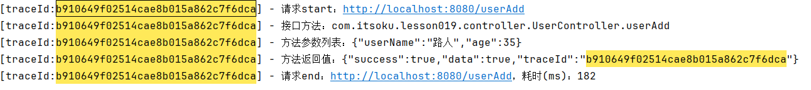
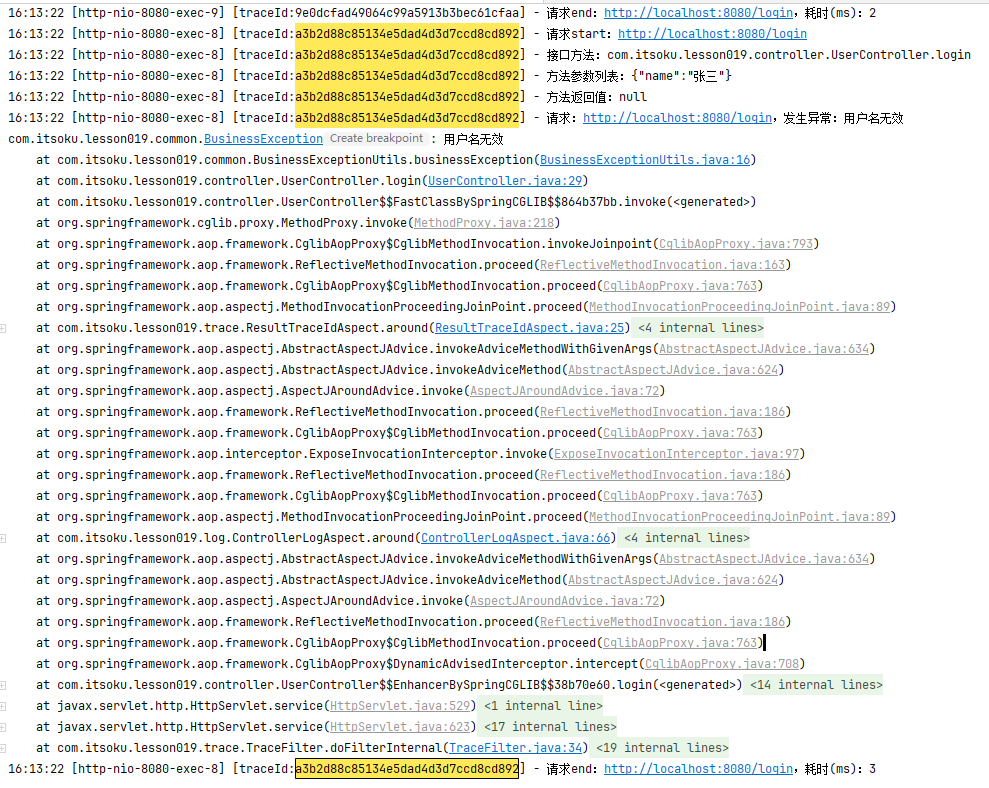

**高并发、微服务 、性能调优实战案例100讲，所有案例均源于个人工作实战，均配合代码落地**

加我微信：itsoku，所有案例均提供在线答疑。


# 第19节 通过AOP统一打印请求链路日志，排错效率飞升

看过本文并实施之后，解决问题的效率将大幅提升。

<span style="color:red; font-weight:bold">案例代码和文档，同样是放在我的《高并发 & 微服务 & 性能调优案例实战100讲中》，有需要的小伙伴，可以点击左下角小黄车下单后获取</span>。


## 思考一个问题：当一个接口报错的时候，如何能够快速定位问题？

如果能够满足下面这些条件，咱们就可以快速定位错误

1. 能够快速找到接口的详细调用日志
2. 日志中最好知道出错的是哪个接口的哪个方法，即哪个controller的哪个方法
3. 日志中最好有接口的入参、返参
4. 日志中含有异常的详细堆栈信息（即：哪行代码报的错）

有了这些信息之后，解决问题的效率将大幅提升。

本文就是帮你解决这些问题。


## 下面，先带大家看效果，再看代码如何实现

### 启动案例

```java
com.itsoku.lesson019.Lesson019Application
```

### 访问一个正常的接口

```http
http://localhost:8080/userAdd?userName=路人&age=35&password=123456
```

### 先看下接口的返回值，里面有个traceId

```json
{
  "success": true,
  "data": true,
  "msg": null,
  "code": null,
  "traceId": "b910649f02514cae8b015a862c7f6dca"
}
```

### 拿着这个traceId的值，可以找到这个请求完整的日志

看后端控制台，通过traceId的值去检索，如下，可以看到接口的详细执行日志，包含（接口url、开始时间、结束时间、及处理这个请求的controller和方法、还有方法的入参、返回值，都输出了），前端给我们这个traceId，我们便可以快速定位到这个请求的完整调用日志。



### 再来看请求一个异常的接口，浏览器中打开下面地址

```http
http://localhost:8080/login?name=张三
```

### 浏览器中显示如下，可以看出接口报错了

```json
{
  "success": false,
  "data": null,
  "msg": "用户名无效",
  "code": null,
  "traceId": "a3b2d88c85134e5dad4d3d7ccd8cd892"
}
```

### 我们可以拿着上面的traceId的值，去后端控制台找对应的日志，看到的结果如下



## 源码解析

### ControllerLogAspect：打印接口的详细日志

### TraceFilter：生成唯一的traceId，日志中会输出这个tracId

### ResultTraceIdAspect：将traceId统一丢到响应结果Result类的traceId字段中


## 源码

源码同样是放在我的《高并发&微服务&性能调优实战案例100讲》的代码中（lesson019模块中），有兴趣的可以点击左下角的小黄车了解下，感谢大家的观看。


## 下节内容

大批量任务处理常见的方案，会（模拟余额宝发放收益）这个场景。


# 高并发 & 微服务 & 性能调优实战案例100讲

## 已更新 19 节课

<span style="font-weight:bold; color:red">目前整个课程59块钱，一杯咖啡的价格，还没下手的朋友，赶紧了，马上要涨价了</span>。

```java
1. 分片上传实战
2. 通用并发处理工具类实战
3. 实现一个好用接口性能压测工具类
4. 超卖问题的4种解决方案，也是防止并发修改数据出错的通用方案
5. Semaphore实现接口限流实战
6. 并行查询，优化接口响应速度实战
7. 接口性能优化之大事务优化
8. 通用的Excel动态导出功能实战
9. 手写线程池管理器，管理&监控所有线程池
10. 动态线程池
11. 使用SpringBoot实现动态Job实战
12. 并行查询，性能优化利器，可能有坑
13. 幂等的4种解决方案，吃透幂等性问题
14. 接口通用返回值设计与实现
15. 接口太多，各种dto、vo不计其数，如何命名？
16. 复杂业务，如何传参？
17. 接口报错，如何快速定位日志？
18. ThreadLocal、InheritableThreadLocal、TransmittableThreadLocal
19. 通过AOP统一打印请求链路日志，排错效率飞升
```


## 课程部分大纲，连载中。。。。

以下课程均来源于个人多年的实战，均提供原理讲解 && 源码落地

<span style="font-weight:bold; color:red">目前整个课程59块钱，一杯咖啡的价格，还没下手的朋友，赶紧了，马上要涨价了</span>。

1. 分片上传实战
2. 通用并发处理工具类实战
3. 实现一个好用接口性能压测工具类
4. 超卖问题的4种解决方案，也是防止并发修改数据出错的通用方案
5. Semaphore实现接口限流实战
6. 并行查询，优化接口响应速度实战
7. 接口性能优化之大事务优化
8. 通用的Excel动态导出功能实战
9. 手写线程池管理器，管理&监控所有线程池
10. 动态线程池
11. 使用SpringBoot实现动态Job实战
12. 并行查询，性能优化利器，可能有坑
13. 幂等的4种解决方案，吃透幂等性问题
14. 接口通用返回值设计与实现
15. 接口太多，各种dto、vo不计其数，如何命名？
16. 一个业务太复杂了，方法太多，如何传参？
17. 接口报错，如何快速定位日志？
18. ThreadLocal、InheritableThreadLocal、TransmittableThreadLocal
19. AOP实战接口日志打印功能
20. 大批量任务处理常见的方案（模拟余额宝发放收益）
21. AOP实现业务操作日志记录功能
22. AOP实现MyBatis分页功能
23. SpringBoot读写分离实战
24. MQ专题：事务消息实战（防止消息丢失）
25. MQ专题：消息消息重试策略
26. MQ专题：消息幂等消费通用方案实战
27. MQ专题：延迟消息通用方案实战
28. MQ专题：顺序消息通用方案实战
29. MQ专题：消息积压问题
30. 分布式事务：使用事务消息实现事务最终一致性
31. 分布式事务：通用的TCC分布式事务生产级代码落地实战
32. 分布式锁案例实战
33. 微服务中如何传递上下文？实战
34. 微服务链路日志追踪实战（原理&代码落地）
35. SpringBoot实现租户数据隔离
36. MyBatis进阶：封装MyBatis，实现通用的无SQL版CRUD功能，架构师必备
37. MyBatis进阶：自己实现通用分表功能，架构师必备
38. MyBatis进阶：实现多租户隔离ORM框架
39. SpringBoot中实现自动监听PO的变化，自动生成表结构
40. 分布式专题：其他实战课程等
41. 性能调优：如何排查死锁？
42. 性能调优：如何排查内存溢出？
43. 性能调优：CPU被打满，如何排查？
44. 性能调优：生产代码没生效，如何定位？
45. 性能调优：接口太慢，如何定位？
46. 性能调优：如何查看生产上接口的入参和返回值？
47. 性能调优：远程debug
48. 生产上出现了各种故障，如何定位？
49. db和缓存一致性，常见的方案
50. redis一些使用场景案例。。。
51. 系统资金账户设计案例（一些系统涉及到资金操作）
52. 其他等各种实战案例。。。

