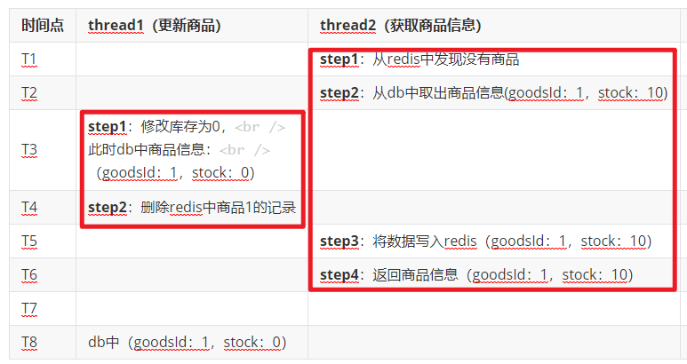

**高并发、微服务 、性能调优实战案例100讲，所有案例均源于个人工作实战，均配合代码落地**

加我微信：itsoku，所有案例均提供在线答疑。

# 第22节 MySql和Redis数据一致性

## 背景

假如我们有个电商系统，为了提升商品详情页访问速度，我们使用redis来缓存商品信息，提升效率。

获取商品信息，先从redis中获取，如果没有，则从db中获取后丢到redis，然后返回。

而后台又可以修改商品的信息，这时如何确保redis和缓存数据一致呢？

即：如何确保通过商品详情接口返回的数据和db中的数据是一致的？


## 方案1

### 准备一张表：商品表（t_goods）

| 字段    | 类型 | 说明   |
| ------- | ---- | ------ |
| goodsId | int  | 商品id |
| stock   | int  | 库存   |

### 获取商品详情接口逻辑

```
step1：先从redis中获取，若能获取到，则直接返回，若没有继续向下
step2：从db中获取出商品信息
step3：放入redis
step4：返回商品信息
```

### 后台更新商品逻辑

```java
step1：更新商品到db
step2：删除redis中的对应的商品记录
```

### 预期

预期并发情况下，数据库中和redis中的数据应该是一致的，即看到的商品信息应该是一致的，比如db中库存是10，那么通过商品详情接口获取到的一定也是10。

### 验证

下面咱们来验证下，并发情况下，是否能够达到预期。

假如现在商品1的库存是10，下面模拟3个线程同时对商品1进行操作

| 时间点 | thread1（执行更新商品）                                      | thread2（调用获取商品信息接口）                      | thread3(调用获取商品信息接口)                    |
| ------ | ------------------------------------------------------------ | ---------------------------------------------------- | ------------------------------------------------ |
| T1     |                                                              | **step1**：从redis中发现没有商品                     |                                                  |
| T2     |                                                              | **step2**：从db中取出商品信息(goodsId：1，stock：10) |                                                  |
| T3     | **step1**：修改库存为0，<br />此时db中商品信息：<br />（goodsId：1，stock：0） |                                                      |                                                  |
| T4     | **step2**：删除redis中商品1的记录                            |                                                      |                                                  |
| T5     |                                                              | **step3**：将数据写入redis（goodsId：1，stock：10）  |                                                  |
| T6     |                                                              | **step4**：返回商品信息（goodsId：1，stock：10）     |                                                  |
| T7     |                                                              |                                                      | **step1**：从redis获取商品信息，此时缓存中有数据 |
| T8     |                                                              |                                                      | **step2**：返回商品信息（goodId：1，stock：10）  |

此时db中的数据和redis的数据并不是一致的。


## 方案2

## 如何解决这个问题

这个问题，大家应该看到很多相关的文章，比如提到的双删，双删可以最大限度的解决这个问题，但是极端情况下没有解决这个问题。

还有根据binlog更新缓存、通过MQ更新缓存，但是binlog的日志、mq的日志还未消费的这个时间段内，通过详情接口获取的数据可能和db中是不一致的，短暂的不一致，如果可以接受短暂的不一致，可以使用这两种方法。

下面给大家介绍一种可以实现强一致的方案，让详情接口返回的数据和db的商品数据是强一致的。


先分析下，导致这个不一致的原因，定位原因，解决方案就容易了。

如下图，主要是下图红框中的2个部分出现了并行导致的，如果让他们排队执行，这个问题是不是就化解了？



如何让他们排队执行呢？加互斥锁，即其中一个在执行的时候，另一个需要等待，等前一个执行完毕之后，后一个才能执行。

由于我们的系统是集群部署的，所以需要分布式锁，这里我们我们使用数据的锁来解决这个问题。

下面带大家看下怎么实现的。

### 商品更新逻辑调整如下

大家先看下，重点在于step3，这里会对这条商品记录for update，如果有其他线程同样执行这个sql的时候，会等待，一直等待下面这个事务执行完毕才能继续。

```java
step1：开启数据库事务
step2：更新商品信息到db
step3：select * from t_goods where t_goods = #{goodsId} for update;
step4：删除redis中的对应的商品记录
step5：提交数据库事务
```

### 获取商品信息的接口调整如下

```java
step1：通过商品id，从redis中查询商品信息，如果可以找到，直接返回，否则继续向下
step2：开启数据库事务
step3：获取商品信息，获取的sql：select * from t_goods where t_goods = #{goodsId} for update;
step4：将商品信息写入redis
step5：提交事务
```

这样如果商品信息在更新过程中，还没有提交事务的时候，此时如果有其他线程来获取商品信息，会走到获取商品信息接口的step3，这个地方会执行for update，会等待，等待商品更新的事务提交后，才能继续。


## 总结

从这个方案中，我们可以看出，并发问题看似比较复杂，但是将其转换为顺序执行，可能看似很复杂的问题，就被解决了。


# 高并发 & 微服务 & 性能调优实战案例100讲

## 已更新 22 节课

<span style="font-weight:bold; color:red">目前整个课程59块钱，一杯咖啡的价格，还没下手的朋友，赶紧了，马上要涨价了</span>。

```java
1. 分片上传实战
2. 通用并发处理工具类实战
3. 实现一个好用接口性能压测工具类
4. 超卖问题的4种解决方案，也是防止并发修改数据出错的通用方案
5. Semaphore实现接口限流实战
6. 并行查询，优化接口响应速度实战
7. 接口性能优化之大事务优化
8. 通用的Excel动态导出功能实战
9. 手写线程池管理器，管理&监控所有线程池
10. 动态线程池
11. SpringBoot实现动态Job实战
12. 并行查询，性能优化利器，可能有坑
13. 幂等的4种解决方案，吃透幂等性问题
14. 接口通用返回值设计与实现
15. 接口太多，各种dto、vo不计其数，如何命名？
16. 一个业务太复杂了，方法太多，如何传参？
17. 接口报错，如何快速定位日志？
18. 线程数据共享必学的3个工具类：ThreadLocal、InheritableThreadLocal、TransmittableThreadLocal
19. 通过AOP统一打印请求链路日志，排错效率飞升
20. 大批量任务处理常见的方案（模拟余额宝发放收益）
21. 并发环境下，如何验证代码是否正常？
22. MySql和Redis数据一致性
```


## 课程部分大纲，连载中。。。。

以下课程均来源于个人多年的实战，均提供原理讲解 && 源码落地

<span style="font-weight:bold; color:red">目前整个课程59块钱，一杯咖啡的价格，还没下手的朋友，赶紧了，马上要涨价了</span>。

1. 分片上传实战
2. 通用并发处理工具类实战
3. 实现一个好用接口性能压测工具类
4. 超卖问题的4种解决方案，也是防止并发修改数据出错的通用方案
5. Semaphore实现接口限流实战
6. 并行查询，优化接口响应速度实战
7. 接口性能优化之大事务优化
8. 通用的Excel动态导出功能实战
9. 手写线程池管理器，管理&监控所有线程池
10. 动态线程池
11. SpringBoot实现动态Job实战
12. 并行查询，性能优化利器，可能有坑
13. 幂等的4种解决方案，吃透幂等性问题
14. 接口通用返回值设计与实现
15. 接口太多，各种dto、vo不计其数，如何命名？
16. 一个业务太复杂了，方法太多，如何传参？
17. 接口报错，如何快速定位日志？
18. 线程数据共享必学的3个工具类：ThreadLocal、InheritableThreadLocal、TransmittableThreadLocal
19. 通过AOP统一打印请求链路日志，排错效率飞升
20. 大批量任务处理常见的方案（模拟余额宝发放收益）
21. 并发环境下，如何验证代码是否正常？
22. MySql和Redis数据一致性
23. SpringBoot接口返回值脱敏
24. AOP实现业务操作日志记录功能
25. AOP实现MyBatis分页功能
26. SpringBoot读写分离实战
27. MQ专题：事务消息实战（防止消息丢失）
28. MQ专题：消息消息重试策略
29. MQ专题：消息幂等消费通用方案实战
30. MQ专题：延迟消息通用方案实战
31. MQ专题：顺序消息通用方案实战
32. MQ专题：消息积压问题
33. 分布式事务：事务消息实现事务最终一致性
34. 分布式事务：通用的TCC分布式事务生产级代码落地实战
35. 分布式锁案例实战
36. 微服务中如何传递上下文？实战
37. 微服务链路日志追踪实战（原理&代码落地）
38. SpringBoot实现租户数据隔离
39. MyBatis进阶：封装MyBatis，实现通用的无SQL版CRUD功能，架构师必备
40. MyBatis进阶：自己实现通用分表功能，架构师必备
41. MyBatis进阶：实现多租户隔离ORM框架
42. SpringBoot中实现自动监听PO的变化，自动生成表结构
43. 分布式专题：其他实战课程等
44. 性能调优：如何排查死锁？
45. 性能调优：如何排查内存溢出？
46. 性能调优：CPU被打满，如何排查？
47. 性能调优：生产代码没生效，如何定位？
48. 性能调优：接口太慢，如何定位？
49. 性能调优：如何查看生产上接口的入参和返回值？
50. 性能调优：远程debug
51. 生产上出现了各种故障，如何定位？
52. db和缓存一致性，常见的方案
53. Redis场景案例。。。
54. 系统资金账户设计案例（一些系统涉及到资金操作）
55. 其他等各种实战案例。。。