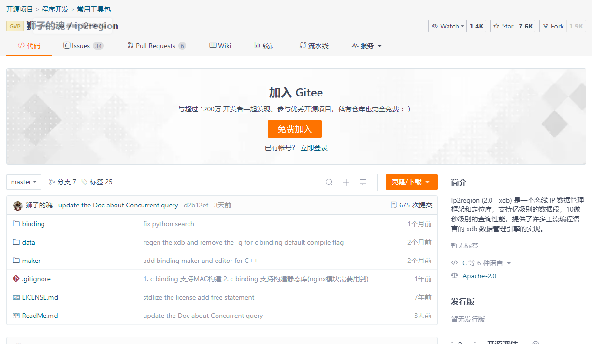

**高并发、微服务 、性能调优实战案例100讲，所有案例均源于个人工作实战，均配合代码落地**

加我微信：itsoku，所有案例均提供在线答疑。

# 第24节 一行代码搞定系统操作日志

<span style="font-weight:bold; color:red">目前整个课程59块钱，100个案例，含所有源码 & 文档 & 技术支持，可点击左下角小黄车了解</span>。

## 本文内容

通过aop统一记录系统操作日志，只需在接口方法上加个自定义的注解，不论接口成功还是失败，都可自动记录操作日志到db中。

操作日志包含的信息有

- 日志描述
- 状态，0：异常，1：正常
- 请求参数json格式
- 响应结果json格式
- 错误信息(状态=0时，记录异常堆栈信息)
- 接口耗时（毫秒）
- 操作ip地址
- 操作ip地址归属地
- 操作人用户名
- 操作时间


## 涉及到的技术

- SpringBoot 2.7.13
- MyBatis Plus
- MySQL
- ip2region：准确率99.9%的离线IP地址定位库，用于获取ip归属地


## 先带大家看下效果

- 启动应用：com.itsoku.lesson024.Lesson024Application

- 接口代码：com.itsoku.lesson024.controller.UserController

- 测试用例代码：UserController.http


## 源码解析

### 操作日志表

```sql
create table if not exists t_oper_log_lesson024
(
    id              varchar(50) primary key comment 'id，主键',
    log             varchar(500) not null comment '操作日志',
    status          smallint     not null default 1 comment '状态，0：异常，1：正常',
    param_json      text comment '请求参数json',
    result_json     text comment '响应结果json',
    error_msg       text comment '错误信息(status=0时，记录错误信息)',
    cost_time       long comment '耗时（毫秒）',
    oper_ip         varchar(50) comment '操作ip地址',
    oper_ip_address varchar(50) comment '操作ip地址归属地',
    oper_user_name  varchar(50) comment '操作人用户名',
    oper_time       datetime comment '操作时间'
) comment '操作日志表';
```

### 自定义注解

用于标注在Controller中需要记录操作日志的方法上。

```java
@Target(ElementType.METHOD)
@Retention(RetentionPolicy.RUNTIME)
public @interface OperLog {
    //日志内容
    String log();
}
```

### 记录日志切面类

> 使用环绕通知，会拦截所有controller中标注有@OperLog注解的方法，会对这些方法记录日志，不管方法是成功还是失败都会记录

```java
com.itsoku.lesson024.log.OperLogAspect
```

### 如何使用？

接口上标注@OprLog就可以了

```java
@PostMapping("/add")
@OperLog(log = "用户管理-新增用户")
public Result<String> add(@Validated @RequestBody UserAddRequest req) {
    return ResultUtils.success(this.userService.add(req));
}
```

## 其他一些技术点

### 操作日志中如何获取到操作人用户名的？

如下，咱们定义了一个接口，接口中有2个方法，一个用户设置用户名，一个用于获取用户名

```java
public interface IUserNameProvider {
    /**
     * 获取用户名
     *
     * @return
     */
    String getUserName();

    /**
     * 设置用户名
     *
     * @param userName
     */
    void setUserName(String userName);
}
```

这个接口有个默认实现，是将用户名放在ThreadLocal中，大家可以根据自己的项目情况，去自己实现一个IUserNameProvider

```java
@Component
public class ThreadLocalUserNameProvider implements IUserNameProvider {
    private ThreadLocal<String> userNameTl = new ThreadLocal<>();

    @Override
    public String getUserName() {
        return this.userNameTl.get();
    }

    @Override
    public void setUserName(String userName) {
        this.userNameTl.set(userName);
    }
}
```

那么这个用户名什么时候放进去的呢？代码如下，咱们搞了个拦截器，拦截请求，从请求中我们可以想办法拿到用户名，然后将其塞到IUserNameProvider中，这样记录操作日志的aop中，就可以通过IUserNameProvider获取到了。

```java
@Component
public class UserNameInterceptor implements HandlerInterceptor {
    @Autowired
    private IUserNameProvider userNameProvider;

    @Override
    public boolean preHandle(HttpServletRequest request, HttpServletResponse response, Object handler) throws Exception {
        //这里从请求中得到用户名，然后塞到userNameProvider中
        String userName = "路人";
        this.userNameProvider.setUserName(userName);
        return HandlerInterceptor.super.preHandle(request, response, handler);
    }
}
```


### ip地址如何获取的？

这里我们提供了一个工具类，可以通过请求拿到ip，具体代码在下面这个位置

```java
com.itsoku.lesson024.ip.IpUtils#getIpAddr()
```


### ip归属地如何获取的？

对应的方法在下面这个位置，传入ip，可以获取到ip对应的归属地。

```java
com.itsoku.lesson024.ip.IpAddressUtils#getRegion
```

这里使用了开源的一个工具：ip2region，准确率99.9%的离线IP地址定位库

项目地址：https://gitee.com/lionsoul/ip2region




## 案例源码

源码同样是放在我的《高并发&微服务&性能调优实战案例100讲》的代码中（lesson024模块中），有兴趣的可以点击左下角的小黄车了解下，感谢大家的观看。


# 高并发 & 微服务 & 性能调优实战案例100讲

## 已更新 24 节课

<span style="font-weight:bold; color:red">目前整个课程59块钱，含所有源码 & 文档 & 技术支持，一杯咖啡的价格，还没下手的朋友，赶紧了，马上要涨价了</span>。

```java
1. 分片上传实战
2. 通用并发处理工具类实战
3. 实现一个好用接口性能压测工具类
4. 超卖问题的4种解决方案，也是防止并发修改数据出错的通用方案
5. Semaphore实现接口限流实战
6. 并行查询，优化接口响应速度实战
7. 接口性能优化之大事务优化
8. 通用的Excel动态导出功能实战
9. 手写线程池管理器，管理&监控所有线程池
10. 动态线程池
11. SpringBoot实现动态Job实战
12. 并行查询，性能优化利器，可能有坑
13. 幂等的4种解决方案，吃透幂等性问题
14. 接口通用返回值设计与实现
15. 接口太多，各种dto、vo不计其数，如何命名？
16. 一个业务太复杂了，方法太多，如何传参？
17. 接口报错，如何快速定位日志？
18. 线程数据共享必学的3个工具类：ThreadLocal、InheritableThreadLocal、TransmittableThreadLocal
19. 通过AOP统一打印请求链路日志，排错效率飞升
20. 大批量任务处理常见的方案（模拟余额宝发放收益）
21. 并发环境下，如何验证代码是否正常？
22. MySql和Redis数据一致性
23. SpringBoot数据脱敏优雅设计与实现
24. 一行代码搞定系统操作日志
```


## 课程部分大纲，连载中。。。。

以下课程均来源于个人多年的实战，均提供原理讲解 && 源码落地

1. 分片上传实战
2. 通用并发处理工具类实战
3. 实现一个好用接口性能压测工具类
4. 超卖问题的4种解决方案，也是防止并发修改数据出错的通用方案
5. Semaphore实现接口限流实战
6. 并行查询，优化接口响应速度实战
7. 接口性能优化之大事务优化
8. 通用的Excel动态导出功能实战
9. 手写线程池管理器，管理&监控所有线程池
10. 动态线程池
11. SpringBoot实现动态Job实战
12. 并行查询，性能优化利器，可能有坑
13. 幂等的4种解决方案，吃透幂等性问题
14. 接口通用返回值设计与实现
15. 接口太多，各种dto、vo不计其数，如何命名？
16. 一个业务太复杂了，方法太多，如何传参？
17. 接口报错，如何快速定位日志？
18. 线程数据共享必学的3个工具类：ThreadLocal、InheritableThreadLocal、TransmittableThreadLocal
19. 通过AOP统一打印请求链路日志，排错效率飞升
20. 大批量任务处理常见的方案（模拟余额宝发放收益）
21. 并发环境下，如何验证代码是否正常？
22. MySql和Redis数据一致性
23. SpringBoot数据脱敏优雅设计与实现
24. 一行代码搞定系统操作日志
25. AOP实现MyBatis分页功能
26. SpringBoot读写分离实战
27. MQ专题：事务消息实战（防止消息丢失）
28. MQ专题：消息消息重试策略
29. MQ专题：消息幂等消费通用方案实战
30. MQ专题：延迟消息通用方案实战
31. MQ专题：顺序消息通用方案实战
32. MQ专题：消息积压问题
33. 分布式事务：事务消息实现事务最终一致性
34. 分布式事务：通用的TCC分布式事务生产级代码落地实战
35. 分布式锁案例实战
36. 微服务中如何传递上下文？实战
37. 微服务链路日志追踪实战（原理&代码落地）
38. SpringBoot实现租户数据隔离
39. MyBatis进阶：封装MyBatis，实现通用的无SQL版CRUD功能，架构师必备
40. MyBatis进阶：自己实现通用分表功能，架构师必备
41. MyBatis进阶：实现多租户隔离ORM框架
42. SpringBoot中实现自动监听PO的变化，自动生成表结构
43. 分布式专题：其他实战课程等
44. 性能调优：如何排查死锁？
45. 性能调优：如何排查内存溢出？
46. 性能调优：CPU被打满，如何排查？
47. 性能调优：生产代码没生效，如何定位？
48. 性能调优：接口太慢，如何定位？
49. 性能调优：如何查看生产上接口的入参和返回值？
50. 性能调优：远程debug
51. 生产上出现了各种故障，如何定位？
52. db和缓存一致性，常见的方案
53. Redis场景案例。。。
54. 系统资金账户设计案例（一些系统涉及到资金操作）
55. 其他等各种实战案例。。。