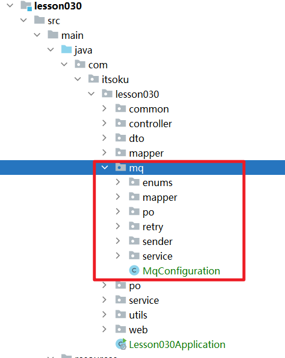

**高并发、微服务 、性能调优实战案例100讲，所有案例均源于个人工作实战，均配合代码落地**

加我微信：itsoku，所有案例均提供在线答疑。


# 第30节 MQ专题-手把手教你，落地事务消息代码

视频有点长，请大家耐心看完，涉及到大量代码，面试和工作中都会用到。

<span style="font-weight:bold; color:red">目前整个课程59块钱，100个案例，含所有源码 & 文档 & 技术支持，可点击左下角小黄车了解</span>


## 本文主要内容

1. 事务消息代码落地，可直接拿去使用
2. 若消息投递到MQ失败，会由Job进行补偿，衰减式自动重试


## 回顾下事务消息

### 什么是事务消息？

事务消息是投递消息的一种方式，可以确保业务执行成功，消息一定会投递成功。

### 需要在业务本地库创建一个消息表(t_msg)

```sql
create table if not exists t_msg
(
    id              varchar(32) not null primary key comment '消息id',
    body_json       text        not null comment '消息体,json格式',
    status          smallint    not null default 0 comment '消息状态，0：待投递到mq，1：投递成功，2：投递失败',
    fail_msg        text comment 'status=2 时，记录消息投递失败的原因',
    fail_count      int         not null default 0 comment '已投递失败次数',
    send_retry      smallint    not null default 1 comment '投递MQ失败了，是否还需要重试？1：是，0：否',
    next_retry_time datetime comment '投递失败后，下次重试时间',
    create_time     datetime comment '创建时间',
    update_time     datetime comment '最近更新时间',
    key idx_status (status)
) comment '本地消息表'
```

### 事务消息投递的过程

- **step1**：开启本地事务
- **step2**：执行本地业务
- **step3**：消息表t_msg写入记录，status为0（待投递到MQ）
- **step4**：提交本地事务
- **step5**：若事务提交成功，则投递消息到MQ，然后将t_msg中的status置为1（投递成功）；本地事务失败的情况不用考虑，此时消息记录也没有写到db中

### 异常情况

step5失败了，其他步骤都成功，此时业务执行成功，但是消息投递失败了，此时需要有个job来进行补偿，对于投递失败的消息进行重试。

### 消息投递补偿job

这个job负责从本地t_msg表中查询出状态为0记录或者失败需要重试的记录，然后进行重新投递到MQ。

对于投递失败的，采用衰减的方式进行重试，比如第1次失败了，则10秒后，继续重试，若还是失败，则再过20秒，再次重试，需要设置一个最大重试次数，最终还是投递失败，则需要告警+人工干预。

本文将上面这些过程，都进行代码落地。


## 同样，还是先看效果

我们会模拟用户注册的一个操作，用户注册成功后，需要给MQ发送一条用户注册的消息，其他服务可能会用到这条消息。

### 准备db初始化脚本

lesson030/src/main/resources/db/init.sql，此文件在当前案例应用启动的时候会自动执行

```sqlite
-- 创建用户表
drop table if exists t_user_lesson030;
create table if not exists t_user_lesson030
(
    id   varchar(32) not null primary key comment '用户id',
    name varchar(500) not null comment '用户名'
) comment '用户表';

-- 创建本地消息表
drop table if exists t_msg_lesson030;
create table if not exists t_msg_lesson030
(
    id              varchar(32) not null primary key comment '消息id',
    body_json       text        not null comment '消息体,json格式',
    status          smallint    not null default 0 comment '消息状态，0：待投递到mq，1：投递成功，2：投递失败',
    fail_msg        text comment 'status=0时，记录消息投递失败的原因',
    fail_count      int         not null default 0 comment '已投递失败次数',
    send_retry      smallint    not null default 1 comment '投递MQ失败了，是否还需要重试？1：是，0：否',
    next_retry_time datetime comment '投递失败后，下次重试时间',
    create_time     datetime comment '创建时间',
    update_time     datetime comment '最近更新时间',
    key idx_status (status)
) comment '本地消息表';
```

### 启动SpringBoot应用

```
Lesson030Application
```

### 案例1、演示正常情况：用户注册成功，消息投递成功

#### 接口代码

```java
com.itsoku.lesson030.controller.UserController#register
```

#### 测试代码

```http
### 1、演示正常情况：用户注册成功，消息投递成功
POST http://localhost:8080/user/register
Accept: application/json
Content-Type: application/json

{
  "name": "路人"
}
```

#### 观察控制台以及db中数据的变化

- 控制台可以看到消息投递成功了
- db中也可以看到用户表（t_user）新增了一条记录，消息表（t_msg）也新增了一条投递成功的记录


### 案例2、演示业务执行失败，消息不会投递

#### 接口代码

```java
com.itsoku.lesson030.controller.UserController#registerError
```

#### 测试代码

```http
### 2、演示业务异常情况：用户注册的事务中有异常，消息投递会被自动取消
POST http://localhost:8080/user/registerError
Accept: application/json
Content-Type: application/json

{
  "name": "路人"
}
```

#### 观察控制台以及db中数据的变化

- 控制台看可以到有异常发生，且消息没有投递
- db中用户表没有记录、消息表也没有记录


### 案例3：演示投递到MQ失败，则由job会自动重试

#### 接口代码

```java
com.itsoku.lesson030.controller.UserController#register
```

#### 测试代码

```http
### 3、演示投递到MQ失败，则由job会自动重试（我们在消息投递的地方，故意加了一段代码：消息体超过100投递失败）
POST http://localhost:8080/user/register
Accept: application/json
Content-Type: application/json

{
  "name": "路人《Java高并发&微服务&性能调优实战案例100讲》，59块钱，含源码 & 文档 & 技术支持，有需要的朋友可以点击左下角小黄车了解，或者加我微信itsoku了解"
}
```

#### 观察控制台以及db中数据的变化

- db中消息表（t_msg）可以看到这条消息投递失败的信息（失败的原因、下次重试投递时间）
- 控制台可以看到job会对投递失败的消息，进行重试投递，job目前是每20秒执行一次


## 源码解析

### 源码位置

源码主要在lesson030模块中，而mq相关的所有核心代码在`com.itsoku.lesson030.mq`包中。

若咱们很多项目都要用到这块代码，大家可以直接把这个包中的代码做成一个springboot的starter，这样其他项目中使用就非常方便。



下面主要介绍核心的几个类的代码。

### IMsgSender：负责消息投递

> 业务方直接使用这个类进行消息投递，将这个类注入到自己的类中，然后调用send相关的方法，便可投递消息。

```java
public interface IMsgSender {
    /**
     * 批量发送消息
     *
     * @param msgList
     */
    void send(List<Object> msgList);

    /**
     * 发送单条消息
     *
     * @param msg
     */
    default void send(Object msg) {
        Objects.nonNull(msg);
        this.send(Arrays.asList(msg));
    }

    /**
     * 投递重试
     *
     * @param msgPO
     */
    void sendRetry(MsgPO msgPO);
}
```

### DefaultMsgSender：消息投递默认实现类，核心类

从下面这个方法开始看，事务消息的代码就在这个方法中

```java
com.itsoku.lesson030.mq.sender.DefaultMsgSender#send
```

### MqSendRetryJob：消息投递补偿的job

这个job默认会20秒执行一次，会从本地消息表查询出需要投递重试的消息，然后会进行再次投递，入口代码如下，我们来看下

```java
com.itsoku.lesson030.mq.sender.MqSendRetryJob#sendRetry
```

### 业务方如何使用IMsgSender投递消息（2步）

1. 先注入 IMsgSender

   ```java
   @Autowired
   private IMsgSender msgSender;
   ```

2. 调用 msgSender.send方法投递消息，如下

   ```java
   @Override
   @Transactional(rollbackFor = Exception.class)
   public String register(UserRegisterRequest req) {
       UserPO userPO = new UserPO();
       userPO.setId(IdUtil.fastSimpleUUID());
       userPO.setName(req.getName());
       this.save(userPO);
   
       //发送用户注册消息
       this.msgSender.send(userPO);
   
       return userPO.getId();
   }
   ```

## 获取源码

源码在lesson030这个模块中，需要的小伙伴可以加我微信：itsoku，获取。


## 下节预告

下节又是非常硬核的一节课：延迟消息的通用实现，会有全量代码落地，还没有关注的朋友，先关注下。


# 高并发 & 微服务 & 性能调优实战案例100讲

## 已更新 30 节课

<span style="font-weight:bold; color:red">目前整个课程59块钱，含所有源码 & 文档 & 技术支持，一杯咖啡的价格，还没下手的朋友，赶紧了，马上要涨价了</span>。

```java
1. 分片上传实战
2. 通用并发处理工具类实战
3. 实现一个好用接口性能压测工具类
4. 超卖问题的4种解决方案，也是防止并发修改数据出错的通用方案
5. Semaphore实现接口限流实战
6. 并行查询，优化接口响应速度实战
7. 接口性能优化之大事务优化
8. 通用的Excel动态导出功能实战
9. 手写线程池管理器，管理&监控所有线程池
10. 动态线程池
11. SpringBoot实现动态Job实战
12. 并行查询，性能优化利器，可能有坑
13. 幂等的4种解决方案，吃透幂等性问题
14. 接口通用返回值设计与实现
15. 接口太多，各种dto、vo不计其数，如何命名？
16. 一个业务太复杂了，方法太多，如何传参？
17. 接口报错，如何快速定位日志？
18. 线程数据共享必学的3个工具类：ThreadLocal、InheritableThreadLocal、TransmittableThreadLocal
19. 通过AOP统一打印请求链路日志，排错效率飞升
20. 大批量任务处理常见的方案（模拟余额宝发放收益）
21. 并发环境下，如何验证代码是否正常？
22. MySql和Redis数据一致性
23. SpringBoot数据脱敏优雅设计与实现
24. 一行代码搞定系统操作日志
25. Aop简化MyBatis分页功能
26. ThreadLocal 遇到线程池有大坑 & 通用解决方案
27. SpringBoot读写分离实战（一个注解搞定读写分离 && 强制路由主库）
28. MQ专题-MQ典型的使用场景
29. MQ专题-如何确保消息的可靠性
30. MQ专题-SpringBoot中，手把手教你实现事务消息
```


## 课程部分大纲，连载中。。。。

以下课程均来源于个人多年的实战，均提供原理讲解 && 源码落地

1. 分片上传实战
2. 通用并发处理工具类实战
3. 实现一个好用接口性能压测工具类
4. 超卖问题的4种解决方案，也是防止并发修改数据出错的通用方案
5. Semaphore实现接口限流实战
6. 并行查询，优化接口响应速度实战
7. 接口性能优化之大事务优化
8. 通用的Excel动态导出功能实战
9. 手写线程池管理器，管理&监控所有线程池
10. 动态线程池
11. SpringBoot实现动态Job实战
12. 并行查询，性能优化利器，可能有坑
13. 幂等的4种解决方案，吃透幂等性问题
14. 接口通用返回值设计与实现
15. 接口太多，各种dto、vo不计其数，如何命名？
16. 一个业务太复杂了，方法太多，如何传参？
17. 接口报错，如何快速定位日志？
18. 线程数据共享必学的3个工具类：ThreadLocal、InheritableThreadLocal、TransmittableThreadLocal
19. 通过AOP统一打印请求链路日志，排错效率飞升
20. 大批量任务处理常见的方案（模拟余额宝发放收益）
21. 并发环境下，如何验证代码是否正常？
22. MySql和Redis数据一致性
23. SpringBoot数据脱敏优雅设计与实现
24. 一行代码搞定系统操作日志
25. Aop简化MyBatis分页功能
26. ThreadLocal 遇到线程池有大坑 & 通用解决方案
27. SpringBoot读写分离实战（一个注解搞定读写分离 && 强制路由主库）
28. MQ专题：MQ典型的7种使用场景
29. MQ专题：如何确保消息的可靠性
30. MQ专题：SpringBoot中，手把手教你实现事务消息
31. 手写一个好用的延迟任务处理工具类
32. MQ专题：延迟消息通用方案实战
33. MQ专题：消息幂等消费通用方案
34. MQ专题：顺序消息通用方案实战
35. MQ专题：消息积压问题
36. 分布式事务：事务消息实现事务最终一致性
37. 分布式事务：通用的TCC分布式事务生产级代码落地实战
38. 分布式锁案例实战
39. 微服务中如何传递上下文？实战
40. 微服务链路日志追踪实战（原理&代码落地）
41. SpringBoot实现租户数据隔离
42. MyBatis进阶：封装MyBatis，实现通用的无SQL版CRUD功能，架构师必备
43. MyBatis进阶：自己实现通用分表功能，架构师必备
44. MyBatis进阶：实现多租户隔离ORM框架
45. SpringBoot中实现自动监听PO的变化，自动生成表结构
46. 分布式专题：其他实战课程等
47. 性能调优：如何排查死锁？
48. 性能调优：如何排查内存溢出？
49. 性能调优：CPU被打满，如何排查？
50. 性能调优：生产代码没生效，如何定位？
51. 性能调优：接口太慢，如何定位？
52. 性能调优：如何查看生产上接口的入参和返回值？
53. 性能调优：远程debug
54. 生产上出现了各种故障，如何定位？
55. db和缓存一致性，常见的方案
56. Redis场景案例。。。
57. 系统资金账户设计案例（一些系统涉及到资金操作）
58. 其他等各种实战案例。。。