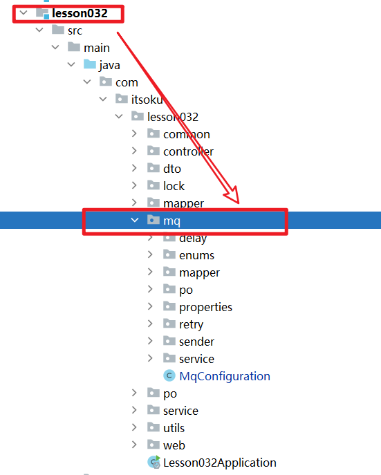

**高并发、微服务 、性能调优实战案例100讲，所有案例均源于个人工作实战，均配合代码落地**

加我微信：itsoku，所有案例均提供在线答疑。


# 第32节 MQ延迟消息通用方案实战

视频有点长，请大家耐心看完，涉及到大量代码，面试和工作中都会用到。

<span style="font-weight:bold; color:red">目前整个课程59块钱，100个案例，含所有源码 & 文档 & 技术支持，可点击左下角小黄车了解</span>


## 本文主要内容

本文将带大家手写一个MQ延迟消息的通用方案。

本文的方案不依赖于MQ中间件，依靠MySQL和DelayQueue解决，不管大家用的是什么MQ，具体是RocketMQ、RabbitMQ还是kafka，本文这个方案你都可以拿去直接使用，可以轻松实现任意时间的延迟消息投递。


## 本文涉及到的技术点

1. SpringBoot2.7
2. MyBatisPlus
3. MySQL
4. 线程池
5. java中的延迟队列：DelayQueue
6. 分布式锁


## 延迟消息常见的使用场景

### 1、订单超时处理

比如下单后15分钟，未支付，则自动取消订单，回退库存。

可以采用延迟队列实现：下单的时候可以投递一条延迟15分钟的消息，15分钟后消息将被消费。

### 2、消息消费失败重试

比如MQ消息消费失败后，可以延迟一段时间再次消费。

可以采用延迟消息实现：消费失败，可以投递一条延迟消息，触发再次消费

### 3、其他任意需要延迟处理的业务

业务中需要延迟处理的场景，都可以使用延迟消息来搞定。


## 延迟消息常见的实现方案

### 方案1：MySQL + job定时轮询

由于延迟消息的时间不确定，若要达到实时性很高的效果，也就是说消息的延迟时间是不知道的，那就需要轮询每一秒才能确保消息在指定的延迟时间被处理，这就要求job需要每秒查询一次db中待投递的消息。

这种方案访问db的频率比较高，对数据库造成了一定的压力。

### 方案2：RabbitMQ 中的TTL+死信队列

rabbitmq中可以使用TTL消息 + 死信队列实现，也可以安装延时插件。

此方案对中间件有依赖，不同的MQ实现是不一样的，若换成其他的MQ，方案要重新实现

### 方案3：MySQL + job定时轮询 + DelayQueue

可以对方案1进行改进，引入java中的 DelayQueue。

job可以采用1分钟执行一次，每次拉取未来2分钟内需要投递的消息，将其丢到java自带的 DelayQueue 这个延迟队列工具类中去处理，这样便能做到实时性很高的投递效果，且对db的压力也降低了很多。

这种方案对db也没什么压力，实时性非常高，且对MQ没有依赖，这样不管切换什么MQ，这种方案都不需要改动。

我比较推荐这种，但是实现可能有点难度，本文将落地该方案。


## 需要一张本地消息表（t_msg）

```sql
create table if not exists t_msg_lesson032
(
    id               varchar(32) not null primary key comment '消息id',
    body_json        text        not null comment '消息体,json格式',
    status           smallint    not null default 0 comment '消息状态，0：待投递到mq，1：投递成功，2：投递失败',
    expect_send_time datetime    not null comment '消息期望投递时间，大于当前时间，则为延迟消息，否则会立即投递',
    actual_send_time datetime comment '消息实际投递时间',
    create_time      datetime comment '创建时间',
    fail_msg         text comment 'status=2 时，记录消息投递失败的原因',
    fail_count       int         not null default 0 comment '已投递失败次数',
    send_retry       smallint    not null default 1 comment '投递MQ失败了，是否还需要重试？1：是，0：否',
    next_retry_time  datetime comment '投递失败后，下次重试时间',
    update_time      datetime comment '最近更新时间',
    key idx_status (status)
) comment '本地消息表';
```


## 先看效果

本案例会模拟电商创建订单，投递一条mq消息的场景。

### 数据库初始化脚本

lesson032/src/main/resources/db/init.sql，系统启动的时候会自动执行，创建2张表，一个订单表，一个本地消息表。

```sql
-- 创建订单表
drop table if exists t_order_lesson032;
create table if not exists t_order_lesson032
(
    id    varchar(32)    not null primary key comment '订单id',
    goods varchar(100)   not null comment '商品',
    price decimal(12, 2) not null comment '订单金额'
) comment '订单表';

-- 创建本地消息表
drop table if exists t_msg_lesson032;
create table if not exists t_msg_lesson032
(
    id               varchar(32) not null primary key comment '消息id',
    body_json        text        not null comment '消息体,json格式',
    status           smallint    not null default 0 comment '消息状态，0：待投递到mq，1：投递成功，2：投递失败',
    expect_send_time datetime    not null comment '消息期望投递时间，大于当前时间，则为延迟消息，否则会立即投递',
    actual_send_time datetime comment '消息实际投递时间',
    create_time      datetime comment '创建时间',
    fail_msg         text comment 'status=2 时，记录消息投递失败的原因',
    fail_count       int         not null default 0 comment '已投递失败次数',
    send_retry       smallint    not null default 1 comment '投递MQ失败了，是否还需要重试？1：是，0：否',
    next_retry_time  datetime comment '投递失败后，下次重试时间',
    update_time      datetime comment '最近更新时间',
    key idx_status (status)
) comment '本地消息表';

```


### 启动应用

```java
com.itsoku.lesson032.Lesson032Application
```

### 案例1：演示：创建订单，模拟立即投递消息

```http
POST http://localhost:8080/order/createOrder
Accept: application/json
Content-Type: application/json

{
  "goods": "立即投递消息",
  "price": "59.00",
  "delaySeconds": 0
}
```

执行完毕后看下数据库中的t_msg_lesson032表的记录，关注下消息的状态，创建时间，期望投递时间，具体投递时间

```sql
select * from t_msg_lesson032;
```


### 案例2：演示：创建订单，模拟投递延迟消息，延迟时间是 5 秒

#### 运行测试用例

```http
POST http://localhost:8080/order/createOrder
Accept: application/json
Content-Type: application/json

{
  "goods": "投递延迟消息，延迟时间 5s",
  "price": "59.00",
  "delaySeconds": 5
}
```

执行完毕后看下数据库中的t_msg_lesson032表的记录，关注下消息的状态，创建时间，期望投递时间，具体投递时间

```sql
select * from t_msg_lesson032;
```


## 源码解析

### 源码位置

源码主要在lesson032模块中，而mq相关的所有核心代码在`com.itsoku.lesson032.mq`包中。



下面主要介绍核心的几个类的代码。

### IMsgSender：负责消息投递

> 业务方直接使用这个类进行消息投递，将这个类注入到自己的类中，然后调用send相关的方法，便可投递消息。
>
> 主要看4个send方法。

```java
com.itsoku.lesson032.mq.sender.IMsgSender
```

### DefaultMsgSender：IMsgSender默认实现类

消息投递的逻辑都在这个类中。

```java
com.itsoku.lesson032.mq.sender.DefaultMsgSender
```

### MqSendRetryJob：消息投递补偿的job

每分钟执行一次，会从本地消息表中查询出未来2分钟内需要投递的消息，然后会进行投递重试，入口代码

```
com.itsoku.lesson032.mq.sender.MqSendRetryJob#sendRetry
```

### 业务方如何使用IMsgSender投递消息（2步）

1. 先注入 IMsgSender

   ```java
   @Autowired
   private IMsgSender msgSender;
   ```

2. 调用 msgSender.send方法投递消息

   ```java
   //投递普通消息
   this.msgSender.send(消息);
   
   //投递延迟消息
   this.msgSender.send(延迟时间, 延迟时间单位, 消息);
   ```


## 使用注意

### 替换分布式锁

生产上，服务都是集群部署的，同一条消息可能会被多个服务同时处理，会出现重复投递，为了避免这个问题，系统中使用了分布锁。

本文的代码中，分布锁默认是使用java中的ReentrantLock搞的，集群中会有问题，大家用的时候，一定要把这个分布式锁给替换掉，可以引入redisson分布式锁来解决这个问题。

### 本地消息表性能问题

本文中用到了一个本地消息表t_msg，会存储所有消息，数据量大了会有性能问题，建议将投递成功的和投递失败不需要重试的消息，移到备份表，这样可以确保t_msg表的压力比较小，性能也就上去了。


## 获取源码

源码在lesson032这个模块中，需要的小伙伴可以加我微信：itsoku，获取。


## 下节预告

下节又是非常硬核的一节课：消息幂等消费通用方案设计，还没有关注的朋友，先关注下。


# 高并发 & 微服务 & 性能调优实战案例100讲

## 已更新 32 节课

<span style="font-weight:bold; color:red">目前整个课程59块钱，含所有源码 & 文档 & 技术支持，一杯咖啡的价格，还没下手的朋友，赶紧了，马上要涨价了</span>。

```java
1. 分片上传实战
2. 通用并发处理工具类实战
3. 实现一个好用接口性能压测工具类
4. 超卖问题的4种解决方案，也是防止并发修改数据出错的通用方案
5. Semaphore实现接口限流实战
6. 并行查询，优化接口响应速度实战
7. 接口性能优化之大事务优化
8. 通用的Excel动态导出功能实战
9. 手写线程池管理器，管理&监控所有线程池
10. 动态线程池
11. SpringBoot实现动态Job实战
12. 并行查询，性能优化利器，可能有坑
13. 幂等的4种解决方案，吃透幂等性问题
14. 接口通用返回值设计与实现
15. 接口太多，各种dto、vo不计其数，如何命名？
16. 一个业务太复杂了，方法太多，如何传参？
17. 接口报错，如何快速定位日志？
18. 线程数据共享必学的3个工具类：ThreadLocal、InheritableThreadLocal、TransmittableThreadLocal
19. 通过AOP统一打印请求链路日志，排错效率飞升
20. 大批量任务处理常见的方案（模拟余额宝发放收益）
21. 并发环境下，如何验证代码是否正常？
22. MySql和Redis数据一致性
23. SpringBoot数据脱敏优雅设计与实现
24. 一行代码搞定系统操作日志
25. Aop简化MyBatis分页功能
26. ThreadLocal 遇到线程池有大坑 & 通用解决方案
27. SpringBoot读写分离实战（一个注解搞定读写分离 && 强制路由主库）
28. MQ专题-MQ典型的使用场景
29. MQ专题-如何确保消息的可靠性
30. MQ专题-SpringBoot中，手把手教你实现事务消息
31. 手写一个好用的延迟任务处理工具类
32. MQ专题-MQ延迟消息通用方案实战
```


## 课程部分大纲，连载中。。。。

以下课程均来源于个人多年的实战，均提供原理讲解 && 源码落地

1. 分片上传实战
2. 通用并发处理工具类实战
3. 实现一个好用接口性能压测工具类
4. 超卖问题的4种解决方案，也是防止并发修改数据出错的通用方案
5. Semaphore实现接口限流实战
6. 并行查询，优化接口响应速度实战
7. 接口性能优化之大事务优化
8. 通用的Excel动态导出功能实战
9. 手写线程池管理器，管理&监控所有线程池
10. 动态线程池
11. SpringBoot实现动态Job实战
12. 并行查询，性能优化利器，可能有坑
13. 幂等的4种解决方案，吃透幂等性问题
14. 接口通用返回值设计与实现
15. 接口太多，各种dto、vo不计其数，如何命名？
16. 一个业务太复杂了，方法太多，如何传参？
17. 接口报错，如何快速定位日志？
18. 线程数据共享必学的3个工具类：ThreadLocal、InheritableThreadLocal、TransmittableThreadLocal
19. 通过AOP统一打印请求链路日志，排错效率飞升
20. 大批量任务处理常见的方案（模拟余额宝发放收益）
21. 并发环境下，如何验证代码是否正常？
22. MySql和Redis数据一致性
23. SpringBoot数据脱敏优雅设计与实现
24. 一行代码搞定系统操作日志
25. Aop简化MyBatis分页功能
26. ThreadLocal 遇到线程池有大坑 & 通用解决方案
27. SpringBoot读写分离实战（一个注解搞定读写分离 && 强制路由主库）
28. MQ专题：MQ典型的7种使用场景
29. MQ专题：如何确保消息的可靠性
30. MQ专题：SpringBoot中，手把手教你实现事务消息
31. 手写一个好用的延迟任务处理工具类
32. MQ专题：延迟消息通用方案实战
33. MQ专题：消息幂等消费 & 消费失败自动重试 通用方案
34. MQ专题：顺序消息通用方案实战
35. MQ专题：消息积压问题
36. 分布式事务：事务消息实现事务最终一致性
37. 分布式事务：通用的TCC分布式事务生产级代码落地实战
38. 分布式锁案例实战
39. 微服务中如何传递上下文？实战
40. 微服务链路日志追踪实战（原理&代码落地）
41. SpringBoot实现租户数据隔离
42. MyBatis进阶：封装MyBatis，实现通用的无SQL版CRUD功能，架构师必备
43. MyBatis进阶：自己实现通用分表功能，架构师必备
44. MyBatis进阶：实现多租户隔离ORM框架
45. SpringBoot中实现自动监听PO的变化，自动生成表结构
46. 分布式专题：其他实战课程等
47. 性能调优：如何排查死锁？
48. 性能调优：如何排查内存溢出？
49. 性能调优：CPU被打满，如何排查？
50. 性能调优：生产代码没生效，如何定位？
51. 性能调优：接口太慢，如何定位？
52. 性能调优：如何查看生产上接口的入参和返回值？
53. 性能调优：远程debug
54. 生产上出现了各种故障，如何定位？
55. db和缓存一致性，常见的方案
56. Redis场景案例。。。
57. 系统资金账户设计案例（一些系统涉及到资金操作）
58. 其他等各种实战案例。。。