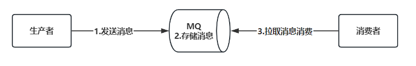

**高并发、微服务 、性能调优实战案例100讲，所有案例均源于个人工作实战，均配合代码落地**

加我微信：itsoku，所有案例均提供在线答疑。


# 第33节 MQ消息幂等消费 & 消费失败自动重试通用方案 & 代码落地

视频有点长，请大家耐心看完，涉及到大量代码，面试和工作中都会用到。

<span style="font-weight:bold; color:red">目前整个课程59块钱，100个案例，含所有源码 & 文档 & 技术支持，可点击左下角小黄车了解</span>


## 通过本文将获得

1. 消息投递的通用代码
   - 非事务消息的投递
   - 事务消息的投递
   - 任意延迟消息的投递，不依赖于任何MQ
   - 上面这些投递都支持批量的方式
   - 投递失败自动重试的代码
2. 幂等消费的通用代码
3. 消费失败，衰减式自动重试的通用代码

**本文所有代码在 lesson033模块中，需要的加我微信itsoku。**


## 本文涉及到的主要技术点

1. SpringBoot2.7
2. MyBatisPlus
3. MySQL
4. 线程池
5. java中的延迟队列：DelayQueue
6. 分布式锁
7. RabbitMQ


## 消费者如何确保消息一定会被消费？

消费者这边可以采用下面的过程，可以确保消息一定会被消费。

- **step1**：从MQ中拉取消息，此时不要从mq中删除消息

- **step2**：执行业务逻辑（需要做幂等）

- **step3**：通知MQ删除这条消息

若上面过程失败了，则采用衰减式的方式进行自动重试，比如第一次消费失败后，延迟10秒后，将消息再次丢入队列，进行消费重试，若还是失败，再延迟20秒后丢入队列，继续重试，但是得有个上限，比如最多50次，达到上限需要进行告警人工干预。

**这里的关键技术点就是：幂等+重试+开启消费者手动ack**


## 什么是消费失败后衰减式重试？

失败后，会过一会，再次重试，若还是失败，则过一会，再次重试。

比如累计失败次数在1-5次内，每次失败后会间隔10秒进行重试，在6-10次内，间隔20秒，在11-20次内，间隔30秒，但是有个次数上限，比如50次，达到最大次数，将不再重试，报警，人工干预


## 衰减重试是如何实现的？

通过延迟消息实现的，消费失败后，会投递一条延迟消息，消息的内容和原本消息的内容是一样的，延迟时间到了后，这个消息会进入消息原本的队列，会触发再次消费。


## 什么是消费者手动ack（acknowledgemenet）？

消费者从mq中拉取消息后，mq需要将消息从mq中删除，这个删除有2种方式

### 方式1：MQ自动删除

消费者从mq中拉取消息后，mq立即就把消息删掉了，此时消费者还未消费。

这种可能会有问题，比如消费者拿到消息后，消费失败了，但是此时消息已经被mq删除了，结果会导致消息未被成功消费。

### 方式2：消费者通知MQ删除（也叫手动ack）

消费者从mq拉取消息后，做业务处理，业务处理完成之后，通知mq删除消息，这种就叫做消费者手动ack

这种会存在通知mq删除消息失败的情况，会导致同一条消息会被消费者消费多次，消费端需要避免重复消费。

本文中用的是这种ack的方式。


## 什么是幂等消费？

同一条消息，即使出现了重复的消息，被同一个消费者消费，也只会成功消费一次。


## 为什么要考虑幂等消费？



先看下上面这个图，消息从发送到消费的整个过程，中间涉及到网络通信，网络存在不稳定的因素，这就可能导致下面2个问题

#### 重复投递的情况

生产者投递消息到MQ，由于网络问题，未收到回执，生产者以为消息投递失败了，会重试，这就可能会导致同一条消息被投递多次

#### 消费者ACK失败，消息会被再次消费

消费者拉取消息消费后，会通知MQ中删除此消息，通知MQ删除消息这个过程又涉及网络通信，可能会失败，此时会导致消息被消费者消费了，但是却未从mq中删除，这样消息就会被再次拉取进行消费。

上面2种情况，会导致同一条消息，会被消费者处理多次，消费端若未考虑幂等性，可能导致严重的事故。


## 如何解决这个问题？

搞定下面2个问题，幂等消费的问题就解决了。

1. 如何确定MQ中的多条消息是同一条业务消息？
2. 消费者如何确保同一条消息只被成功消费一次？


## 如何确定MQ中的多条消息是同一条业务消息？

我们可以定义一种通用的消息的格式，格式如下，生产者发送的所有消息，都必须采用这个格式。

```java
public class Msg<T> {
    /**
     * 生产者名称
     */
    private String producer;
    /**
     * 生产者这边消息的唯一标识
     */
    private String producerBusId;
    /**
     * 消息体，主要是消息的业务数据
     */
    private T body;
}
```

对于多条消息，通过（producer、producerBusId）这两个字段来判断是否是同一条消息，若他们的这两个字段的值是一样的，则表示他们是同一条消息。

- producer：可以使用服务名称
- producerBusId：生产者这边消息的唯一标识，比如可以使用UUID


## 消费者如何确保同一条消息只被成功消费一次？

### 使用唯一约束实现

需要一个幂等辅助表，如下，idempotent_key 添加了唯一约束，多个线程同时向这个表写入数据，若idempotent_key是一样的，则只有一个会成功，其他的会违反唯一约束触发异常，导致失败。

```sql
create table if not exists t_idempotent_lesson033
(
    id             varchar(50) primary key comment 'id，主键',
    idempotent_key varchar(500) not null comment '需要确保幂等的key',
    unique key uq_idempotent_key (idempotent_key)
) comment '幂等辅助表';
```

### 消费端幂等消费如何实现呢？

用上面的幂等辅助表，便可实现幂等消费，过程如下

```java
// 这里的幂等key，由消息里面的(producer,producerBusId)加上消费者完整类名组成，也就是同一条消息只能被同一个消费者消费一次
String idempotentKey = (producer,producerBusId,消费者完整类名);

// 幂等表是否存在记录，如果存在说明处理过，直接返回成功
IdempotentPO idempotentPO = select * from t_idempotent_lesson033 where idempotent_key = #{idempotentKey};
if(idempotentPO!=null){
	return "SUCCESS";
}

开启Spring事务(这里千万不要漏掉，一定要有事务)

这里放入消息消费的实际业务逻辑，最好是db操作的代码。。。。。

String idempotentId = "";
// 这里是关键一步，向 t_idempotent 插入记录，如果有并发过来，只会有一个成功，其他的会报异常导致事务回滚
insert into t_idempotent_lesson033 (id, idempotent_key) values (#{idempotentId}, #{idempotentKey});

提交spring事务
```


## 下面先看案例

会模拟电商中下单后，投递一条订单消息，然后会搞一个消费者来消费这个消息。

本案例会用到RabbitMQ，大家先安装rabbitmq，然后修改`lesson033/src/main/resources/application.yml`中rabbitmq相关配置。

> RabbitMQ的安装可以参考：http://itsoku.com/course/22/381

### 会有3个案例代码

- 投递普通订单消息，模拟消费
- 投递延迟订单消息，延迟5秒，模拟消费
- 投递普通消息，模拟消费失败，自动重试的情况

### 案例中会用到5个表

先不用记，大概有个印象，知道每个表是干什么用的就行了

```sql
-- 创建订单表
drop table if exists t_order_lesson033;
create table if not exists t_order_lesson033
(
    id    varchar(32)    not null primary key comment '订单id',
    goods varchar(100)   not null comment '商品',
    price decimal(12, 2) comment '订单金额'
) comment '订单表';

-- 创建本地消息表
drop table if exists t_msg_lesson033;
create table if not exists t_msg_lesson033
(
    id               varchar(32) not null primary key comment '消息id',
    exchange         varchar(100) comment '交换机',
    routing_key      varchar(100) comment '路由key',
    body_json        text        not null comment '消息体,json格式',
    status           smallint    not null default 0 comment '消息状态，0：待投递到mq，1：投递成功，2：投递失败',
    expect_send_time datetime    not null comment '消息期望投递时间，大于当前时间，则为延迟消息，否则会立即投递',
    actual_send_time datetime comment '消息实际投递时间',
    create_time      datetime comment '创建时间',
    fail_msg         text comment 'status=2 时，记录消息投递失败的原因',
    fail_count       int         not null default 0 comment '已投递失败次数',
    send_retry       smallint    not null default 1 comment '投递MQ失败了，是否还需要重试？1：是，0：否',
    next_retry_time  datetime comment '投递失败后，下次重试时间',
    update_time      datetime comment '最近更新时间',
    key idx_status (status)
) comment '本地消息表';


-- 创建消息和消费者关联表，（producer, producer_bus_id, consumer_class_name）相同时，此表只会产生一条记录，就是同一条消息被同一个消费者消费，此表只会产生一条记录
drop table if exists t_msg_consume_lesson033;
create table if not exists t_msg_consume_lesson033
(
    id              varchar(32)  not null primary key comment '消息id',
    producer        varchar(100) not null comment '生产者名称',
    producer_bus_id varchar(100) not null comment '生产者这边消息的唯一标识',
    consumer_class_name        varchar(300) not null comment '消费者完整类名',
    queue_name      varchar(100) not null comment '队列名称',
    body_json       text         not null comment '消息体,json格式',
    status          smallint     not null default 0 comment '消息状态，0：待消费，1：消费成功，2：消费失败',
    create_time     datetime comment '创建时间',
    fail_msg        text comment 'status=2 时，记录消息消费失败的原因',
    fail_count      int          not null default 0 comment '已投递失败次数',
    consume_retry   smallint     not null default 1 comment '消费失败后，是否还需要重试？1：是，0：否',
    next_retry_time datetime comment '投递失败后，下次重试时间',
    update_time     datetime comment '最近更新时间',
    key idx_status (status),
    unique uq_msg (producer, producer_bus_id, consumer_class_name)
) comment '消息和消费者关联表';

drop table if exists t_msg_consume_log_lesson033;
create table if not exists t_msg_consume_log_lesson033
(
    id              varchar(32)  not null primary key comment '消息id',
    msg_consume_id        varchar(32) not null comment '消息和消费者关联记录',
    status          smallint     not null default 0 comment '消费状态，1：消费成功，2：消费失败',
    create_time     datetime comment '创建时间',
    fail_msg        text comment 'status=2 时，记录消息消费失败的原因',
    key idx_msg_consume_id (msg_consume_id)
) comment '消息消费日志';

-- 幂等辅助表
drop table if exists t_idempotent_lesson033;
create table if not exists t_idempotent_lesson033
(
    id             varchar(50) primary key comment 'id，主键',
    idempotent_key varchar(500) not null comment '需要确保幂等的key',
    unique key uq_idempotent_key (idempotent_key)
) comment '幂等辅助表';
```

### 启动SpringBoot应用

```java
com.itsoku.lesson033.Lesson033Application
```

### 测试代码

- com.itsoku.lesson033.controller.OrderController#createOrder：测试接口入口
- com.itsoku.lesson033.service.impl.OrderServiceImpl#createOrder：创建订单，投递消息
- com.itsoku.lesson033.service.OrderConsumer：订单消息消费者，会输出日志

### 案例1：投递普通订单消息，模拟消费

#### 清理下数据

```sql
-- 清理下数据
delete from t_msg_lesson033;
delete from t_msg_consume_lesson033;
delete from t_msg_consume_log_lesson033;
delete from t_idempotent_lesson033;
```

#### 运行测试用例

```java
### 案例1：投递普通订单消息，模拟消费
POST http://localhost:8080/order/createOrder
Accept: application/json
Content-Type: application/json

{
  "goods": "立即投递消息",
  "price": "59.00",
  "delaySeconds": 0
}
```

控制台输出

```java
[http-nio-8080-exec-1] 18:13:34 ：***************投递普通消息：OrderPO(id=2ec57ce4b5b1445ca668f8321ffb52d0, goods=立即投递消息, price=59.00)
[org.springframework.amqp.rabbit.RabbitListenerEndpointContainer#0-1] 18:13:35 ：***************收到订单消息：OrderPO(id=2ec57ce4b5b1445ca668f8321ffb52d0, goods=立即投递消息, price=59)
```

#### 查看结果

```sql
-- 本地消息表
select * from t_msg_lesson033;

-- 消息和消费者关联表
select * from t_msg_consume_lesson033;

-- 消息消费日志表
select * from t_msg_consume_log_lesson033 order by create_time asc;

-- 幂等辅助表
select * from t_idempotent_lesson033;
```


### 案例2：投递延迟订单消息，延迟5秒，模拟消费

#### 清理下数据

```sql
-- 清理下数据
delete from t_msg_lesson033;
delete from t_msg_consume_lesson033;
delete from t_msg_consume_log_lesson033;
delete from t_idempotent_lesson033;
```

#### 运行测试用例

```java
### 案例2：投递延迟订单消息，延迟5秒，模拟消费
POST http://localhost:8080/order/createOrder
Accept: application/json
Content-Type: application/json

{
  "goods": "投递延迟消息，延迟时间 5s",
  "price": "59.00",
  "delaySeconds": 5
}
```

#### 查看结果

```sql
-- 本地消息表
select * from t_msg_lesson033;

-- 消息和消费者关联表
select * from t_msg_consume_lesson033;

-- 消息消费日志表
select * from t_msg_consume_log_lesson033 order by create_time asc;

-- 幂等辅助表
select * from t_idempotent_lesson033;
```


### 案例3：投递普通消息，模拟消费失败，自动重试的情况

#### 清理下数据

```sql
-- 清理下数据
delete from t_msg_lesson033;
delete from t_msg_consume_lesson033;
delete from t_msg_consume_log_lesson033;
delete from t_idempotent_lesson033;
```

#### 运行测试用例

> 消费的时候，有判断金额，如果为null，则会抛出一个异常，会触发衰减式消费重试的逻辑。

```java
### 案例3：投递普通消息，模拟消费失败，自动重试的情况
POST http://localhost:8080/order/createOrder
Accept: application/json
Content-Type: application/json

{
  "goods": "尝试消费失败重试的情况，金额为空，消费的时候会失败",
  "price": null
}
```

#### 查看结果

```sql
-- 本地消息表
select * from t_msg_lesson033;

-- 消息和消费者关联表
select * from t_msg_consume_lesson033;

-- 消息消费日志表
select * from t_msg_consume_log_lesson033 order by create_time asc;

-- 幂等辅助表
select * from t_idempotent_lesson033;
```


## 源码解析

### 开启rabbitmq消费者ack

lesson033/src/main/resources/application.yml 添加下面配置，auto表示消费者消费消息的过程中没有向最外层抛出异常，则mq才会将消息从队列中删除。

```yaml
  rabbitmq:
    listener:
      simple:
        acknowledge-mode: auto # 消费过程没有向外抛出异常自动ack
```

### IMsgSender：负责投递各种类型消息

- 里面send开头的方法，都是用于投递消息的，消息类型必须为Msg类型
- sendWithBody开头的方法会将丢进来的消息包装为Msg类型的消息，然后投递

### AbstractIdempotentConsumer：幂等消费+消费失败衰减式自动重试

如下，用法可以参考OrderConsumer，继承AbstractIdempotentConsumer就可以了，然后写两个方法如下，业务方消费逻辑写在disposeIn方法中，那么便可以自动确保幂等消费，以及消费失败后会自动重试，默认会采用衰减的方式进行重试，最多50次

```java
@Slf4j
@Component
public class OrderConsumer extends AbstractIdempotentConsumer<OrderPO, Msg<OrderPO>> {

    @RabbitListener(queues = RabbitMQConfiguration.Order.QUEUE)
    public void dispose(Message message) {
        super.dispose(message);
    }

    @Override
    protected void disposeIn(Message message, OrderPO body) {
        log.info("***************收到订单消息：{}", body);

        //这里是为了演示消费异常重试的场景，这里加了个判断，金额为空的时候，弹出异常
        if (body.getPrice() == null) {
            throw BusinessExceptionUtils.businessException("订单金额有误啊!");
        }
    }
}
```


## 最佳实战

### 如何投递事务消息？

> 将消息投递的代码放在有事务的方法中，投递的便是事务消息，消息一定会投递成功，如下，方法上有@Transaction注解，这个方法就会有事务

```java
//1、注入消息发送器
@Autowired
private IMsgSender msgSender;

//2、投递消息的方法在事务中，那么投递的消息就是事务消息，如下案例
@Override
@Transactional(rollbackFor = Exception.class)
public String createOrder(CreateOrderRequest req) {
    this.msgSender.sendWithBody(RabbitMQConfiguration.Order.EXCHANGE, RabbitMQConfiguration.Order.ROUTING_KEY, orderPO);
}
```

### 如何投递延迟消息？

> 如下，调用 msgSender 中投递延迟消息的方法，便可投递延迟消息

```
this.msgSender.sendWithBody(RabbitMQConfiguration.Order.EXCHANGE, RabbitMQConfiguration.Order.ROUTING_KEY, req.getDelaySeconds(), TimeUnit.SECONDS, orderPO);
```

### 幂等消费如何实现

> 继承 AbstractIdempotentConsumer，便可实现幂等消费，参考 com.itsoku.lesson033.service.OrderConsumer 的代码，如下，非常简单

```java
@Slf4j
@Component
public class OrderConsumer extends AbstractIdempotentConsumer<OrderPO, Msg<OrderPO>> {

    @RabbitListener(queues = RabbitMQConfiguration.Order.QUEUE)
    public void dispose(Message message) {
        super.dispose(message);
    }

    @Override
    protected void disposeIn(Message message, OrderPO body) {
        log.info("***************收到订单消息：{}", body);

        //这里是为了演示消费异常重试的场景，这里加了个判断，金额为空的时候，弹出异常
        if (body.getPrice() == null) {
            throw BusinessExceptionUtils.businessException("订单金额有误啊!");
        }
    }
}
```

### 如何查看消息发送记录？

目前只有事务消息在db的本地消息表中会有记录，如下

```sql
-- 本地消息表
select * from t_msg_lesson033;
```

### 如何查看消息消费日志？下面2张表

```sql
-- 消息和消费者关联表
select * from t_msg_consume_lesson033;

-- 消息消费日志表
select * from t_msg_consume_log_lesson033 order by create_time asc;
```


## 源码获取

源码在lesson033这个模块中，需要的小伙伴可以加我微信：itsoku，获取。


## 下节预告

下节又是非常硬核的一节课：顺序消息的通用方案 & 代码落地，还没有关注的朋友，先关注下。


# 高并发 & 微服务 & 性能调优实战案例100讲

## 已更新 33 节课

<span style="font-weight:bold; color:red">目前整个课程59块钱，含所有源码 & 文档 & 技术支持，一杯咖啡的价格，还没下手的朋友，赶紧了，马上要涨价了</span>。

```java
1. 分片上传实战
2. 通用并发处理工具类实战
3. 实现一个好用接口性能压测工具类
4. 超卖问题的4种解决方案，也是防止并发修改数据出错的通用方案
5. Semaphore实现接口限流实战
6. 并行查询，优化接口响应速度实战
7. 接口性能优化之大事务优化
8. 通用的Excel动态导出功能实战
9. 手写线程池管理器，管理&监控所有线程池
10. 动态线程池
11. SpringBoot实现动态Job实战
12. 并行查询，性能优化利器，可能有坑
13. 幂等的4种解决方案，吃透幂等性问题
14. 接口通用返回值设计与实现
15. 接口太多，各种dto、vo不计其数，如何命名？
16. 一个业务太复杂了，方法太多，如何传参？
17. 接口报错，如何快速定位日志？
18. 线程数据共享必学的3个工具类：ThreadLocal、InheritableThreadLocal、TransmittableThreadLocal
19. 通过AOP统一打印请求链路日志，排错效率飞升
20. 大批量任务处理常见的方案（模拟余额宝发放收益）
21. 并发环境下，如何验证代码是否正常？
22. MySql和Redis数据一致性
23. SpringBoot数据脱敏优雅设计与实现
24. 一行代码搞定系统操作日志
25. Aop简化MyBatis分页功能
26. ThreadLocal 遇到线程池有大坑 & 通用解决方案
27. SpringBoot读写分离实战（一个注解搞定读写分离 && 强制路由主库）
28. MQ专题-MQ典型的使用场景
29. MQ专题-如何确保消息的可靠性
30. MQ专题-SpringBoot中，手把手教你实现事务消息
31. 手写一个好用的延迟任务处理工具类
32. MQ专题-MQ延迟消息通用方案实战
33. MQ消息幂等消费 & 消费失败衰减式重试通用方案 & 代码 & 文档
```


## 课程部分大纲，连载中。。。。

以下课程均来源于个人多年的实战，均提供原理讲解 && 源码落地

1. 分片上传实战
2. 通用并发处理工具类实战
3. 实现一个好用接口性能压测工具类
4. 超卖问题的4种解决方案，也是防止并发修改数据出错的通用方案
5. Semaphore实现接口限流实战
6. 并行查询，优化接口响应速度实战
7. 接口性能优化之大事务优化
8. 通用的Excel动态导出功能实战
9. 手写线程池管理器，管理&监控所有线程池
10. 动态线程池
11. SpringBoot实现动态Job实战
12. 并行查询，性能优化利器，可能有坑
13. 幂等的4种解决方案，吃透幂等性问题
14. 接口通用返回值设计与实现
15. 接口太多，各种dto、vo不计其数，如何命名？
16. 一个业务太复杂了，方法太多，如何传参？
17. 接口报错，如何快速定位日志？
18. 线程数据共享必学的3个工具类：ThreadLocal、InheritableThreadLocal、TransmittableThreadLocal
19. 通过AOP统一打印请求链路日志，排错效率飞升
20. 大批量任务处理常见的方案（模拟余额宝发放收益）
21. 并发环境下，如何验证代码是否正常？
22. MySql和Redis数据一致性
23. SpringBoot数据脱敏优雅设计与实现
24. 一行代码搞定系统操作日志
25. Aop简化MyBatis分页功能
26. ThreadLocal 遇到线程池有大坑 & 通用解决方案
27. SpringBoot读写分离实战（一个注解搞定读写分离 && 强制路由主库）
28. MQ专题：MQ典型的7种使用场景
29. MQ专题：如何确保消息的可靠性
30. MQ专题：SpringBoot中，手把手教你实现事务消息
31. 手写一个好用的延迟任务处理工具类
32. MQ专题：延迟消息通用方案实战
33. MQ专题：消息幂等消费 & 消费失败自动重试通用方案 & 代码落地
34. MQ专题：顺序消息通用方案实战
35. MQ专题：消息积压问题
36. 分布式事务：事务消息实现事务最终一致性
37. 分布式事务：通用的TCC分布式事务生产级代码落地实战
38. 分布式锁案例实战
39. 微服务中如何传递上下文？实战
40. 微服务链路日志追踪实战（原理&代码落地）
41. SpringBoot实现租户数据隔离
42. MyBatis进阶：封装MyBatis，实现通用的无SQL版CRUD功能，架构师必备
43. MyBatis进阶：自己实现通用分表功能，架构师必备
44. MyBatis进阶：实现多租户隔离ORM框架
45. SpringBoot中实现自动监听PO的变化，自动生成表结构
46. 分布式专题：其他实战课程等
47. 性能调优：如何排查死锁？
48. 性能调优：如何排查内存溢出？
49. 性能调优：CPU被打满，如何排查？
50. 性能调优：生产代码没生效，如何定位？
51. 性能调优：接口太慢，如何定位？
52. 性能调优：如何查看生产上接口的入参和返回值？
53. 性能调优：远程debug
54. 生产上出现了各种故障，如何定位？
55. db和缓存一致性，常见的方案
56. Redis场景案例。。。
57. 系统资金账户设计案例（一些系统涉及到资金操作）
58. 其他等各种实战案例。。。