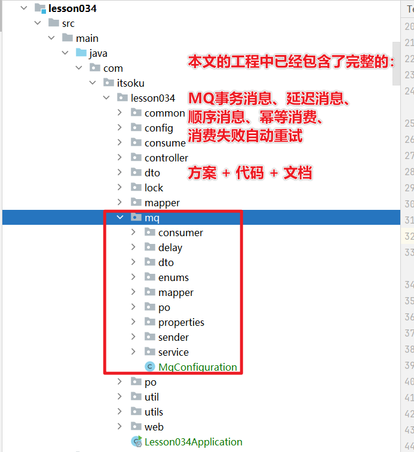

**高并发、微服务 、性能调优实战案例100讲，所有案例均源于个人工作实战，均配合代码落地**

加我微信：itsoku，所有案例均提供在线答疑。


# 第34节 MQ顺序消息通用方案 & 代码落地

<span style="font-weight:bold; color:red">目前整个课程59块钱，100个案例，含所有源码 & 文档 & 技术支持，可点击左下角小黄车了解</span>


## 什么是顺序消息

投递消息的顺序和消费消息的顺序一致。

比如生产者按顺序投递了1/2/3/4/5 这 5 条消息，那么消费的时候也必须按照1到5的顺序消费这些消息。


## 顺序消息如何实现？（2种方案）

1. 方案1：生产者串行发送+同一个队列+消费者单线程消费
2. 方案2：生产方消息带上连续递增编号+同一个队列+消费按编号顺序消费消息


## 方案1：生产者串行发送+同一个队列+消费者单线程消费

### 生产者串行发送消息

- 使用分布式锁，让消息投递串行执行
- 确保顺序消息到达同一个队列

### 消费者单线程消费

- 消费者这边只能有一个线程，拉取一个消费一个，消费完成后再拉取下一个消费


## 方案2：生产方消息带上连续递增编号+同一个队列+消费按编号顺序消费消息

### 生产方消息带上连续递增编号

- 顺序消息携带连续递增的编号，从1开始，连续递增，比如发送了3条消息，编号分别是1、2、3，后面再投递消息，编号就从4开始了
- 确保顺序消息到达同一个队列

### 消费方按照编号顺序消费消息

- 消费方需要记录消息消费的位置：当前轮到哪个编号的消息了
- 收到消息后，将消息的编号和当前消费的位置对比下，是不是轮着这条消息消费了，如果是则进行消费，如果不是，则排队等待，等待前一个到达后，且消费成功后，将自己唤醒进行消费

这里举个例子，如下

- 生产者发送了编号为看1、2、3 的3条消息

- 到达的消费端顺序刚好相反，3先到，发现没有轮到自己，会进行排队

- 然后2到了，发现也没有轮到自己，也会排队
- 然后过了一会1到了，发现轮到自己了，然后1被消费了
- 1消费后，会唤醒下一个编号的2进行消费
- 2消费完了，会唤醒下一个编号的3进行消费。

本文我们会落地方案2。


## 先看效果，然后再带大家看源码

### 发送顺序消息

如下模拟发送订单相关的5条顺序消息

```java
com.itsoku.lesson034.controller.TestController#sendSequential

@PostMapping("/sendSequential")
public Result<Void> sendSequential() {
    String orderId = IdUtil.fastSimpleUUID();

    List<String> list = Arrays.asList("订单创建消息",
            "订单支付消息",
            "订单已发货",
            "买家确认收货",
            "订单已完成");
    for (String type : list) {
        msgSender.sendSequentialWithBody(orderId,
                RabbitMQConfiguration.Order.EXCHANGE,
                RabbitMQConfiguration.Order.ROUTING_KEY,
                OrderMsg.builder().orderId(orderId).type(type).build());

    }
    return ResultUtils.success();
}
```

### 演示：没有确保顺序消费的情况

```java
com.itsoku.lesson034.consume.TestConsumer.dispose

@Override
@RabbitListener(queues = RabbitMQConfiguration.Order.QUEUE, concurrency = "5")
public void dispose(Message message) {
    Msg<OrderMsg> msg = getMsg(message);
    String log = "☆☆☆☆☆☆☆☆☆☆☆☆☆☆☆☆☆☆☆顺序消息消费,消息编号：" + msg.getSequentialMsgNumbering() + ",消息体：" + JSONUtil.toJsonStr(msg.getBody());
    System.err.println(log);
//        super.dispose(message);
}
```

输出：

```
☆☆☆☆☆☆☆☆☆☆☆☆☆☆☆☆☆☆☆顺序消息消费,消息编号：4,消息体：{"orderId":"06e7e2d9195444a4a145c31c28297b20","type":"买家确认收货"}
☆☆☆☆☆☆☆☆☆☆☆☆☆☆☆☆☆☆☆顺序消息消费,消息编号：1,消息体：{"orderId":"06e7e2d9195444a4a145c31c28297b20","type":"订单创建消息"}
☆☆☆☆☆☆☆☆☆☆☆☆☆☆☆☆☆☆☆顺序消息消费,消息编号：2,消息体：{"orderId":"06e7e2d9195444a4a145c31c28297b20","type":"订单支付消息"}
☆☆☆☆☆☆☆☆☆☆☆☆☆☆☆☆☆☆☆顺序消息消费,消息编号：3,消息体：{"orderId":"06e7e2d9195444a4a145c31c28297b20","type":"订单已发货"}
☆☆☆☆☆☆☆☆☆☆☆☆☆☆☆☆☆☆☆顺序消息消费,消息编号：5,消息体：{"orderId":"06e7e2d9195444a4a145c31c28297b20","type":"订单已完成"}
```


### 演示：顺序消费的情况

需要调整：com.itsoku.lesson034.consume.TestConsumer.dispose 代码，如下

```
@Override
@RabbitListener(queues = RabbitMQConfiguration.Order.QUEUE, concurrency = "5")
public void dispose(Message message) {
    super.dispose(message);
}
```

然后重启服务，测试效果，输出如下：

```
☆☆☆☆☆☆☆☆☆☆☆☆☆☆☆☆☆☆☆顺序消息消费,消息编号：1,消息体：{"orderId":"0ca696d9fb6340a2a3b3133428de90b7","type":"订单创建消息"}
☆☆☆☆☆☆☆☆☆☆☆☆☆☆☆☆☆☆☆顺序消息消费,消息编号：2,消息体：{"orderId":"0ca696d9fb6340a2a3b3133428de90b7","type":"订单支付消息"}
☆☆☆☆☆☆☆☆☆☆☆☆☆☆☆☆☆☆☆顺序消息消费,消息编号：3,消息体：{"orderId":"0ca696d9fb6340a2a3b3133428de90b7","type":"订单已发货"}
☆☆☆☆☆☆☆☆☆☆☆☆☆☆☆☆☆☆☆顺序消息消费,消息编号：4,消息体：{"orderId":"0ca696d9fb6340a2a3b3133428de90b7","type":"买家确认收货"}
☆☆☆☆☆☆☆☆☆☆☆☆☆☆☆☆☆☆☆顺序消息消费,消息编号：5,消息体：{"orderId":"0ca696d9fb6340a2a3b3133428de90b7","type":"订单已完成"}
```


## 如何使用？源码解析

### 投递顺序消息

```java
com.itsoku.lesson034.mq.sender.IMsgSender#sendSequentialWithBody
    
/**
 * 发送顺序消息，可确保（busId+exchange+routingKey）相同的情况下，消息的顺序性
 * 这里我们使用的是rabbitmq，rabbitmq中 exchange+routingKey 可以确保消息被路由到相同的队列
 * <p>
 * 这里为什么要加入busId？
 * 以订单消息举例，所有订单消息都会进入同样的队列，订单有3种类型消息（创建、支付、发货）
 * 同一个订单的这3种类型的消息是要有序的，但是不同订单之间，他们不需要有序，所以这里加了个busId，此时就可以将订单id作为busId
 *
 * @param busId      业务id
 * @param exchange
 * @param routingKey
 * @param msgBody    消息体
 */
default void sendSequentialWithBody(String busId, String exchange, String routingKey, Object msgBody) {
    this.sendSequentialMsg(busId, exchange, routingKey, this.build(msgBody));
}
```

### 消费端确保顺序消费

参考：com.itsoku.lesson034.consume.TestConsumer，需要继承 AbstractSequentialMsgConsumer 类，如下，便可确保顺序消费

```java
@Component
@Slf4j
public class TestConsumer extends AbstractSequentialMsgConsumer<OrderMsg, Msg<OrderMsg>> {
    @Override
    @RabbitListener(queues = RabbitMQConfiguration.Order.QUEUE, concurrency = "5")
    public void dispose(Message message) {
        super.dispose(message);
    }

    @Override
    protected void sequentialMsgConsume(Msg<OrderMsg> msg) {
        String log = "☆☆☆☆☆☆☆☆☆☆☆☆☆☆☆☆☆☆☆顺序消息消费,消息编号：" + msg.getSequentialMsgNumbering();
        System.err.println(log);
        //这里休眠500ms，模拟耗时的业务操作
        try {
            TimeUnit.MILLISECONDS.sleep(500);
        } catch (InterruptedException e) {
            throw new RuntimeException(e);
        }
    }

}
```


## 总结

到此，MQ相关的已经进入尾声了。

本文的工程中已经包含了完整的：MQ事务消息、延迟消息、顺序消息、幂等消费、消费失败自动重试的方案 + 代码 + 文档，大家有空了，还是希望抽时间练练，把这块知识吃透。




## 源码获取

源码在lesson034这个模块中，需要的小伙伴可以加我微信：itsoku，获取。


## 下节预告

下节又是非常硬核的一节课：消息积压问题，还没有关注的朋友，先关注下。


# 高并发 & 微服务 & 性能调优实战案例100讲

## 已更新 34 节课

<span style="font-weight:bold; color:red">目前整个课程59块钱，含所有源码 & 文档 & 技术支持，一杯咖啡的价格，还没下手的朋友，赶紧了，马上要涨价了</span>。

```java
1. 分片上传实战
2. 通用并发处理工具类实战
3. 实现一个好用接口性能压测工具类
4. 超卖问题的4种解决方案，也是防止并发修改数据出错的通用方案
5. Semaphore实现接口限流实战
6. 并行查询，优化接口响应速度实战
7. 接口性能优化之大事务优化
8. 通用的Excel动态导出功能实战
9. 手写线程池管理器，管理&监控所有线程池
10. 动态线程池
11. SpringBoot实现动态Job实战
12. 并行查询，性能优化利器，可能有坑
13. 幂等的4种解决方案，吃透幂等性问题
14. 接口通用返回值设计与实现
15. 接口太多，各种dto、vo不计其数，如何命名？
16. 一个业务太复杂了，方法太多，如何传参？
17. 接口报错，如何快速定位日志？
18. 线程数据共享必学的3个工具类：ThreadLocal、InheritableThreadLocal、TransmittableThreadLocal
19. 通过AOP统一打印请求链路日志，排错效率飞升
20. 大批量任务处理常见的方案（模拟余额宝发放收益）
21. 并发环境下，如何验证代码是否正常？
22. MySql和Redis数据一致性
23. SpringBoot数据脱敏优雅设计与实现
24. 一行代码搞定系统操作日志
25. Aop简化MyBatis分页功能
26. ThreadLocal 遇到线程池有大坑 & 通用解决方案
27. SpringBoot读写分离实战（一个注解搞定读写分离 && 强制路由主库）
28. MQ专题-MQ典型的使用场景
29. MQ专题-如何确保消息的可靠性
30. MQ专题-SpringBoot中，手把手教你实现事务消息
31. 手写一个好用的延迟任务处理工具类
32. MQ专题-MQ延迟消息通用方案实战
33. MQ消息幂等消费 & 消费失败衰减式重试通用方案 & 代码 & 文档
34. MQ专题：顺序消息通用方案实战 & 代码落地 & 文档
```


## 课程部分大纲，连载中。。。。

以下课程均来源于个人多年的实战，均提供原理讲解 && 源码落地

1. 分片上传实战
2. 通用并发处理工具类实战
3. 实现一个好用接口性能压测工具类
4. 超卖问题的4种解决方案，也是防止并发修改数据出错的通用方案
5. Semaphore实现接口限流实战
6. 并行查询，优化接口响应速度实战
7. 接口性能优化之大事务优化
8. 通用的Excel动态导出功能实战
9. 手写线程池管理器，管理&监控所有线程池
10. 动态线程池
11. SpringBoot实现动态Job实战
12. 并行查询，性能优化利器，可能有坑
13. 幂等的4种解决方案，吃透幂等性问题
14. 接口通用返回值设计与实现
15. 接口太多，各种dto、vo不计其数，如何命名？
16. 一个业务太复杂了，方法太多，如何传参？
17. 接口报错，如何快速定位日志？
18. 线程数据共享必学的3个工具类：ThreadLocal、InheritableThreadLocal、TransmittableThreadLocal
19. 通过AOP统一打印请求链路日志，排错效率飞升
20. 大批量任务处理常见的方案（模拟余额宝发放收益）
21. 并发环境下，如何验证代码是否正常？
22. MySql和Redis数据一致性
23. SpringBoot数据脱敏优雅设计与实现
24. 一行代码搞定系统操作日志
25. Aop简化MyBatis分页功能
26. ThreadLocal 遇到线程池有大坑 & 通用解决方案
27. SpringBoot读写分离实战（一个注解搞定读写分离 && 强制路由主库）
28. MQ专题：MQ典型的7种使用场景
29. MQ专题：如何确保消息的可靠性
30. MQ专题：SpringBoot中，手把手教你实现事务消息
31. 手写一个好用的延迟任务处理工具类
32. MQ专题：延迟消息通用方案实战
33. MQ专题：消息幂等消费 & 消费失败自动重试通用方案 & 代码落地
34. MQ专题：顺序消息通用方案实战
35. MQ专题：消息积压问题
36. 分布式事务：事务消息实现事务最终一致性
37. 分布式事务：通用的TCC分布式事务生产级代码落地实战
38. 分布式锁案例实战
39. 微服务中如何传递上下文？实战
40. 微服务链路日志追踪实战（原理&代码落地）
41. SpringBoot实现租户数据隔离
42. MyBatis进阶：封装MyBatis，实现通用的无SQL版CRUD功能，架构师必备
43. MyBatis进阶：自己实现通用分表功能，架构师必备
44. MyBatis进阶：实现多租户隔离ORM框架
45. SpringBoot中实现自动监听PO的变化，自动生成表结构
46. 分布式专题：其他实战课程等
47. 性能调优：如何排查死锁？
48. 性能调优：如何排查内存溢出？
49. 性能调优：CPU被打满，如何排查？
50. 性能调优：生产代码没生效，如何定位？
51. 性能调优：接口太慢，如何定位？
52. 性能调优：如何查看生产上接口的入参和返回值？
53. 性能调优：远程debug
54. 生产上出现了各种故障，如何定位？
55. db和缓存一致性，常见的方案
56. Redis场景案例。。。
57. 系统资金账户设计案例（一些系统涉及到资金操作）
58. 其他等各种实战案例。。。