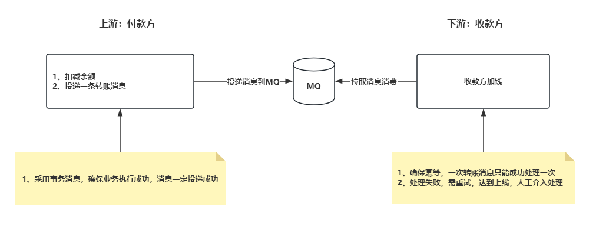
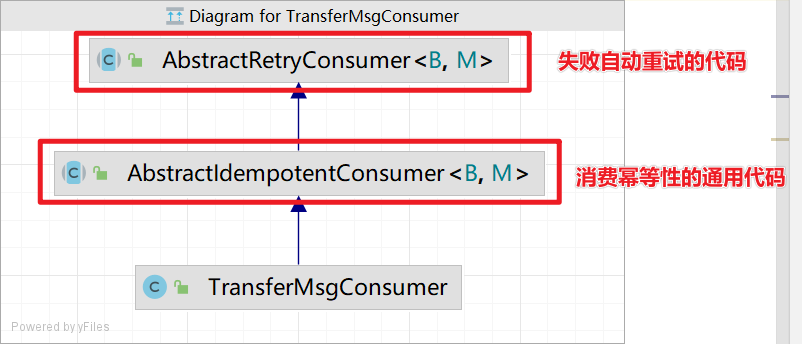
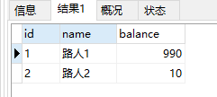

**高并发、微服务 、性能调优实战案例100讲，所有案例均源于个人工作实战，均配合代码落地**

加我微信：itsoku，所有案例均提供在线答疑。


# 第36节 使用MQ最终一致性实现跨库转账

<span style="font-weight:bold; color:red">目前整个课程59块钱，100个案例，含所有源码 & 文档 & 技术支持，可点击左下角小黄车了解</span>

本文将通过跨库转账这个案例，带大家掌握MQ最终一致性解决分布式事务问题。

案例中，通用的代码我都给大家写好了，大家拿这个方案去解决分布式事务，只需要写你们的业务代码就可以了，这样大家遇到分布式事务问题，可以快速搞定。

## 前言

接下来三四节，属于分布式事务专题，会带来：分布式事务相关的一些解决方案+案例+代码落地，基本上可以解决工作中碰到的分布式事务问题

主要会给大家介绍2种方案

- MQ最终一致性解决分布式事务
- TCC 的方式解决分布式事务

都会配代码+案例+文档。

## MQ解决分布式事务问题

会提供2个案例，这两个案例是比较有代表性的，掌握后，基本上可以完全掌握MQ解决分布式事务的套路。

1. 跨库转账
2. 平台账户-提现到微信钱包

## 前置知识

- 分布式事务相关的一些概念知识
  - 什么是分布式事务：http://itsoku.com/course/7/160
  - CAP原则：http://itsoku.com/course/7/161
  - BASE理论：http://itsoku.com/course/7/162
- 本课程 第12节 幂等性 4 种方案
- 本课程 第 28 - 35 节 MQ专题相关


## 案例：使用MQ解决跨库转账



上面整个过程中，开发者只需要写业务代码，其他的事情框架中都帮忙干了。

- 上游我们只需要写扣减余额和投递消息的代码

- 下游只需要写给收款方加钱的代码


## 先带大家看下效果

### 先准备一个表

```sql
drop table if exists t_account_lesson036;
create table if not exists t_account_lesson036
(
    id      varchar(32)    not null primary key comment '用户id',
    name    varchar(50)    not null comment '用户名',
    balance decimal(12, 2) not null comment '账户余额'
) comment '账户表';

insert ignore into t_account_lesson036 value ('1','路人1','1000.00');
insert ignore into t_account_lesson036 value ('2','路人2','0.00');
```

跨库转账这个案例中，为了方便，我们将付款方和收款方，用的是同一个库中的同一个账户表，但是在应用层面，我们用的是分布式事务解决的。

### 跨库转账接口

```java
com.itsoku.lesson036.controller.AccountController#transfer
```

这个方法中主要对应付款方的代码，干了2件事情：

1. 付款方扣减余额
2. 投递一条转账消息到MQ（这里投递的是事务消息，可以去报扣减余额成功，消息一定会投递成功）

### 下游：消费转账消息，给收款方加钱

```java
com.itsoku.lesson036.consume.TransferMsgConsumer#idempotentConsume
```

在这个方法中，只需要给收款方加钱就可以了

下面是这个类的一个类图，他上面有2个父类，父类中是通用的代码，分别帮我们实现了失败自动重试、消费幂等性的工作，所以我们只需要写业务代码就行了，大大节省了我们的工作量。



### 启动应用

```java
com.itsoku.lesson036.Lesson036Application
```

### 先看db中账户余额

```sql
select * from t_account_lesson036;
```


### 执行测试用例

src/test/resources/AccountController.http

```http
### 跨库转账
POST http://localhost:8080/account/transfer
Accept: application/json
Content-Type: application/json

{
  "fromAccountId": "1",
  "toAccountId": "2",
  "transferPrice": "10.00"
}
```

### 查看db中2个账户的余额

```sql
select * from t_account_lesson036;
```



## MQ最终一致性适用的场景

适合分布式事务中有2个事务参与者，且后面一个一定会成功的场景，这种比较适合采用MQ最终一致性来解决。

- 第一个参与者：执行本地业务+投递事务消息
- 第二个参与者：幂等消费消息+消费失败衰减式重试+重试达到上线人工干预


## 源码获取

源码在lesson036这个模块中，需要的小伙伴可以加我微信：itsoku，获取。


## 下节预告

将分享分布式-MQ最终一致性的另外一个案例：电商账户余额提现到微信钱包，敬请期待。

MQ最终一致性这2个案例，基本上能够覆盖业务上使用MQ解决分布式事务的所有场景，所以这两个案例大家一定要掌握。


# 高并发 & 微服务 & 性能调优实战案例100讲

## 已更新 36 节课

<span style="font-weight:bold; color:red">目前整个课程59块钱，含所有源码 & 文档 & 技术支持，一杯咖啡的价格，还没下手的朋友，赶紧了，马上要涨价了</span>。

```java
1. 分片上传实战
2. 通用并发处理工具类实战
3. 实现一个好用接口性能压测工具类
4. 超卖问题的4种解决方案，也是防止并发修改数据出错的通用方案
5. Semaphore实现接口限流实战
6. 并行查询，优化接口响应速度实战
7. 接口性能优化之大事务优化
8. 通用的Excel动态导出功能实战
9. 手写线程池管理器，管理&监控所有线程池
10. 动态线程池
11. SpringBoot实现动态Job实战
12. 并行查询，性能优化利器，可能有坑
13. 幂等的4种解决方案，吃透幂等性问题
14. 接口通用返回值设计与实现
15. 接口太多，各种dto、vo不计其数，如何命名？
16. 一个业务太复杂了，方法太多，如何传参？
17. 接口报错，如何快速定位日志？
18. 线程数据共享必学的3个工具类：ThreadLocal、InheritableThreadLocal、TransmittableThreadLocal
19. 通过AOP统一打印请求链路日志，排错效率飞升
20. 大批量任务处理常见的方案（模拟余额宝发放收益）
21. 并发环境下，如何验证代码是否正常？
22. MySql和Redis数据一致性
23. SpringBoot数据脱敏优雅设计与实现
24. 一行代码搞定系统操作日志
25. Aop简化MyBatis分页功能
26. ThreadLocal 遇到线程池有大坑 & 通用解决方案
27. SpringBoot读写分离实战（一个注解搞定读写分离 && 强制路由主库）
28. MQ专题-MQ典型的使用场景
29. MQ专题-如何确保消息的可靠性
30. MQ专题-SpringBoot中，手把手教你实现事务消息
31. 手写一个好用的延迟任务处理工具类
32. MQ专题-MQ延迟消息通用方案实战
33. MQ消息幂等消费 & 消费失败衰减式重试通用方案 & 代码 & 文档
34. MQ专题：顺序消息通用方案实战 & 代码落地 & 文档
35. MQ专题：消息积压相关问题及解决思路
36. 分布式事务-MQ最终一致性-实现跨库转账（案例+源码+文档）
```


## 课程部分大纲，连载中。。。。

以下课程均来源于个人多年的实战，均提供原理讲解 && 源码落地

1. 分片上传实战
2. 通用并发处理工具类实战
3. 实现一个好用接口性能压测工具类
4. 超卖问题的4种解决方案，也是防止并发修改数据出错的通用方案
5. Semaphore实现接口限流实战
6. 并行查询，优化接口响应速度实战
7. 接口性能优化之大事务优化
8. 通用的Excel动态导出功能实战
9. 手写线程池管理器，管理&监控所有线程池
10. 动态线程池
11. SpringBoot实现动态Job实战
12. 并行查询，性能优化利器，可能有坑
13. 幂等的4种解决方案，吃透幂等性问题
14. 接口通用返回值设计与实现
15. 接口太多，各种dto、vo不计其数，如何命名？
16. 一个业务太复杂了，方法太多，如何传参？
17. 接口报错，如何快速定位日志？
18. 线程数据共享必学的3个工具类：ThreadLocal、InheritableThreadLocal、TransmittableThreadLocal
19. 通过AOP统一打印请求链路日志，排错效率飞升
20. 大批量任务处理常见的方案（模拟余额宝发放收益）
21. 并发环境下，如何验证代码是否正常？
22. MySql和Redis数据一致性
23. SpringBoot数据脱敏优雅设计与实现
24. 一行代码搞定系统操作日志
25. Aop简化MyBatis分页功能
26. ThreadLocal 遇到线程池有大坑 & 通用解决方案
27. SpringBoot读写分离实战（一个注解搞定读写分离 && 强制路由主库）
28. MQ专题：MQ典型的7种使用场景
29. MQ专题：如何确保消息的可靠性
30. MQ专题：SpringBoot中，手把手教你实现事务消息
31. 手写一个好用的延迟任务处理工具类
32. MQ专题：延迟消息通用方案实战
33. MQ专题：消息幂等消费 & 消费失败自动重试通用方案 & 代码落地
34. MQ专题：顺序消息通用方案实战
35. MQ专题：消息积压问题
36. 分布式事务-MQ最终一致性-实现跨库转账（案例+源码+文档）
37. 分布式事务-MQ最终一致性-实现商品平台账户提现到微信钱包（案例+源码+文档）
38. 分布式事务：通用的TCC分布式事务生产级代码落地实战
39. 分布式锁案例实战
40. 微服务中如何传递上下文？实战
41. 微服务链路日志追踪实战（原理&代码落地）
42. SpringBoot实现租户数据隔离
43. MyBatis进阶：封装MyBatis，实现通用的无SQL版CRUD功能，架构师必备
44. MyBatis进阶：自己实现通用分表功能，架构师必备
45. MyBatis进阶：实现多租户隔离ORM框架
46. SpringBoot中实现自动监听PO的变化，自动生成表结构
47. 分布式专题：其他实战课程等
48. 性能调优：如何排查死锁？
49. 性能调优：如何排查内存溢出？
50. 性能调优：CPU被打满，如何排查？
51. 性能调优：生产代码没生效，如何定位？
52. 性能调优：接口太慢，如何定位？
53. 性能调优：如何查看生产上接口的入参和返回值？
54. 性能调优：远程debug
55. 生产上出现了各种故障，如何定位？
56. db和缓存一致性，常见的方案
57. Redis场景案例。。。
58. 系统资金账户设计案例（一些系统涉及到资金操作）
59. 其他等各种实战案例。。。