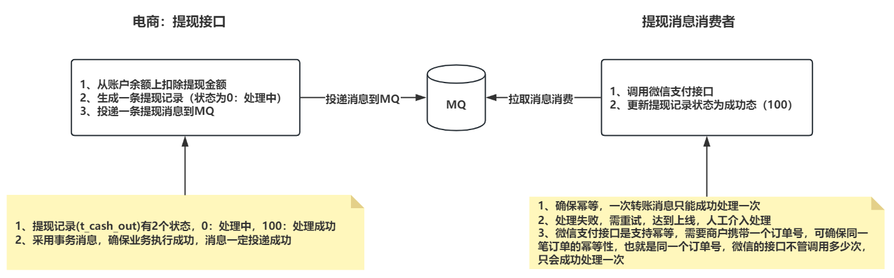
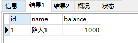

**高并发、微服务 、性能调优实战案例100讲，所有案例均源于个人工作实战，均配合代码落地**

加我微信：itsoku，所有案例均提供在线答疑。


# 第37节 使用MQ最终一致性实现：电商平台账户余额提现到微信钱包

<span style="font-weight:bold; color:red">目前整个课程59块钱，100个案例，含所有源码 & 文档 & 技术支持，可点击左下角小黄车了解</span>

## 场景

假如咱们做个电商系统，商户可以在上面卖东西，卖东西会产生交易，交易产生的收入在平台账户的余额中，这就涉及到商户提现的操作

需支持：商户将平台上账户余额提现到微信钱包，这个功能如果交给我们，该如何实现？

本文将大家搞定这个问题，这个场景算是分布式事务中比较有代表性的一个案例，大家大概率会遇到类似的场景，望大家掌握。


## 方案

使用MQ最终一致性解决，大致的过程如下：



代码我们已经实现了。

## 带大家看下效果

### 先准备2个表

账号表和提现记录表，账户表插入了一个用户，等会会模拟从这个账号中体现100到微信钱包。

```sql
-- 创建账户表
drop table if exists t_account_lesson037;
create table if not exists t_account_lesson037
(
    id      varchar(32)    not null primary key comment '用户id',
    name    varchar(50)    not null comment '用户名',
    balance decimal(12, 2) not null comment '账户余额'
) comment '账户表';

insert ignore into t_account_lesson037 value ('1','路人1','1000.00');

-- 提现记录表
drop table if exists t_cash_out_lesson037;
create table if not exists t_cash_out_lesson037
(
    id          varchar(32)    not null primary key comment '用户id',
    account_id  varchar(32)    not null comment '账号id',
    price       decimal(12, 2) not null comment '提现金额',
    status      smallint       not null comment '状态，0：待处理，100：提现成功',
    create_time datetime       not null comment '创建时间',
    update_time datetime comment '最后更新时间'
) comment '提现记录表';
```

### 提现接口

```java
com.itsoku.lesson037.controller.AccountController#cashOut
```

主要干了3件事情

1. 扣减账户余额
2. 创建提现记录，状态为0（处理中）
3. 发送提现消息（这块必须是事务消息，可以确保业务执行成功，消息一定会投递成功，不会丢失）

### 提现消息消费者

```java
com.itsoku.lesson037.consume.CashOutMsgConsumer#consume
```

主要干了2件事

1. 调用微信支付接口给个人钱包打款

   > 微信支付接口天然支幂等，如果也遇到了需要调用第三方接口的场景，也需要对方做幂等，这块可以参考微信支付接口或者支付宝接口

2. 将体现记录状态置为成功（status=100）

CashOutMsgConsumer 类继承了 com.itsoku.lesson037.mq.consumer.AbstractRetryConsumer，自动拥有了失败自动重试的功能。

### 启动应用

```java
com.itsoku.lesson037.Lesson037Application
```

### 先看db中账户余额

```sql
select * from t_account_lesson037;
```



### 执行测试用例

src/test/resources/AccountController.http

```http
### 平台账户余额提现到微信钱包
POST http://localhost:8080/account/cashOut
Accept: application/json
Content-Type: application/json

{
  "price": "10.00"
}
```

### 看db中账户余额

```sql
select * from t_account_lesson037;
```


## 源码获取

源码在lesson037这个模块中，需要的小伙伴可以加我微信：itsoku，获取。


## 下节预告

分布式事务：通用的TCC分布式事务生产级代码落地实战


# 高并发 & 微服务 & 性能调优实战案例100讲

## 已更新 37 节课

<span style="font-weight:bold; color:red">目前整个课程59块钱，含所有源码 & 文档 & 技术支持，一杯咖啡的价格，还没下手的朋友，赶紧了，马上要涨价了</span>。

```java
1. 分片上传实战
2. 通用并发处理工具类实战
3. 实现一个好用接口性能压测工具类
4. 超卖问题的4种解决方案，也是防止并发修改数据出错的通用方案
5. Semaphore实现接口限流实战
6. 并行查询，优化接口响应速度实战
7. 接口性能优化之大事务优化
8. 通用的Excel动态导出功能实战
9. 手写线程池管理器，管理&监控所有线程池
10. 动态线程池
11. SpringBoot实现动态Job实战
12. 并行查询，性能优化利器，可能有坑
13. 幂等的4种解决方案，吃透幂等性问题
14. 接口通用返回值设计与实现
15. 接口太多，各种dto、vo不计其数，如何命名？
16. 一个业务太复杂了，方法太多，如何传参？
17. 接口报错，如何快速定位日志？
18. 线程数据共享必学的3个工具类：ThreadLocal、InheritableThreadLocal、TransmittableThreadLocal
19. 通过AOP统一打印请求链路日志，排错效率飞升
20. 大批量任务处理常见的方案（模拟余额宝发放收益）
21. 并发环境下，如何验证代码是否正常？
22. MySql和Redis数据一致性
23. SpringBoot数据脱敏优雅设计与实现
24. 一行代码搞定系统操作日志
25. Aop简化MyBatis分页功能
26. ThreadLocal 遇到线程池有大坑 & 通用解决方案
27. SpringBoot读写分离实战（一个注解搞定读写分离 && 强制路由主库）
28. MQ专题-MQ典型的使用场景
29. MQ专题-如何确保消息的可靠性
30. MQ专题-SpringBoot中，手把手教你实现事务消息
31. 手写一个好用的延迟任务处理工具类
32. MQ专题-MQ延迟消息通用方案实战
33. MQ消息幂等消费 & 消费失败衰减式重试通用方案 & 代码 & 文档
34. MQ专题：顺序消息通用方案实战 & 代码落地 & 文档
35. MQ专题：消息积压相关问题及解决思路
36. 分布式事务-MQ最终一致性-实现跨库转账（案例+源码+文档）
37. 分布式事务-MQ最终一致性-实现电商账户余额提现到微信钱包（案例+源码+文档）
```


## 课程部分大纲，连载中。。。。

以下课程均来源于个人多年的实战，均提供原理讲解 && 源码落地

1. 分片上传实战
2. 通用并发处理工具类实战
3. 实现一个好用接口性能压测工具类
4. 超卖问题的4种解决方案，也是防止并发修改数据出错的通用方案
5. Semaphore实现接口限流实战
6. 并行查询，优化接口响应速度实战
7. 接口性能优化之大事务优化
8. 通用的Excel动态导出功能实战
9. 手写线程池管理器，管理&监控所有线程池
10. 动态线程池
11. SpringBoot实现动态Job实战
12. 并行查询，性能优化利器，可能有坑
13. 幂等的4种解决方案，吃透幂等性问题
14. 接口通用返回值设计与实现
15. 接口太多，各种dto、vo不计其数，如何命名？
16. 一个业务太复杂了，方法太多，如何传参？
17. 接口报错，如何快速定位日志？
18. 线程数据共享必学的3个工具类：ThreadLocal、InheritableThreadLocal、TransmittableThreadLocal
19. 通过AOP统一打印请求链路日志，排错效率飞升
20. 大批量任务处理常见的方案（模拟余额宝发放收益）
21. 并发环境下，如何验证代码是否正常？
22. MySql和Redis数据一致性
23. SpringBoot数据脱敏优雅设计与实现
24. 一行代码搞定系统操作日志
25. Aop简化MyBatis分页功能
26. ThreadLocal 遇到线程池有大坑 & 通用解决方案
27. SpringBoot读写分离实战（一个注解搞定读写分离 && 强制路由主库）
28. MQ专题：MQ典型的7种使用场景
29. MQ专题：如何确保消息的可靠性
30. MQ专题：SpringBoot中，手把手教你实现事务消息
31. 手写一个好用的延迟任务处理工具类
32. MQ专题：延迟消息通用方案实战
33. MQ专题：消息幂等消费 & 消费失败自动重试通用方案 & 代码落地
34. MQ专题：顺序消息通用方案实战
35. MQ专题：消息积压问题
36. 分布式事务-MQ最终一致性-实现跨库转账（案例+源码+文档）
37. 分布式事务-MQ最终一致性-实现电商账户余额提现到微信钱包（案例+源码+文档）
38. 分布式事务：通用的TCC分布式事务生产级代码落地实战
39. 分布式锁案例实战
40. 微服务中如何传递上下文？实战
41. 微服务链路日志追踪实战（原理&代码落地）
42. SpringBoot实现租户数据隔离
43. MyBatis进阶：封装MyBatis，实现通用的无SQL版CRUD功能，架构师必备
44. MyBatis进阶：自己实现通用分表功能，架构师必备
45. MyBatis进阶：实现多租户隔离ORM框架
46. SpringBoot中实现自动监听PO的变化，自动生成表结构
47. 分布式专题：其他实战课程等
48. 性能调优：如何排查死锁？
49. 性能调优：如何排查内存溢出？
50. 性能调优：CPU被打满，如何排查？
51. 性能调优：生产代码没生效，如何定位？
52. 性能调优：接口太慢，如何定位？
53. 性能调优：如何查看生产上接口的入参和返回值？
54. 性能调优：远程debug
55. 生产上出现了各种故障，如何定位？
56. db和缓存一致性，常见的方案
57. Redis场景案例。。。
58. 系统资金账户设计案例（一些系统涉及到资金操作）
59. 其他等各种实战案例。。。