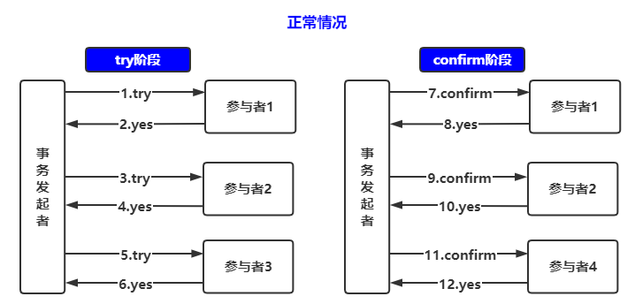
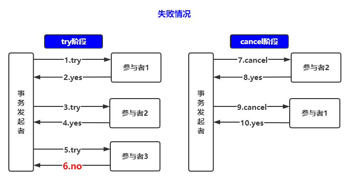
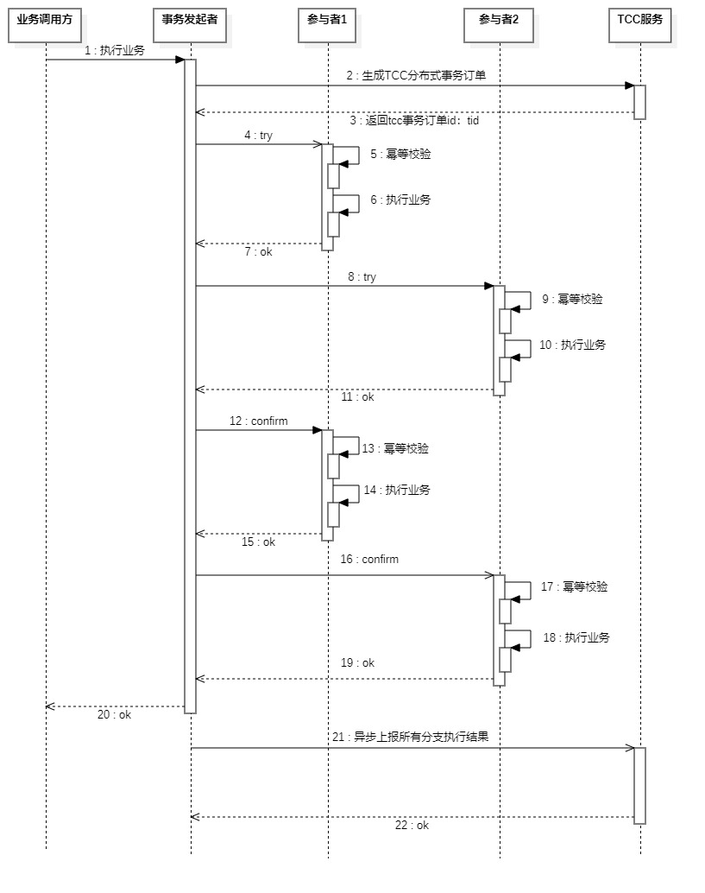

**高并发、微服务 、性能调优实战案例100讲，所有案例均源于个人工作实战，均配合代码落地**

加我微信：itsoku，所有案例均提供在线答疑。


# 第38节 手写一个通用的TCC分布式事务框架

非常硬核的一节，视频有点长，请先收藏起来

<span style="font-weight:bold; color:red">目前整个课程59块钱，100个案例，含所有源码 & 文档 & 技术支持，可点击左下角小黄车了解</span>

## 本文内容

1. TCC 相关概念
2. 自研 TCC 框架设计思路
3. 自研 TCC 框架，代码已落地，大家可以直接拿去用
4. 演示效果（演示跨库转账3个场景）
5. 源码解析
6. 小结

## 1. 什么是TCC？

先了解分布式事务中的2个角色

- TM：事务管理器，可以理解为分布式事务的发起者
- 分支事务：事务中的多个参与者，可以理解为一个个独立的事务

TCC是 try、confirm、cancel三个词语的缩写，是分布式事务的一种解决方案

TCC要求每个分支事务实现三个操作：预处理try、确认confirm、撤销cancel

- try：做业务检查及资源预留
- confirm：做业务确认操作
- cancel：实现一个与Try相反的操作即回滚操作

try有可能失败，但是confirm和cancel是一定会成功的，如果不成功，则经过重试一定会成功。

### 1.1. 正常流程



try阶段：依次调用参与者的try方法，都返回成功

confirm阶段：依次调用参与者的confirm方法，都返回成功

事务完成。

### 1.2. 异常流程



try阶段：依次调用参与者的try方法，前面2个参与者try方法返回yes，而参与者3返回no

cancel阶段：对已经成功的参与者执行cancel操作，**注意了：cancel阶段参与者调用的顺序和try阶段参与者的顺序相反，即先调用参与者2的cancel，然后调用参与者1的cancel**。


## 2. TCC场景案例

### 2.1. 案例1：跨库转账

举例，场景为 A 转账 100 元给 B，A和B账户在不同的服务以及不同的库中。

2个库都有一个账户表

```sql
create table if not exists t_account_lesson038
(
    id      varchar(32)    not null primary key comment '用户id',
    name    varchar(50)    not null comment '用户名',
    balance decimal(12, 2) not null comment '账户余额',
    frozen  decimal(12, 2) not null comment '冻结金额'
) comment '账户表';
```

采用tcc执行流程如下：

```java
账户A
try：
	try幂等校验
	检查余额是否够100元
	A账户：可用余额-100，冻结金额+100
confirm：
	try幂等校验
    A账户：冻结金额-100
cancel：
	cancel幂等校验
	A账户：可用余额+100，冻结金额-100

账户B
try：
	try幂等校验
	B账户：冻结金额+100
confirm：
	confirm幂等校验
	B账户：冻结金额-100元，可用余额+100
cancel：
	cancel幂等校验
	B账户：冻结金额-100
```

### 2.2. 案例2：提现到支付宝

举例，大家玩过抖音，有些朋友抖音上面有收益，可以将收益提现到支付宝，假如提现100到支付宝

```java
tcc事务分支1
try：
	try幂等校验
	检查余额是否够100元
	抖音账户表余额-100，冻结金额+100
confirm：
	confirm幂等校验
	抖音账户冻结金额-100
cancel：
	cancel幂等校验
	抖音账户表余额+100，冻结金额-100

tcc事务分支2
try：
	空
confirm：
	confirm幂等校验
	调用支付宝打款接口，打款100元（对于商户同一笔订单支付宝接口是支持幂等的）
cancel：
	空
```


## 3. TCC常见框架

| 框架名称        | github地址                                      | star数量 |
| --------------- | ----------------------------------------------- | -------- |
| tcc-transaction | https://github.com/changmingxie/tcc-transaction | 5750     |
| hmily           | https://github.com/Dromara/hmily                | 2900     |
| ByteTCC         | https://github.com/liuyangming/ByteTCC          | 2450     |
| EasyTransaction | https://github.com/QNJR-GROUP/EasyTransaction   | 2100     |

本文给大家分享的是自研。

## 4. 自研TCC框架设计思路（本文已落地实现）

### 4.1. 涉及到的角色（事务发起者、事务参与者、TCC服务）

#### (1)、事务发起者（TM）

- 发起分布式事务：调用tcc服务注册一个分布式事务订单

- 调用分支：依次调用每个分支

- 上报结果：最终将事务所有分支的执行结果汇报给TCC服务
- 提供补偿接口：给TCC服务使用，tcc服务会调用这个补偿接口进行补偿操作

#### (2)、事务参与者

- 提供3个方法：try、confirm、cancel
- 确保3个方法的幂等性
- 3个方法返回的结果状态码只有3种（成功、失败、处理中），处理中相当于状态未知，对于状态未知的，会在补偿的过程中进行重试

#### (3)、TCC服务

- 是一个独立的服务
- 提供分布式事务订单注册接口：给事务发起者使用【事务发起者调用tcc服务生成一个分布式事务订单（订单状态：0：处理中，1：处理成功，2：处理失败），获取一个分布式订单id：TID】
- 提供分布式事务结果上报接口：给事务发起者使用【事务发起者在事务的执行过程中将事务的执行结果汇报给TCC服务】
- 提供事务补偿操作：启动一个job轮询tcc订单中状态为0的订单，继续调用事务发起者进行补偿，最终经过多次补偿，这个订单最终的状态应该为1（成功）或者2（失败）；否则人工介入进行处理

### 4.2. 时序图



### 4.3. 自研TCC框架技术要点

#### (1)、框架应该考虑的地方

开发者应该只用关注分支中3个方法的代码，其他的应该全部交由框架去完成。

#### (2)、tcc服务中的事务记录表设计

 - id：tcc记录id
- bus_id：业务方业务id
- bus_type：业务类型 （bus_id& bus_type需唯一）
- request_data：业务请求数据，json格式存储
- status：状态，0：处理中，1：处理成功，2：处理失败，初始状态为0，最终必须为1或者2

#### (3)、关于分支中3个方法幂等的设计

以java中的spring为例，可以通过拦截器来实现，拦截器对分支的3个方法进行拦截，拦截器中实现幂等性的操作。

可以用一张表来实现【分支方法执行记录表：tccRecordId（也就是上面说的tid，分布式事务记录id）、分支、方法（try、confirm、cancel）、状态（0：处理中；1：成功；2：失败）、request_json（请求参数）、response_json（响应参数）】

关于请求参数：这个用来记录整个方法请求的完整参数，内部包含了业务参数，可以采用json格式存储。

响应参数：分支方法的执行结果，以json格式存储。

拦截器中，通过分支 & 方法 这2个条件去查询分支方法执行记录表，如果查询的记录状态为1或者2，那么直接将response_json返回。

#### (4)、try阶段同步、其他阶段异步

如果try阶段全部成功，那么confirm阶段最终应该一定是成功的，try阶段如果有失败的，那么需要执行cancel，最终所有的cancel应该也是一定可以成功的；所以try阶段完成之后，其实已经知道最终的结果了，所以try阶段完成之后，后面的confirm或者cancel可以采用异步的方式去执行；提升系统整体的性能。

#### (5)、异步上报事务执行结果

发起方将所有分支每个步骤的执行结果及最终事务的执行结果上报给tcc服务，由tcc服务落库，方便运营人员查看事务执行结果以及排错。

#### (6)、关于补偿

tcc服务中添加一个补偿job，定时轮询tcc分布式订单表，将状态为处理中的记录撸出来，订单表request_data包含了请求参数，使用request_data去调用事务发起者提供的补偿接口进行补偿操作，直到订单的状态为最终状态（成功或者失败）。

补偿采用衰减的形式，对应同一笔订单采用时间间隔衰减的方式补偿，每次间隔时间：10s、20s、40s、80s、160s、320s。。。

#### (7)、人工干预

tcc分布式订单如果长期处于处理中，经过了很多次的补偿，也未能到达最终状态，此时可能业务有问题，需要人工进行补偿，对于这对订单记录需要有监控系统进行报警，提醒开发者进行干预处理。


## 5. 先看效果

通用的TCC分布式事务通用代码，我们已经写好了，这里先带大家看下效果。

### 演示跨库转账3个场景

- 跨库转账：执行成功的情况
- 跨库转账：执行失败的情况
- 跨库转账：测试自动补偿的情况

### 跨库转账涉及到3个服务

- TccService：TCC服务
- TccBranch1Service：跨库转账操作的发起者，也是转账第1个分支，负责发起分布式事务，操作付款人账户，从付款人账户扣款
- TccBranch2Service：跨库转账第2个分支，操作收款人账户，给收款人账户打款

### 3个服务对应3个数据库

```sql
/* tcc 分布式事务服务库*/
DROP DATABASE IF EXISTS tcc;
CREATE DATABASE tcc;

/*tcc_service1：付款人账户所在库*/
DROP DATABASE IF EXISTS tcc_service1;
CREATE DATABASE tcc_service1;


/*tcc_service2：收款人账户所在库*/
DROP DATABASE IF EXISTS tcc_service2;
CREATE DATABASE tcc_service2;
```

### 2个账户库：创建表和测试数据

```sql
use tcc_service1;
drop table if exists t_account_lesson038;
create table if not exists t_account_lesson038
(
    id      varchar(32)    not null primary key comment '用户id',
    name    varchar(50)    not null comment '用户名',
    balance decimal(12, 2) not null comment '账户余额',
    frozen  decimal(12, 2) not null comment '冻结金额'
) comment '账户表';

insert ignore into t_account_lesson038 value ('1','A','1000.00','0.00');


use tcc_service2;
drop table if exists t_account_lesson038;
create table if not exists t_account_lesson038
(
    id      varchar(32)    not null primary key comment '用户id',
    name    varchar(50)    not null comment '用户名',
    balance decimal(12, 2) not null comment '账户余额',
    frozen  decimal(12, 2) not null comment '冻结金额'
) comment '账户表';

insert ignore into t_account_lesson038 value ('2','B','0.00','0.00');
```

### 启动3个服务

```java
com.ms.dts.service.TccService
com.itsoku.lesson038.service1.TccBranch1Service
com.itsoku.lesson038.service2.TccBranch2Service
```

### 演示：跨库转账：执行成功的情况

```http
lesson038/service1/src/test/resources/TransferController.http

### 1、跨库转账：正常情况
POST http://localhost:9101/transfer
Accept: application/json
Content-Type: application/json

{
  "fromAccountId": "1",
  "toAccountId": "2",
  "transferPrice": "10.00"
}
```

查看2个库账户的资金信息

```sql
-- 付款方
select * from tcc_service1.t_account_lesson038;
-- 收款方
select * from tcc_service2.t_account_lesson038;
```

查看tcc分布式事务记录

http://localhost:9100/tccRecord/list

### 演示：跨库转账：执行失败的情况

> 下面转账人账户不存在，会导致分布式事务第二个分支的try方法执行失败

```http
lesson038/service1/src/test/resources/TransferController.http

### 2、跨库转账：异常情况，目标账户不存在
POST http://localhost:9101/transfer
Accept: application/json
Content-Type: application/json

{
  "fromAccountId": "1",
  "toAccountId": "3",
  "transferPrice": "10.00"
}
```

查看2个库账户的资金信息

```sql
-- 付款方
select * from tcc_service1.t_account_lesson038;
-- 收款方
select * from tcc_service2.t_account_lesson038;
```

查看tcc分布式事务记录

http://localhost:9100/tccRecord/list

### 演示：跨库转账：测试自动补偿的情况

把TccBranch2Service停掉，然后执行下面测试代码

```http
lesson038/service1/src/test/resources/TransferController.http

### 3、跨库转账：测试自动补偿，把TccBranch2Service停掉，会导致第2个分支调用失败，然后再重启，重试
POST http://localhost:9101/transfer
Accept: application/json
Content-Type: application/json

{
  "fromAccountId": "1",
  "toAccountId": "2",
  "transferPrice": "10.00"
}
```

查看2个库账户的资金信息

```sql
-- 付款方
select * from tcc_service1.t_account_lesson038;
-- 收款方
select * from tcc_service2.t_account_lesson038;
```

查看tcc分布式事务记录

http://localhost:9100/tccRecord/list

启动TccBranch2Service，在http://localhost:9100/tccRecord/list中点击重试，进行补偿，可以看到分布式事务执行成功了。


## 6、源码解析

### DefaultTccProcessor：TCC分布式事务的核心代码

入口：com.ms.dts.business.service.tcc.DefaultTccProcessor#dispose，主要逻辑如下：

```java
1、调用TccServcie服务，创建分布式事务记录
2、依次调用分支的try方法
3、依次调用分支的confirm方法（如果try阶段失败了，则会走分支的cancel方法）
4、将分支的每个方法（try、confirm、cancel）执行日志上报给TccService服务
```

### 2个核心拦截器

```java
com.ms.dts.business.service.tcc.interceptor.TccBranchStepBeforeInterceptor：在Spring事务拦截器之前执行
com.ms.dts.business.service.tcc.interceptor.TccBranchStepAfterInterceptor：在Spring事务拦截器后面执行
```

- 负责拦截分支中的3个方法（try、confirm、cancel）
- 分支中3个方法的幂等性是依靠这2个拦截器实现的
- 这2个拦截器会记录分支中3个方法的执行日志（包含了方法的入参、返回值，都会序列化为json数据存储到db中）

### tcc服务中3个关键表

```sql
-- tcc分布式事务记录表
drop table if exists t_tcc_record;
create table if not exists t_tcc_record
(
    id                       varchar(32)   not null primary key comment '订单id',
    bus_type                 varchar(100)  not null comment '业务类型',
    bus_id                   varchar(100)  not null comment '业务id',
    classname                varchar(500)  not null comment '事务发起者',
    status                   smallint      not null default 0 comment '状态，0：待处理，1：处理成功，2：处理失败',
    service_application_name varchar(1000) not null comment '事务发起者服务名称，也可能是服务地址',
    beanname                 varchar(500)  not null comment '事务发起者bean名称',
    request_data             longtext      not null comment '请求参数json格式',
    next_dispose_time        bigint        not null default 0 comment '下次处理时间',
    max_failure              int           not null default 50 comment '最大允许失败次数',
    failure                  int           not null default 0 comment '当前已失败次数',
    addtime                  bigint        not null default 0 comment '创建时间',
    uptime                   bigint        not null default 0 comment '最后更新时间',
    version                  bigint        not null default 0 comment '版本号，每次更新+1',
    unique key uk_1 (bus_type, bus_id)
) comment 'tcc分布式事务记录表';

-- tcc分布式事务->分支日志记录表
drop table if exists t_tcc_branch_log;
create table if not exists t_tcc_branch_log
(
    id                 varchar(32)  not null primary key comment '主键',
    tcc_record_id      varchar(32)  not null comment '事务记录id发，来源于t_tcc_record表的id',
    classname          varchar(500) not null comment '分支完整类名',
    method             varchar(100) not null comment '方法，0:try1，1:confirm，2:cancel',
    msg                varchar(200) comment '分支执行结果',
    status             smallint     not null default 0 comment '状态，0：待处理，1：处理成功，2：处理失败',
    context            longtext     not null comment '上下文信息,json格式',
    addtime            bigint       not null default 0 comment '创建时间',
    uptime             bigint       not null default 0 comment '最后更新时间',
    version            bigint       not null default 0 comment '版本号，每次更新+1',
    unique key uk_1 (tcc_record_id, classname, method),
    key idx_tcc_record_id (tcc_record_id)
) comment 'tcc分布式事务->分支日志记录表';

-- tcc分布式事务->补偿日志表
drop table if exists t_tcc_dispose_log;
create table if not exists t_tcc_dispose_log
(
    id            varchar(32) not null primary key comment '主键',
    tcc_record_id varchar(32) not null comment '事务记录id发，来源于t_tcc_record表的id',
    msg           longtext comment '执行结果',
    starttime     bigint      not null default 0 comment '开始时间（时间戳）',
    endtime       bigint      not null default 0 comment '结束时间（时间戳）',
    addtime       bigint      not null default 0 comment '创建时间（时间戳）',
    key idx_tcc_record_id (tcc_record_id)
) comment 'tcc分布式事务->补偿日志表';
```

### 业务库：分支日志记录表

> 分支中3个方法的执行日志，都会记录到下面这个表中，包含了方法入参、返回值，都会被序列化为json格式的字符串保存到这个表中。

```sql
-- tcc分布式事务->业务库->分支日志记录表
drop table if exists t_tcc_bus_branch_log;
create table if not exists t_tcc_bus_branch_log
(
    id                 varchar(32)  not null primary key comment '主键',
    tcc_record_id      varchar(32)  not null comment '事务记录id发，来源于t_tcc_record表的id',
    classname          varchar(500) not null comment '分支完整类名',
    method             varchar(100) not null comment '方法，0:try1，1:confirm，2:cancel',
    msg                varchar(200) comment '分支执行结果',
    status             smallint     not null default 0 comment '状态，0：待处理，1：处理成功，2：处理失败',
    context            longtext     not null comment '上下文信息,json格式',
    addtime            bigint       not null default 0 comment '创建时间',
    uptime             bigint       not null default 0 comment '最后更新时间',
    version            bigint       not null default 0 comment '版本号，每次更新+1',
    unique key uk_1 (tcc_record_id, classname, method),
    key idx_tcc_record_id (tcc_record_id)
) comment 'tcc分布式事务->业务库->分支日志记录表';
```

### com.ms.dts.tcc.branch.ITccBranch：Tcc分支接口

该接口中定义了分支用到的3个方法，TCC中的分支需要实现该接口，然后实现里面的3个方法。

```java
public interface ITccBranch<T extends ITccBranchRequest> {
    String TRY1_METHOD = "try1";
    String CONFIRM_METHOD = "confirm";
    String CANCEL_METHOD = "cancel";

    /**
     * tcc->try方法
     *
     * @param context
     * @return
     */
    ResultDto<TccBranchContext<T>> try1(TccBranchContext<T> context);

    /**
     * tcc->confirm方法
     *
     * @param context
     * @return
     * @throws Exception
     */
    ResultDto<TccBranchContext<T>> confirm(TccBranchContext<T> context);

    /**
     * tcc->confirm方法
     *
     * @param context
     * @return
     * @throws Exception
     */
    ResultDto<TccBranchContext<T>> cancel(TccBranchContext<T> context);
}
```

### TCC 补偿相关代码

下面这个方法，可以对某个tcc记录进行补偿

```java
com.ms.dts.service.tcc.bus.impl.TccBusImpl#recover
```

### TCC 补偿JOB

> 处理需要补偿的tcc记录，会对这些记录发起重试

```java
com.ms.dts.service.tcc.job.TccJob#recover
```

## 7、如何使用？

### 引入maven配置

```xml
<dependency>
    <groupId>com.itsoku</groupId>
    <artifactId>p-dts-business-service-starter</artifactId>
</dependency>
```

### 参考跨库转账案例

```java
com.itsoku.lesson038.service1.controller.TransferController#transfer
```

#### 定义TCC事务处理器

需要继承DefaultTccProcessor，如问案例中的跨库转账

```
com.itsoku.lesson038.service1.bus.TransferTccProcess
```

### 定义分支，并实现3个方法

分支需要实现com.ms.dts.tcc.branch.ITccBranchBus接口，然后实现其内部的3个方法，如下：跨库转账的2个分支

```java
com.itsoku.lesson038.service1.bus.TransferTccBranch1
com.itsoku.lesson038.service2.bus.TransferTccBranch2
```

程序如何判断分支中某个方法是否执行成功？

- 方法上有@Transactional，表示有事务，若方法没有异常，表示当前方法执行成功
- 方法上没有@Transactional，表示没有事务，方法内部需要告知调用方是否成功，需通过context.getResponse().setResultStatus设置当前方法的执行结果

### 将2个分支添加到TCC事务处理器中，并指定顺序

这里参考跨库转账的代码，如下，下面引入了2个分支，并在分支上需要使用`@TccBranchOrder`注解标注分支的执行顺序

```java
@Component
public class TransferTccProcess extends DefaultTccProcessor<TransferTccBranchRequest> {

    @TccBranchOrder(1)
    @Autowired
    private TransferTccBranch1 transferTccBranch1;

    @TccBranchOrder(2)
    @Autowired
    private TransferTccBranch2Client transferTccBranch2;
    
}
```


## 8. 小结

- TCC对代码入侵性非常强，业务逻辑的每个分支都需要实现try、confirm、cancel三个操作，代码量比较大，对于事务参与者很多的场景，可以使用。

  比如某个业务涉及到>=3个以上的分支事务时，可以采用TCC的方式，若只有2个参与者，可以考虑使用MQ最终一致性解决。

- 本文稍微有点难度，建议抽点时间好好看看，以便工作中，面对分布式事务的时候，能够轻松应对

- 本系列 28-38 这11节视频，如果吃透了，将能够轻松搞定分布式事务，建议多看几遍，多练练


## 9. 源码获取

源码在lesson038这个模块中，需要的小伙伴可以加我微信：itsoku，获取。


# 高并发 & 微服务 & 性能调优实战案例100讲

## 已更新 38 节课

<span style="font-weight:bold; color:red">目前整个课程59块钱，含所有源码 & 文档 & 技术支持，一杯咖啡的价格，还没下手的朋友，赶紧了，马上要涨价了</span>。

```java
1. 分片上传实战
2. 通用并发处理工具类实战
3. 实现一个好用接口性能压测工具类
4. 超卖问题的4种解决方案，也是防止并发修改数据出错的通用方案
5. Semaphore实现接口限流实战
6. 并行查询，优化接口响应速度实战
7. 接口性能优化之大事务优化
8. 通用的Excel动态导出功能实战
9. 手写线程池管理器，管理&监控所有线程池
10. 动态线程池
11. SpringBoot实现动态Job实战
12. 并行查询，性能优化利器，可能有坑
13. 幂等的4种解决方案，吃透幂等性问题
14. 接口通用返回值设计与实现
15. 接口太多，各种dto、vo不计其数，如何命名？
16. 一个业务太复杂了，方法太多，如何传参？
17. 接口报错，如何快速定位日志？
18. 线程数据共享必学的3个工具类：ThreadLocal、InheritableThreadLocal、TransmittableThreadLocal
19. 通过AOP统一打印请求链路日志，排错效率飞升
20. 大批量任务处理常见的方案（模拟余额宝发放收益）
21. 并发环境下，如何验证代码是否正常？
22. MySql和Redis数据一致性
23. SpringBoot数据脱敏优雅设计与实现
24. 一行代码搞定系统操作日志
25. Aop简化MyBatis分页功能
26. ThreadLocal 遇到线程池有大坑 & 通用解决方案
27. SpringBoot读写分离实战（一个注解搞定读写分离 && 强制路由主库）
28. MQ专题-MQ典型的使用场景
29. MQ专题-如何确保消息的可靠性
30. MQ专题-SpringBoot中，手把手教你实现事务消息
31. 手写一个好用的延迟任务处理工具类
32. MQ专题-MQ延迟消息通用方案实战
33. MQ消息幂等消费 & 消费失败衰减式重试通用方案 & 代码 & 文档
34. MQ专题：顺序消息通用方案实战 & 代码落地 & 文档
35. MQ专题：消息积压相关问题及解决思路
36. 分布式事务-MQ最终一致性-实现跨库转账（案例+源码+文档）
37. 分布式事务-MQ最终一致性-实现电商账户余额提现到微信钱包（案例+源码+文档）
38. 分布式事务：通用的TCC分布式事务生产级代码落地实战
```


## 课程部分大纲，连载中。。。。

以下课程均来源于个人多年的实战，均提供原理讲解 && 源码落地

1. 分片上传实战
2. 通用并发处理工具类实战
3. 实现一个好用接口性能压测工具类
4. 超卖问题的4种解决方案，也是防止并发修改数据出错的通用方案
5. Semaphore实现接口限流实战
6. 并行查询，优化接口响应速度实战
7. 接口性能优化之大事务优化
8. 通用的Excel动态导出功能实战
9. 手写线程池管理器，管理&监控所有线程池
10. 动态线程池
11. SpringBoot实现动态Job实战
12. 并行查询，性能优化利器，可能有坑
13. 幂等的4种解决方案，吃透幂等性问题
14. 接口通用返回值设计与实现
15. 接口太多，各种dto、vo不计其数，如何命名？
16. 一个业务太复杂了，方法太多，如何传参？
17. 接口报错，如何快速定位日志？
18. 线程数据共享必学的3个工具类：ThreadLocal、InheritableThreadLocal、TransmittableThreadLocal
19. 通过AOP统一打印请求链路日志，排错效率飞升
20. 大批量任务处理常见的方案（模拟余额宝发放收益）
21. 并发环境下，如何验证代码是否正常？
22. MySql和Redis数据一致性
23. SpringBoot数据脱敏优雅设计与实现
24. 一行代码搞定系统操作日志
25. Aop简化MyBatis分页功能
26. ThreadLocal 遇到线程池有大坑 & 通用解决方案
27. SpringBoot读写分离实战（一个注解搞定读写分离 && 强制路由主库）
28. MQ专题：MQ典型的7种使用场景
29. MQ专题：如何确保消息的可靠性
30. MQ专题：SpringBoot中，手把手教你实现事务消息
31. 手写一个好用的延迟任务处理工具类
32. MQ专题：延迟消息通用方案实战
33. MQ专题：消息幂等消费 & 消费失败自动重试通用方案 & 代码落地
34. MQ专题：顺序消息通用方案实战
35. MQ专题：消息积压问题
36. 分布式事务-MQ最终一致性-实现跨库转账（案例+源码+文档）
37. 分布式事务-MQ最终一致性-实现电商账户余额提现到微信钱包（案例+源码+文档）
38. 分布式事务：通用的TCC分布式事务生产级代码落地实战
39. 分布式锁案例实战
40. 微服务中如何传递上下文？实战
41. 微服务链路日志追踪实战（原理&代码落地）
42. SpringBoot实现租户数据隔离
43. MyBatis进阶：封装MyBatis，实现通用的无SQL版CRUD功能，架构师必备
44. MyBatis进阶：自己实现通用分表功能，架构师必备
45. MyBatis进阶：实现多租户隔离ORM框架
46. SpringBoot中实现自动监听PO的变化，自动生成表结构
47. 分布式专题：其他实战课程等
48. 性能调优：如何排查死锁？
49. 性能调优：如何排查内存溢出？
50. 性能调优：CPU被打满，如何排查？
51. 性能调优：生产代码没生效，如何定位？
52. 性能调优：接口太慢，如何定位？
53. 性能调优：如何查看生产上接口的入参和返回值？
54. 性能调优：远程debug
55. 生产上出现了各种故障，如何定位？
56. db和缓存一致性，常见的方案
57. Redis场景案例。。。
58. 系统资金账户设计案例（一些系统涉及到资金操作）
59. 其他等各种实战案例。。。

