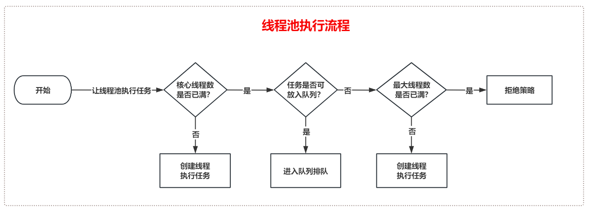

**高并发、微服务 、性能调优实战案例100讲，所有案例均源于个人工作实战，均配合代码落地**

加我微信：itsoku，所有案例均提供在线答疑。

# 第6节：并行查询，接口响应速度提升5倍

今天给大家讲的是性能优化中非常实用的且必备的一种方法，一定要看完。

<font style="color:red; font-weight:bold">整个实战课程大概100讲，本节课只是里面的一节课，可以点击视频左下角小黄车了解下。</font>

这节课前面已经讲过一次，如果看过的朋友，直接移步到后面的部分（并行查询可能存在的问题？）


## 需求：后端提供一个接口获取商品信息

接口传入一个商品id，需要返回商品下面这些信息，这些信息都在不同的表中，通过商品id就可以查到

- 商品基本信息（如商品名称、价格等基本信息)
- 商品描述信息（可能是富文本，放在单独的表中）
- 商品收藏量
- 商品评论量


## 常规版本实现（性能低）

按照id一步步查询，组装结果然后返回，代码如下

```java
com.itsoku.lesson006.GoodsController#getGoodsDetail
```

`http://localhost:8080/getGoodsDetail?goodsId=1`耗时如下：

```java
获取商品信息，普通版耗时：402 ms
```


## 有没有更快的方法呢？

这里面的4个查询并没有任何依赖，这些没有依赖的查询其实是可以并行查询的，那么我们可以使用线程池同时去拿这4个结果，然后等4个结果都拿到后，组装好，返回，这样效率将大大提升。


### 高性能版本实现（性能高）

使用线程池对4个方法并行查询，代码如下

```
com.itsoku.lesson006.GoodsController#getGoodsDetailNew
```

`http://localhost:8080/getGoodsDetailNew?goodsId=1`耗时如下：

```java
获取商品信息，使用线程池并行查询耗时：106 ms
```


## 小结

建议：当接口中，需要执行多个步骤，而多个步骤没有依赖的时候，那么可以采用线程池并行去执行这些步骤，可以大大提升接口的性能。

<span style="color:red; font-weight:bold">优化无处不在，下节课我们将继续介绍另外一种接口优化方案，请持续关注。</span>


## 并行查询可能存在的问题？

如果上面执行并行查询用到的线程池配置不当，可能导致比较严重的性能问题。

比如将核心线程数设置为了1，而队列大小没有限制，那么所有的请求都变成串行了，会导致请求响应非常慢，出现大事故。

或者核心线程数设置的比较小，比如10，而队列大小没有设置上限，那么这个线程池同时只可支持10个任务并行，其他的请求进入这个接口后都变成串行执行了，进入队列排队，从而导致接口响应特别慢。


## 怎么解决这个问题？

解决这个问题本质是不要让任务排队或者排队时间不要太长，这个时候我们就要先说一下线程池的原理了，了解原理之后，就知道如何破解这个问题



了解了这个过程我们就有优化办法了，如下：

- 可以将核心线程数、最大线程数调大，但是也不能随便调，比如调的很大，反而会降低系统性能，建议调的过程中根据业务的指标进行压测得到一个合理的值

- 将队列大小设置的比较小，这样排队的时间大概率会比较短，或者排队失败，直接后面的流程

  > `LinkedBlockingQueue、ArrayBlockingQueue` 容量是不允许为0的，如果需要用到容量为0的队列，则需要使用同步阻塞队列`SynchronousQueue`

- 将队列大小设置为0，这样任务就不会进入队列，而直接创建新的线程去执行，或者走拒绝策略

- 拒绝策略可以使用`CallerRunsPolicy`，这个策略是直接在当前线程执行，即如果线程池执行不了，则自己去执行，这样至少不会一直等着

- 线程池隔离，不同的业务最好使用不同的线程池，互不影响，强烈建议核心业务一定要使用单独的线程池。

优化后的线程池配置如下

```java
@Bean
public ThreadPoolTaskExecutor goodsThreadPool() {
    ThreadPoolTaskExecutor threadPoolTaskExecutor = new ThreadPoolTaskExecutor();
    threadPoolTaskExecutor.setThreadNamePrefix("ThreadPool-Goods-");
    // 核心线程数为cpu核数 * 4，最大线程数据为cpu核数 * 8
    threadPoolTaskExecutor.setCorePoolSize(Runtime.getRuntime().availableProcessors() * 4);
    threadPoolTaskExecutor.setMaxPoolSize(Runtime.getRuntime().availableProcessors() * 8);
    // 队列容量为0，则任务就不会进入队列
    threadPoolTaskExecutor.setQueueCapacity(0);
    // 拒绝策略使用CallerRunsPolicy，让当前线程去兜底去执行任务
    threadPoolTaskExecutor.setRejectedExecutionHandler(new ThreadPoolExecutor.CallerRunsPolicy());
    return threadPoolTaskExecutor;
}
```


## 源码

在高并发系列实战案例的 lesson006 模块中，如果找不到的，留言获取，感谢大家。


# 高并发 & 微服务 & 性能调优实战案例100讲

## 已更新 11 节课

<span style="font-weight:bold; color:red">目前整个课程59块钱，一杯咖啡的价格，还没下手的朋友，赶紧了，马上要涨价了</span>。

```java
1. 分片上传实战
2. 通用并发处理工具类实战
3. 实现一个好用接口性能压测工具类
4. 超卖问题的4种解决方案，也是防止并发修改数据出错的通用方案
5. Semaphore实现接口限流实战
6. 并行查询，优化接口响应速度实战
7. 接口性能优化之大事务优化
8. 通用的Excel动态导出功能实战
9. 手写线程池管理器，管理&监控所有线程池
10. 动态线程池
11. 使用SpringBoot实现动态Job实战
```


## 课程部分大纲，连载中。。。。

以下课程均来源于个人多年的实战，均提供原理讲解 && 源码落地

<span style="font-weight:bold; color:red">目前整个课程59块钱，一杯咖啡的价格，还没下手的朋友，赶紧了，马上要涨价了</span>。

```java
1. 分片上传实战
2. 通用并发处理工具类实战
3. 实现一个好用接口性能压测工具类
4. 超卖问题的4种解决方案，也是防止并发修改数据出错的通用方案
5. Semaphore实现接口限流实战
6. 并行查询，优化接口响应速度实战
7. 接口性能优化之大事务优化
8. 通用的Excel动态导出功能实战
9. 手写线程池管理器，管理&监控所有线程池
10. 动态线程池
11. 使用SpringBoot实现动态Job实战
12. 通用的幂等性工具类实战
13. 接口返回值通用设计
14. 接口太多，各种dto、vo不计其数，如何命名？
15. 一个业务太复杂了，方法太多，如何传参？
16. 如何统计接口耗时？
17. AOP实战接口日志打印功能
18. AOP实现业务操作日志记录功能
19. AOP实现MyBatis分页功能
20. SpringBoot读写分离实战
21. MQ专题：事务消息实战（防止消息丢失）
22. MQ专题：消息幂等消费通用方案实战
23. MQ专题：延迟消息通用方案实战
24. MQ专题：顺序消息通用方案实战
25. MQ专题：消息积压问题
26. 分布式事务：使用事务消息实现事务最终一致性
27. 分布式事务：通用的TCC分布式事务生产级代码落地实战
28. 分布式锁案例实战
29. 微服务中如何传递上下文？实战
30. 微服务链路日志追踪实战（原理&代码落地）
31. SpringBoot实现租户数据隔离
32. MyBatis进阶：封装MyBatis，实现通用的无SQL版CRUD功能，架构师必备
33. MyBatis进阶：自己实现通用分表功能，架构师必备
34. MyBatis进阶：实现多租户隔离ORM框架
35. SpringBoot中实现自动监听PO的变化，自动生成表结构
36. 分布式专题：其他实战课程等
37. 性能调优：如何排查死锁？
38. 性能调优：如何排查内存溢出？
39. 性能调优：CPU被打满，如何排查？
40. 性能调优：生产代码没生效，如何定位？
41. 性能调优：接口太慢，如何定位？
42. 性能调优：如何查看生产上接口的入参和返回值？
43. 性能调优：远程debug
44. 生产上出现了各种故障，如何定位？
45. 其他等各种实战案例。。。
。。。
```

