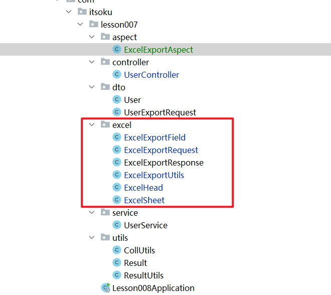

**高并发、微服务 、性能调优实战案例100讲，所有案例均源于个人工作实战，均配合代码落地**

加我微信：itsoku，所有案例均提供在线答疑。


# 第8节 SpringBoot中实现一个通用Excel导出功能


## 这个导出功能的特色

- 非常通用，能够满足大部分项目中99%的导出功能，代码复用性很强
- 导出的列可以由前端自定义（比如哪些列需要导出、列的顺序、名称等都是可以由前端自定义）


## 看效果

先带大家看一下效果。

启动`com.itsoku.lesson007.Lesson008Application`，启动好之后，浏览器中打开`http://localhost:8080/userList`，看效果。


## 代码解析

```
com.itsoku.lesson007.controller.UserController#userExport
```

### 入参（ExcelExportRequest）

```java
public class ExcelExportRequest {
    /**
     * excel名称
     */
    private String excelName;

    /**
     * sheet的名称
     */
    private String sheetName;

    /**
     * 导出字段有序列表
     */
    private List<ExcelExportField> fieldList;
 }
```


### 出参（ExcelExportResponse）

```java
public class ExcelExportResponse {
    //导出的excel文件名称
    private String excelName;
    // sheet列表数据
    private List<ExcelSheet> sheetList;
}
```


### Aop拦截请求，将 ExcelExportResponse 处理成excel导出

```java
@Component
@Aspect
public class ExcelExportAspect {
    @Around(value = "execution(* com.itsoku..*Controller.*(..))")
    public Object around(ProceedingJoinPoint proceedingJoinPoint) throws Throwable {
        Object result = proceedingJoinPoint.proceed();
        if (result instanceof ExcelExportResponse) {
            //下载excel
            ExcelExportUtils.writeExcelToResponse((ExcelExportResponse) result);
            return null;
        } else {
            return result;
        }
    }
}
```


## 核心代码



## 源码

在高并发系列实战案例的 lesson008 模块中，如果找不到的，留言获取，感谢大家。


# 高并发 & 微服务 & 性能调优实战案例100讲

## 已更新 8 节课

```java
1. 分片上传实战
2. 通用并发处理工具类实战
3. 实现一个好用接口性能压测工具类
4. 超卖问题的4种解决方案，也是防止并发修改数据出错的通用方案
5. Semaphore实现接口限流实战
6. 并行查询，优化接口响应速度实战
7. 使用TransactionTemplate优化接口性能（大事务优化）
8. 通用的动态Excel导出功能实战（很实用）
```

## 课程部分大纲，连载中。。。。

以下课程均来源于个人多年的实战，均提供原理讲解 && 源码落地

```java
1. 分片上传实战
2. 通用并发处理工具类实战
3. 实现一个好用接口性能压测工具类
4.超卖问题的4种解决方案，也是防止并发修改数据出错的通用方案
5. Semaphore实现接口限流实战
6. 并行查询，优化接口响应速度实战
7. 使用TransactionTemplate优化接口性能（大事务优化）
8. 手写线程池管理器，管理&监控所有线程池
9. 使用SpringBoot实现动态Job管理功能
10. 通用的Excel导出功能实战
11. 通用的幂等性工具类实战
12. 接口返回值通用设计
13. 接口太多，各种dto、vo不计其数，如何命名？
14. 一个业务太复杂了，方法太多，如何传参？
15. 如何统计接口耗时？
16. AOP实战接口日志打印功能
17. AOP实现业务操作日志记录功能
18. AOP实现MyBatis分页功能
19. SpringBoot读写分离实战
20. MQ专题：事务消息实战（防止消息丢失）
21. MQ专题：消息幂等消费通用方案实战
22. MQ专题：延迟消息通用方案实战
23. MQ专题：顺序消息通用方案实战
24. 分布式事务：使用事务消息实现事务最终一致性
25. 分布式事务：通用的TCC分布式事务生产级代码落地实战
26. 分布式锁案例实战
27. 微服务中如何传递上下文？实战
28. 微服务链路日志追踪实战（原理&代码落地）
29. SpringBoot实现租户数据隔离
30. MyBatis进阶：封装MyBatis，实现通用的无SQL版CRUD功能，架构师必备
31. MyBatis进阶：自己实现通用分表功能，架构师必备
32. MyBatis进阶：实现多租户隔离ORM框架
33. SpringBoot中实现自动监听PO的变化，自动生成表结构
34. 分布式专题：其他实战课程等
35. 性能调优：如何排查死锁？
36. 性能调优：如何排查内存溢出？
37. 性能调优：CPU被打满，如何排查？
38. 性能调优：生产代码没生效，如何定位？
39. 性能调优：接口太慢，如何定位？
40. 性能调优：如何查看生产上接口的入参和返回值？
41. 性能调优：远程debug
42. 生产上出现了各种故障，如何定位？
43. 其他等各种实战案例。。。
。。。
```


